---
## Front matter
title: "Отчёт по лабораторной работе №2"
subtitle: "Первоначальная настройка git"
author: "Тагиев Павел Фаикович"

## Generic otions
lang: ru-RU
toc-title: "Содержание"

## Bibliography
bibliography: bib/cite.bib
csl: pandoc/csl/gost-r-7-0-5-2008-numeric.csl

## Pdf output format
toc: true # Table of contents
toc-depth: 2
lof: true # List of figures
lot: false # List of tables
fontsize: 12pt
linestretch: 1.5
papersize: a4
documentclass: scrreprt
## I18n polyglossia
polyglossia-lang:
  name: russian
  options:
	  - spelling=modern
	  - babelshorthands=true
polyglossia-otherlangs:
  name: english
## I18n babel
babel-lang: russian
babel-otherlangs: english
## Fonts
mainfont: PT Serif
romanfont: PT Serif
sansfont: PT Sans
monofont: PT Mono
mainfontoptions: Ligatures=TeX
romanfontoptions: Ligatures=TeX
sansfontoptions: Ligatures=TeX,Scale=MatchLowercase
monofontoptions: Scale=MatchLowercase,Scale=0.9
## Biblatex
biblatex: true
biblio-style: "gost-numeric"
biblatexoptions:
  - parentracker=true
  - backend=biber
  - hyperref=auto
  - language=auto
  - autolang=other*
  - citestyle=gost-numeric
## Pandoc-crossref LaTeX customization
figureTitle: "Рис."
tableTitle: "Таблица"
listingTitle: "Листинг"
lofTitle: "Список иллюстраций"
lotTitle: "Список таблиц"
lolTitle: "Листинги"
## Misc options
indent: true
header-includes:
  - \usepackage{indentfirst}
  - \usepackage{float} # keep figures where there are in the text
  - \floatplacement{figure}{H} # keep figures where there are in the text
---

# Цель работы

* Изучить идеологию и применение средств контроля версий.
* Освоить умения по работе с git.

# Задание

* Произвести базовую конфигурацию git. 
* Создать ssh ключ и добавить его на github
* Создать gpg ключ и добавить его на github. Настроить автоматическое подписание коммитов.
* Создать репозиторий курса на основе шаблона.

# Теоретическое введение

Git — система управления версиями с распределенной архитектурой. В отличие от некогда популярных систем вроде CVS и Subversio
(SVN), где полная история версий проекта доступна лишь в одном месте, в Git каждая рабочая копия кода сама по себе является
репозиторием. Это позволяет всем разработчикам хранить историю изменений в полном объеме.

Разработка в Git ориентирована на обеспечение высокой производительности, 
безопасности и гибкости распределенной системы [@atlassian].

# Выполнение лабораторной работы

## Подготовительные действия на WSL + Ubuntu

Так как лабораторная работа №2 мной выполнялась на WSL [@microsoft] с установленной ОС Ubuntu,
нужно произвести некторые подготовительные действия. Добавим в файл `~/.bashrc`{.bash}, строку
`export GPG_TTY=$(tty)`, она нужна чтобы при использовании gpg ключа кодовое слово спрашивалось в текущем
терминале. Еще нам будет полезна функция, которую я назвал `winclip`{.bash} (рис. [-@fig:016]). Переданная ей через пайп строка
преобразуется из utf8 в utf16le и затем копируется в буфер обмена Windows. 
Например, после выполнения `echo "Привет из wsl!" | winclip`{.bash} в буфер обмена Windows будет
скопирована строка `Привет из wsl!`{.bash}. Далее я буду использовать эту функцию для копирования
публичных ключей ssh и gpg.

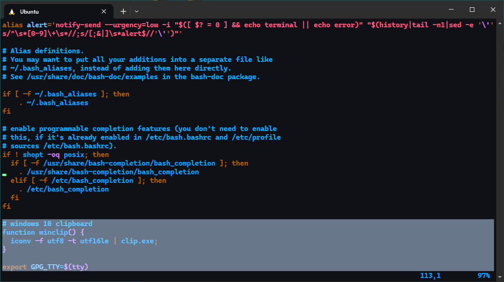{#fig:016}

## Конфигурация git

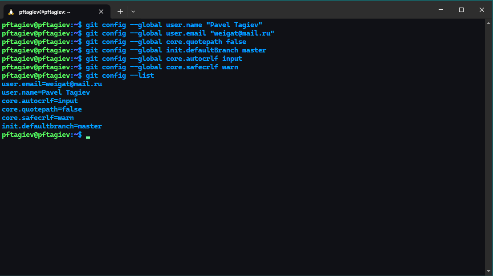{#fig:001}

* В первых двух строках на рис. [-@fig:001] мы глобально задаем свое имя и email.
* Третья строка включает utf8 при выводе сообщений git.
* Четвертая задает имя `master`{.bash} дефолтной ветке.
* Пятая строка задает переносы строк для Linux.
* Шестая включает предупреждение о необратимом пробразовании переноса строк.

Далее выводится текущая конфигурация (рис. [-@fig:001]).

## Генерация ssh ключа

Публичный и приватный ключ можно сгенерировать командой `ssh-keygen`{.bash}.
Пара ключей хранится в директории `~/.ssh`. Сгенерируем наш ключ по алгоритму
`ed25519`{.bash}, оставим комментарий с помощью флага `-С`{.bash}, в качестве комментария
укажем нашу почту. Все шаги утилиты при генерации ключа опциональны, пропустим их нажимая клавишу
**Enter**. Скопируем публичный ключ в буфер обмена Windows c помощью описанной ранее функции
`winclip`{.bash} (рис. [-@fig:003]).

{#fig:003}

## Добавление публичного ssh ключа на github

Перейдем в настройки аккаунта github, в раздел 
***SSH and GPG keys*** (рис. [-@fig:004]). Нажмем кнопку ***New SSH key***, добавим скопированный
ранее публичный ключ (рис. [-@fig:006]).

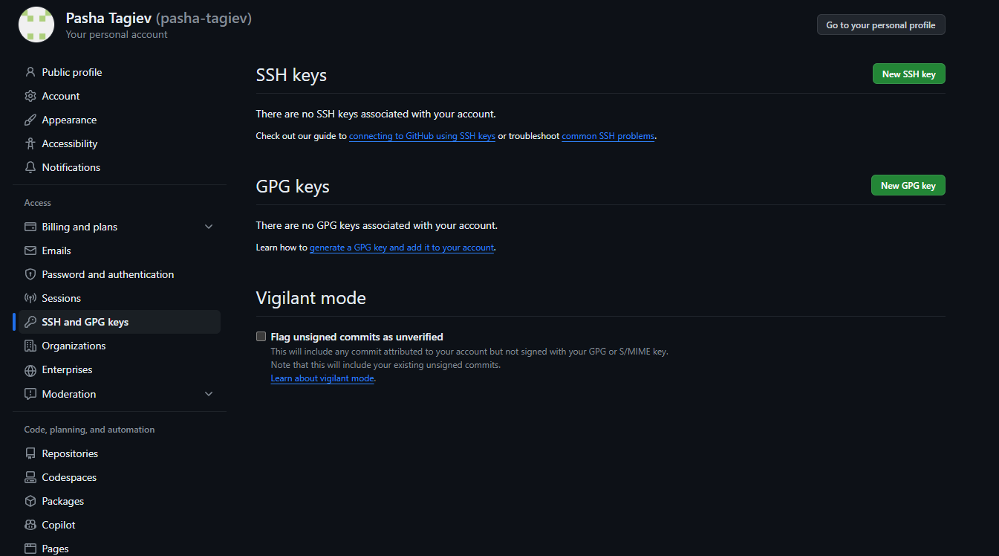{#fig:004}

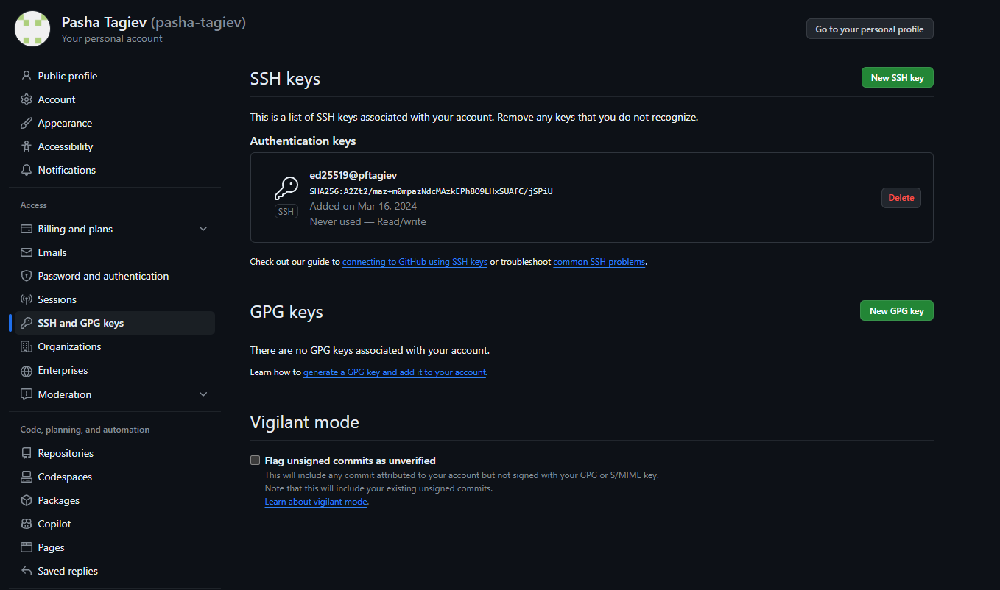{#fig:006}

Проверим наш ключ, попробовав подключиться к git по ssh (рис. [-@fig:007]).
Как можно увидеть, ключ работает.

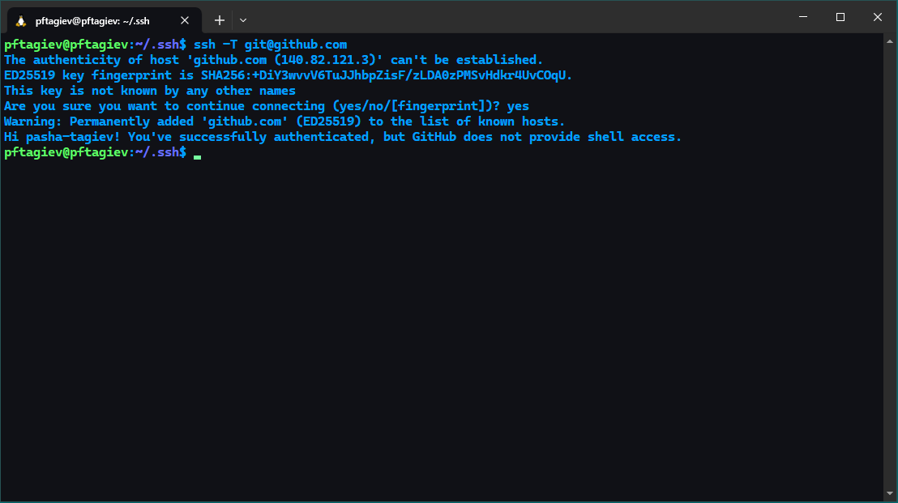{#fig:007}

## Генерация gpg ключа

Сгенерируем gpg ключ. Для этого введем в терминале 
`gpg --full-generate-key`{.bash}. Генерация ключей с помощью этой утилиты
происходит в несколько этапов (рис. [-@fig:008]), опишем каждый из них:

1. Нас просят выбрать тип ключа. Выбираем RSA, введя в терминал цифру 1 и нажав **Enter**.
2. Далее просят указать размер ключа выбираем максимально возможный - 4096.
3. Тут нужно узказать через какое время ключ станет недействительным. Укажем 0, что
означет что у него нет срока годности. Повторно подтверждаем наш выбор введя y и нажав **Enter**.
4. Теперь нас просят ввести имя и email, email должен совпадать с тем что используется в github аккаунте.
5. Далее нужно ввести кодовую фразу.
6. После начнется создание ключа. Утилита попросит нас совершать как можно больше действий 
с машиной (набор текста на клавиатуре, перемещение курсора мыши и т.д.) во время создания ключа,
это нужно для боле качественной генерации случайных чисел.

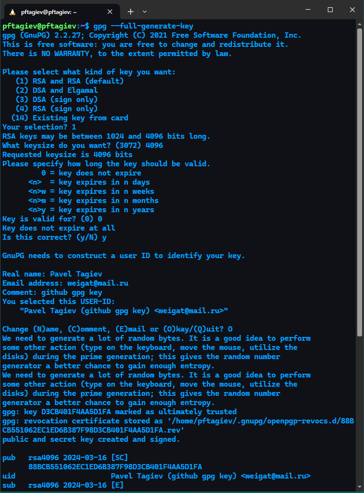{#fig:008}

## Автоматическое подписание коммитов и добавление ключа на github

На рис. [-@fig:009] можно увидеть настройку автоматического подписания коммитов, разберем каждый шаг:

1. Выводм список gpg ключей, копируем id нужного нам ключа.
2. Записываем публичный ключ в буфер обмена Windows.
3. Добавляем id ключа в глобальный конфиг git.
4. Включаем подписание коммитов.
5. Указываем программу для генерации gpg в глобальном конфиге git.

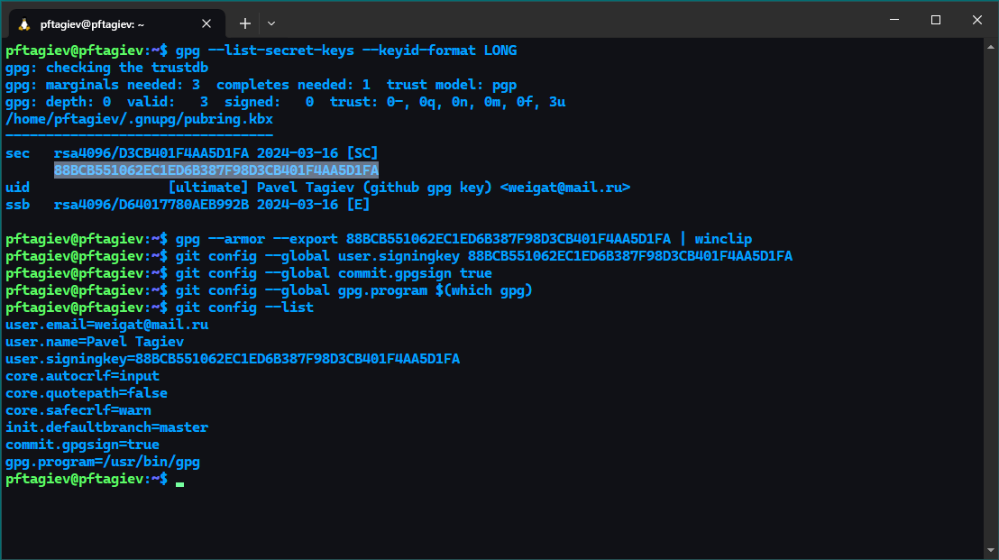{#fig:009}

Добавим скопированный ранее публичный ключ в настройки github по аналогии с ssh ключем. Включим 
***Vigilant mode*** (рис. [-@fig:010]). Для отображения подписанных и неподписанных коммитов на github.

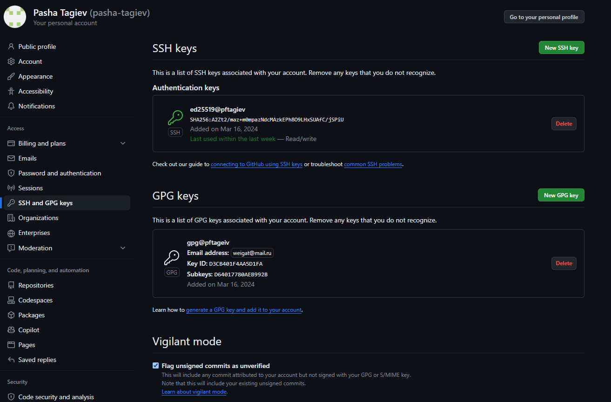{#fig:010}

## Установка утилиты gh и авторизация

По причине того, что у меня уже есть git на WSL, повтроно я его устанавливать не буду,
но на Ubuntu это можно сделать следующей командой `sudo apt install git`{.bash}.
Установку gh можно увидеть на рис. [-@fig:011].

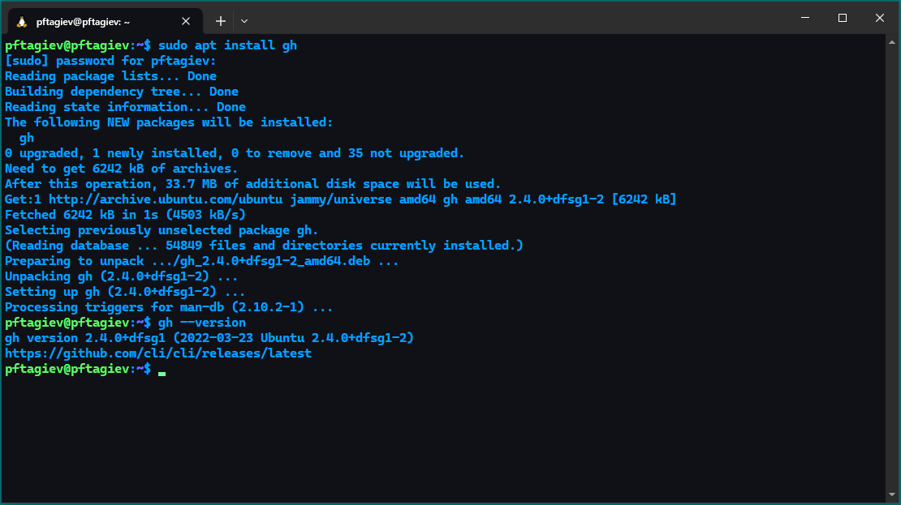{#fig:011}

Авторизируемся на github c помощью gh (рис. [-@fig:013]). Я выбрал авторизацию через браузер, но так как на WSL
он у меня не установлен. Я открыл ссылку из терминал в браузере на Windows и вставил код. После ответа на несколько вопросов
мне удалось авторизироваться на github (рис. [-@fig:012]).

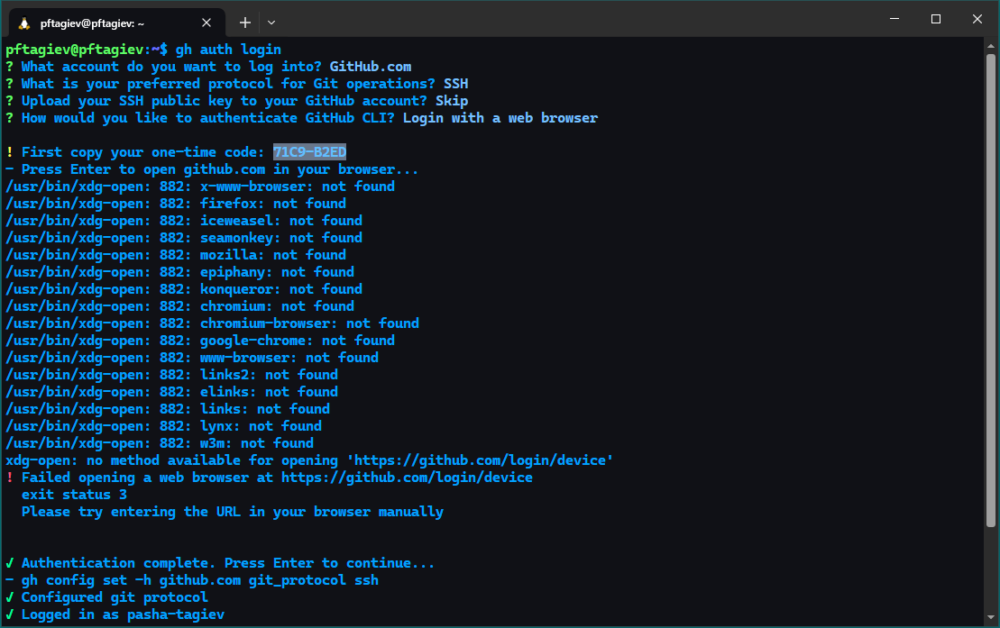{#fig:013}

{#fig:012}

## Создание репозитория курса из шаблона

Создадим директорию для выоплнения лабораторных работ командой
`mkdir -p <директория>`{.bash}. И перейдем в нее командой `cd`{.bash}.
Создаем публичный удаленный репозиторий с помощью gh, по шаблоноу:

```bash
yamadharma/course-directory-student-template
```

Клонируем созданный
удаленный репозиторий в папку `os-intro`{.bash} с флагом `--recursive`{.bash},
для клонирования и его подмодулей (рис. [-@fig:014]).

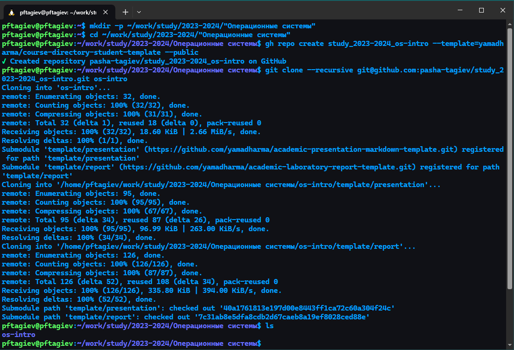{#fig:014}

Переходим в папку `os-intro`{.bash}, удаляем лишний файл `package.json`{.bash}.
Записываем в файл `COURSE`{.bash} название курса (в нашем случае `os-intro`{.bash}).
Вызываем `make`{.bash} для таргета `submodule`{.bash}, чтобы обновить подмодули, затем
`make prepare`{.bash}, чтобы сгенерировать структуру курса (рис. [-@fig:015]).

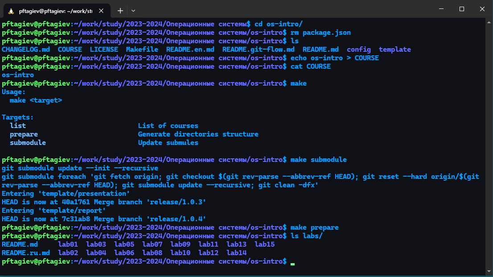{#fig:015}

Добавляем файлы в индекс git командой `git add .`{.bash},
фиксируем изменения с требуемым по заданию комментарием:

```bash
git commit -m "feat(main): make course structure"
```

Нас попросят ввести
кодовую фразу, которую мы вводили при генерации gpg ключа. После успешного ввода фразы
отправляем изменения в удаленный репозиторий `git push`{.bash} (рис. [-@fig:017;-@fig:018]).

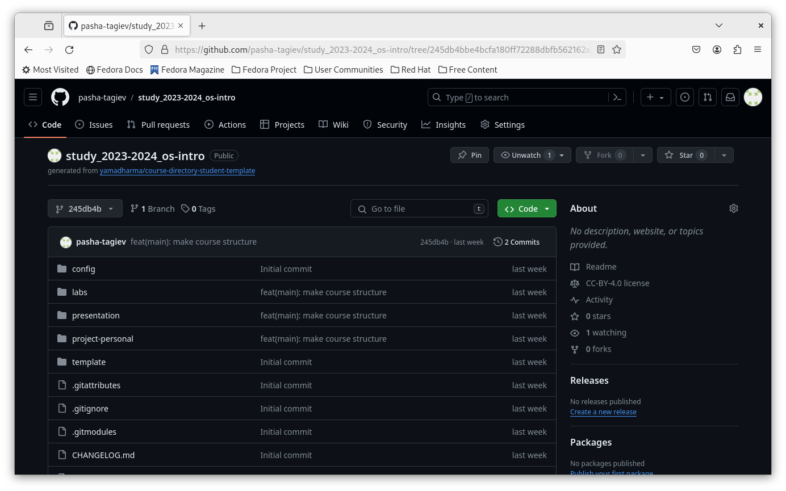{#fig:017}

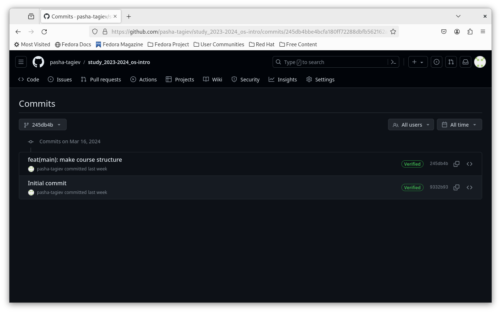{#fig:018}

# Ответы на контрольные вопросы

1. Что такое системы контроля версий (VCS) и для решеня каких задач они предназначаются?  
Системы контроля версий (Version Control System, VCS) — это программные
инструменты, помогающие командам
разработчиков управлять изменениями в исходном коде с течением времени.
В свете усложнения сред разработки они помогают командам 
разработчиков работать быстрее и эффективнее. 
2. Объясните следующие понятия VCS и их отношения: хранилище, commit, история, рабочая копия.
    1. Репозиторий(хранилище) Git — это виртуальное хранилище проекта. В нем можно хранить версии кода для доступа по мере необходимости.
    2. Commit — это команда в системе контроля версий Git, которая фиксирует изменения в репозитории.
    3. История - список коммитов, который можно посмотреть командой `git log`{.bash}.
    4. Рабочая копия - рабочая копия является снимком(коммитом) одной из версий проекта.
3. Что представляют собой и чем отличаются централизованные и децентрализованные VCS? Приведите примеры VCS каждого вида.
    * централизованные - история версий хранится на удалённом сервере, а рабочий код на нескольких компьютерах. Компьютеры связаны с одним сервером. Примером может послужить SVN (Subversion).
    * децентрализованные - рабочий код хранится на нескольких компьютерах, а история всех версий хранится как на удалённом сервере, так и на каждом из этих компьютеров. Все компьютеры связаны с сервером, но ещё дополнительно связаны между собой. Пример Git.
4. Опишите действия с VCS при единоличной работе с хранилищем.
    1. Инициализация репозитория
    2. Создание рабочей копии
    3. Внесение изменений
    4. Коммит изменений
    5. Просмотр истории
    6. Обновление рабочей копии
5. Опишите порядок работы с общим хранилищем VCS.
    1. Получение последней версии проекта
    2. Внесение изменений
    3. Фиксация изменений
    4. Обновление рабочей копии
    5. Разрешение конфликтов
    6. Просмотр истории
    7. Отправка изменений в общий репозиторий
6. Каковы основные задачи, решаемые инструментальным средством git?
    * Хранить информацию и всех изменениях в коде, с возможностью в любой момент перейти к любому из них.
    * Обеспечение удобства командной работы над кодом.
7. Назовите и дайте краткую характеристику командам git.
    1. `git init`{.bash} - создание основаного дерева репозитория.
    2. `git pull`{.bash} - получение изменений текущего дерева из центрального репозитория.
    3. `git push`{.bash} - отправка изменений в центральный репозиторий. 
    4. `git status`{.bash} - просмотр измененных файлов.
    5. `git diff`{.bash} - просмотр изменений.
    6. `git add`{.bash} - добавить изменения.
    7. `git commit`{.bash} - фиксация изменений.
8. Приведите примеры использования при работе с локальным и удалённым репозиториями.
    * локальный репозиторий: `git commit -am "мой коммит"`{.bash}.
    * удаленный репозиторий: `git push origin master`{.bash} - отправка изменений на удаленный репозиторий `origin`{.bash}, на ветку `master`{.bash}.
9. Что такое и зачем могут быть нужны ветви (branches)?  
Ветка - параллельный участок истории в одном хранилище, между ветками возможно слияние. Обычно используются
для создания новых функций или новых версий приложения.
10. Как и зачем можно игнорировать некоторые файлы при commit?  
Можно просто не добавлять их в индекс командой `git add`{.bash} или создать файл `.gitignore`{.bash},
в котором перечислить все файлы и папки которые требуется игнорировать. Может понадобиться игнорировать настройки
IDE, или бинарные файлы. Так как они зависят от конкретного разработчика и платформы, и в репозитории 
они могут быть лишними.

# Выводы

В этой лабораторной работе мы научились настраивать git генерировать ключи для ssh и gpg,
а также взаимодействовать с удаленными репозиториями, создавая свои из шаблонов и загружая изменения в локальном
репозитории на удаленный.

# Список литературы{.unnumbered}

::: {#refs}
:::
