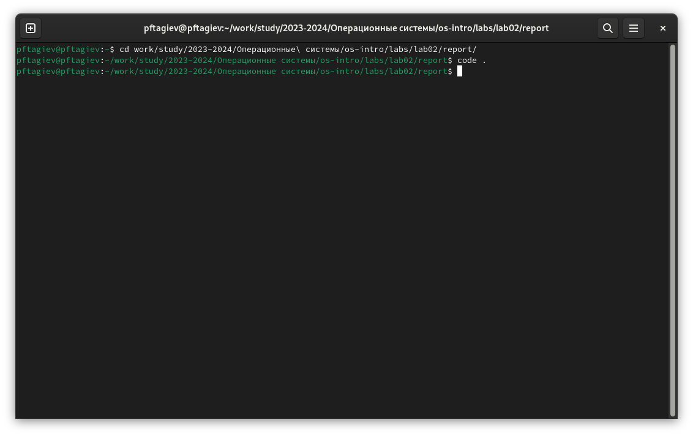
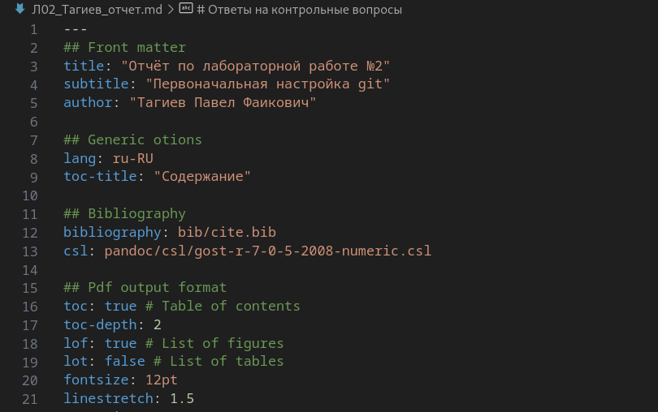
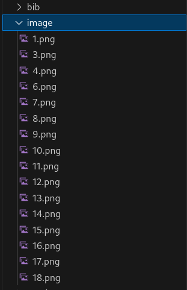
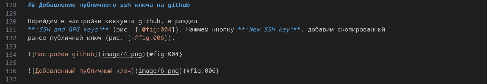
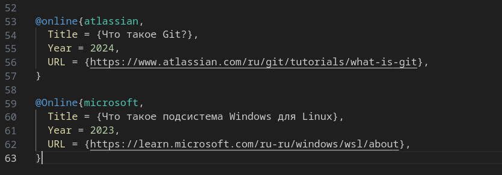
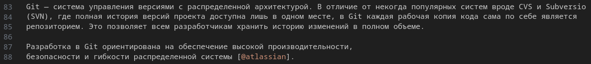
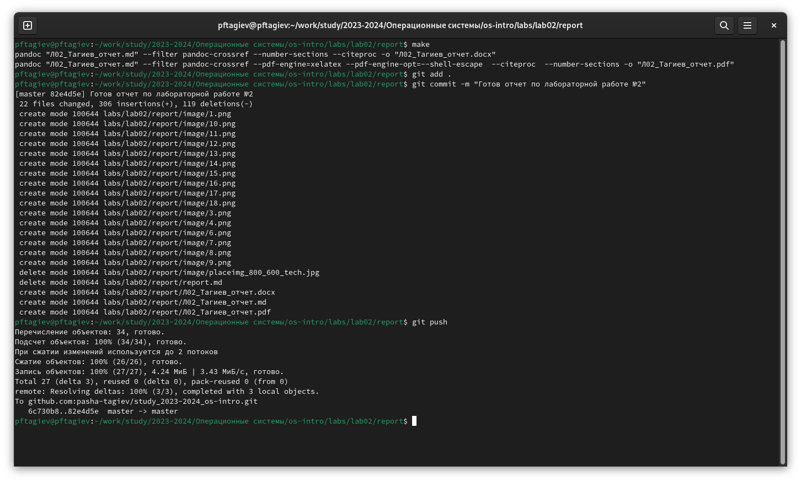
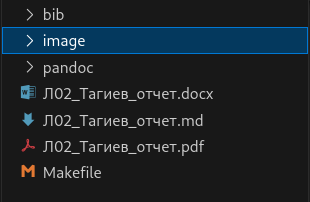

---
## Front matter
title: "Отчёт по лабораторной работе №3"
subtitle: "Написание отчета в Markdown"
author: "Тагиев Павел Фаикович"

## Generic otions
lang: ru-RU
toc-title: "Содержание"

## Bibliography
bibliography: bib/cite.bib
csl: pandoc/csl/gost-r-7-0-5-2008-numeric.csl

## Pdf output format
toc: true # Table of contents
toc-depth: 2
lof: true # List of figures
lot: false # List of tables
fontsize: 12pt
linestretch: 1.5
papersize: a4
documentclass: scrreprt
## I18n polyglossia
polyglossia-lang:
  name: russian
  options:
	- spelling=modern
	- babelshorthands=true
polyglossia-otherlangs:
  name: english
## I18n babel
babel-lang: russian
babel-otherlangs: english
## Fonts
mainfont: PT Serif
romanfont: PT Serif
sansfont: PT Sans
monofont: PT Mono
mainfontoptions: Ligatures=TeX
romanfontoptions: Ligatures=TeX
sansfontoptions: Ligatures=TeX,Scale=MatchLowercase
monofontoptions: Scale=MatchLowercase,Scale=0.9
## Biblatex
biblatex: true
biblio-style: "gost-numeric"
biblatexoptions:
  - parentracker=true
  - backend=biber
  - hyperref=auto
  - language=auto
  - autolang=other*
  - citestyle=gost-numeric
## Pandoc-crossref LaTeX customization
figureTitle: "Рис."
tableTitle: "Таблица"
listingTitle: "Листинг"
lofTitle: "Список иллюстраций"
lotTitle: "Список таблиц"
lolTitle: "Листинги"
## Misc options
indent: true
header-includes:
  - \usepackage{indentfirst}
  - \usepackage{float} # keep figures where there are in the text
  - \floatplacement{figure}{H} # keep figures where there are in the text
---

# Цель работы

Научиться оформлять отчеты с помощью легковесного языка разметки Markdown.

# Задание

- Продемонстрировать процесс создания отчета по лабораторной работе №2 в формате Markdown.
- Предоставить отчет в трех форматах: pdf, docx и md.

# Теоретическое введение

## Базовые сведения о Markdown

Чтобы создать заголовок, используется знак `#`, например:

```markdown
# This is heading 1
## This is heading 2
### This is heading 3
#### This is heading 4
```

Чтобы задать для текста полужирное начертание, заключите его в двойный звездочки:

```markdown
**bold**
```

Чтобы задать тексту курсивное начертание, зкалючите его в одинарные звездочки:

```markdown
*italic*
```

Чтобы задать для текста полужирное и курсивное начертнаие, зключите его в тройные звездочки:

```markdown
***bold and italic***
```

Для цитирования используется знак `>`:

```markdown
> Lorem ipsum dolor sit amet, consectetur adipiscing elit, sed do  
eiusmod tempor incididunt ut labore et dolore magna aliqua.
```

Неупорядоченный список создается с помощью звездочек и тире:

```markdown
- List item 1
- List item 2
- List item 3
```

Чтобы вложить один список в другой используется отступ:

```markdown
- List item 1
  - List item A
  - List item B
- List item 2
```

Упорядоченный список создается с помощью цифр:

```markdown
1. First
2. Second
3. Third
```

Вложенный упорядоченный список создается по аналогии с неупрядоченным, т.е. нужно просто добавить отступы.
Встроенные ссылки создаются так:

```markdown
[link text](file_name_or_url)
```

Создать блок кода в markdown можно с помощью следующего синтаксиса:

````
```cpp
std::cout << "Hi!" << std::endl;
```
````

Верхние и нижние индексы: 

H~2~0 записывается как: `H~2~0`{.markdown}

2^10^ записывается как: `2^10^`{.markdown}

Внутритекстовые формулы записываются аналогично формулам LaTeX. Например,
формула $\sin^2(x) + \cos^2(x) = 1$ будет записана так:

```tex
$\sin^2(x) + \cos^2(x) = 1$
```

Подробнее можно познакомиться с синтаксисом Markdown например в [@yamad;@cheat_sheet]

## Обработка Markdown

Для обработки Markdown мы используем `pandoc`{.bash},`pandoc-crossref` 
и `texlive`{.bash}. Все эти пакеты были установлены в
лаборатороной работе №1. Чтобы преобразовать Markdown файл например в pdf
можно использовать такую команду: 

```bash
pandoc <file_name>.md -o <file_name>.pdf
```

# Выполнение лабораторной работы

## Установка vs code

Для редактирования текстовых файлов я использую vs code, так как ее нет в
стандартных репозиториях, установка немного отличается от привычной. Подбробнее можно
ознакомится с этим процессом в [@install_vscode].

## Изменение преамбулы

{#fig:000}

Перейдем в рабочую папку, и запустим vs code (рис. [-@fig:000]).

Изменим значеня ***title***, ***subtitle*** и ***author*** под себя. Также отлючим
генерацию списка таблиц так как они не использовались (рис. [-@fig:001]).

{#fig:001}

## Добавление и использование картинок

{#fig:006}

Добавим картинки в папку `image/`{.bash}, чтобы соответствовать шаблону (рис. [-@fig:006]).
Вставку картинок и использование перекрестных ссылок можно увидеть на рис. [-@fig:005].

{#fig:005}

## Добавление и использование источников

Откроем файл `cite.bib`{.bash} в папке `bib/`{.bash}, и добавим свои источники (рис. [-@fig:003]).
Пример их использования можно увидеть на рис. [-@fig:004].

{#fig:003}

{#fig:004}

## Обработка Markdown и отправка в удаленный репозиторий.

В шаблоне лаборатороных работ имеется написаный за нас Makefile. Запустим его написав в терминале
`make` и нажав **Enter** (рис. [-@fig:010]). После в папке отчета лаборатороной работы появятся 
файлы .pdf и .docx (рис. [-@fig:007]). Добавим все файлы в индекс, сделаем коммит 
и отправим изменения в удаленный репозиторий (рис. [-@fig:010]).

{#fig:010}

{#fig:007}

# Выводы

Мы познакомились с языком разметки Markdown. Разобрались с различными его аспектами,
такими как вставка картинок, заполнение библиографии и генерация других форматов из Markdown файла.

# Список литературы{.unnumbered}

::: {#refs}
:::
