---
## Front matter
title: "Отчёт по лабораторной работе №4"
subtitle: "Основы интерфейса взаимодействия пользователя с системой Unix на уровне командной строки"
author: "Тагиев Павел Фаикович"

## Generic otions
lang: ru-RU
toc-title: "Содержание"

## Bibliography
bibliography: bib/cite.bib
csl: pandoc/csl/gost-r-7-0-5-2008-numeric.csl

## Pdf output format
toc: true # Table of contents
toc-depth: 2
lof: true # List of figures
lot: true # List of tables
fontsize: 12pt
linestretch: 1.5
papersize: a4
documentclass: scrreprt
## I18n polyglossia
polyglossia-lang:
  name: russian
  options:
    - spelling=modern
	  - babelshorthands=true
polyglossia-otherlangs:
  name: english
## I18n babel
babel-lang: russian
babel-otherlangs: english
## Fonts
mainfont: PT Serif
romanfont: PT Serif
sansfont: PT Sans
monofont: PT Mono
mainfontoptions: Ligatures=TeX
romanfontoptions: Ligatures=TeX
sansfontoptions: Ligatures=TeX,Scale=MatchLowercase
monofontoptions: Scale=MatchLowercase,Scale=0.9
## Biblatex
biblatex: true
biblio-style: "gost-numeric"
biblatexoptions:
  - parentracker=true
  - backend=biber
  - hyperref=auto
  - language=auto
  - autolang=other*
  - citestyle=gost-numeric
## Pandoc-crossref LaTeX customization
figureTitle: "Рис."
tableTitle: "Таблица"
listingTitle: "Листинг"
lofTitle: "Список иллюстраций"
lotTitle: "Список таблиц"
lolTitle: "Листинги"
## Misc options
indent: true
header-includes:
  - \usepackage{indentfirst}
  - \usepackage{float} # keep figures where there are in the text
  - \floatplacement{figure}{H} # keep figures where there are in the text
---

# Цель работы

Приобретение практических навыков взаимодействия пользователя с системой посредством командной строки.

# Задание

1. Определить полное имя домашнего каталога.
2. Выполнить следующие действия:
    1. Перейти в каталог `/tmp`{.bash}.
    2. Вывести на экран содержимое каталога `/tmp`{.bash} командой `ls`{.bash} с различными опциями.\
    Пояснить разницу выводимой информации.
    3. Определить есть ли в каталоге `/var/spool/`{.bash} подкаталог с именем `cron`{.bash}.
    4. Перейти в домашний каталог и вывести его содержимое. Определить кто является владельцом файлов и подкаталогов.
3. Выпольнить следующие действия:
    1. В домашнем каталоге создать новый каталог с именем `newdir`{.bash}.
    2. В каталоге `~/newdir` создать новый каталог с именем `morefun`{.bash}.
    3. Создать одной командой в домашнем каталоге три новый каталога с именами\
    `letters,memos,misk`{.bash}. Затем удалить эти каталоги одной командой.
    4. Попробовать удалить ранее созданный каталог `~/newdir`{.bash} командой `rm`{.bash}. Проверить был ли удален каталог.
    5. Удалить каталог `~/newdir/morefun`{.bash} из домашнего каталога. Проверит был ли удален каталог.
4. С помощью команды `man`{.bash} определить, какую опцию команды `ls`{.bash} нужно использовать для просмотра не только указаного каталога, но\
и его подкаталогов.
5. С помощью команды `man`{.bash} определить набор опций команды `ls`{.bash}, позволяющий отсортировать по времени последнего изменения выводимый список\
содержимого каталога развернутым описанием файлов.
6. Использовать команду `man`{.bash} для просмотра описания следующих команд: `cd, pwd, mkdir, rmdir, rm`{.bash}.\
Поясните основные опции этих команд.
7. Используя ифнормацию полученную при помощи команду `history`{.bash}, выполните модификацию и исполнение нескольких команд из буфера команд.

Задание сформировано в соответствии с [@yamad].

# Теоретическое введение

В операционной системе типа Linux взаимодействие пользователя с системой обычно осуществляется с помощью командной строки посредством построчного
ввода команд. При этом обычно используются командные интерпритаторы языка shell. Такие как `/bin/sh; /bin/csh; /bin/ksh /bin/zsh`{.bash},
мы же используем `/bin/bash`{.bash}.

Общий формат команд можно представить следующим образом:

```bash
<имя_команды><разделитель><аргументы>
```

Далее в отчете мы подробно рассмотрим и испольуем команды:\
`cd, pwd, ls, mkdir, rmdir, rm`{.bash} и `man`{.bash}.

# Выполнение лабораторной работы

## Некоторые необходимые сведения

Перед основной частью отчета, нужно уточнить некторые моменты. Эту работу я выполнял на WSL с установленной ОС Ubuntu.
В терминале я использую немного измененный `prompt`{.bash}(рис. [-@fig:000]). Если смотреть слева направо, то сначала идет 
`имя_пользователя@имя_хоста`{.bash} потом в квадратных скобках текущая директория: `[текущая_директория]`{.bash}. Затем если
мы находимся в git репозитории отображается `[имя_ветки коммит]`{.bash}. В конце я добавил нумерацию `prompt`{.bash}, которая
сбрасывается когда вызывается команда `clear` или нажимается комбинация клавишь <kbd>Ctrl</kbd> + <kbd>l</kbd>. Так мне будет
удобнее ссылаться на части терминала.

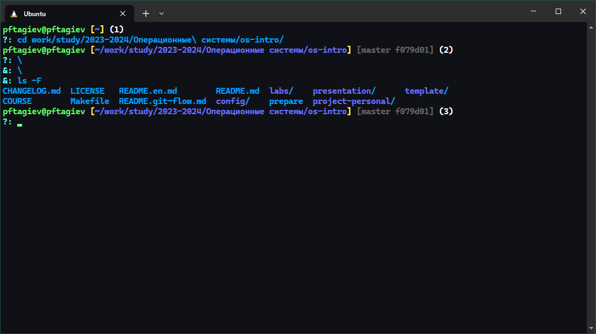{#fig:000}

Ввод команд всегда начинается с новой строки после `?: `{.bash}. В остальном, это обычная ОС Ubuntu с командной оболочкой `bash`{.bash}.
Подробнее о настройке `prompt`{.bash} можно узнать в [@custom_prompt].
Код меняющий `prompt`{.bash} расположен
в конце раздела на лист. [-@lst:prompt_code] его нужно поместить в файл `~/.bashrc`.
Теперь мы можем перейти к основной части отчета.

```{#lst:prompt_code .bash caption="Код изменяющий prompt"}
parse_git_info() {
    branch=$(git rev-parse --abbrev-ref HEAD 2> /dev/null)
    if [ -z "$branch" ]; then
        return
    fi

    commit=$(git rev-parse --short HEAD 2> /dev/null)
    if [ -n "$commit" ]; then
        commit=" $commit"
    fi

    echo -e "\e[90m[$branch$commit] "
}

PORMPT_NUMBER=1

clear() {
    $(which clear)
    PORMPT_NUMBER=1
}

update_prompt() {
    PS1="\\[\e[1;92m\\]\u@\H\\[\e[1;33m\\] "
    PS1+="[\\[\e[1;94m\\]\w\\[\e[1;33m\\]] "

    PS1+="$(parse_git_info)"

    PS1+="\\[\e[37m\\]($PORMPT_NUMBER) "

    PS1+="\n"
    PS1+="\\[\e[1;96m\\]?: "
    PS1+="\\[\e[0m\\]"

    ((++PORMPT_NUMBER))
}

PROMPT_COMMAND="update_prompt"

PS2="\\[\e[1;96m\\]&: \\[\e[0m\\]"
```

## Полное имя домашней директории

Чтобы узнать полное имя домашней директории текущего пользователя можно воспользоваться командой pwd вызвав ее из `~/`{.bash}.
Или же можно вывести на экран значение константы `HOME`{.bash} из любой директории системы. Пример можно увидеть на рис. [-@fig:001].

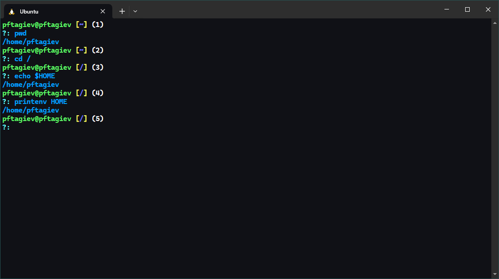{#fig:001}

## Директория /tmp и ее содержимое

В директории `/tmp`{.bash} хранятся временные файлы которые необходимы для запущенного программного обеспечения.
Перейдем в нее командой `cd`{.bash} как показано на рис. [-@fig:002]. Используем команду `ls`{.bash}, мы видем 4 временных
файла. Узнаем о них чуть больше добавив флаг `-l`{.bash} как показано в `(3)`. 
Как видно они были созданы 5 апреля от имени пользователя `root`{.bash} и только у него есть права на чтение, редактирование и исполнение
этих файлов.

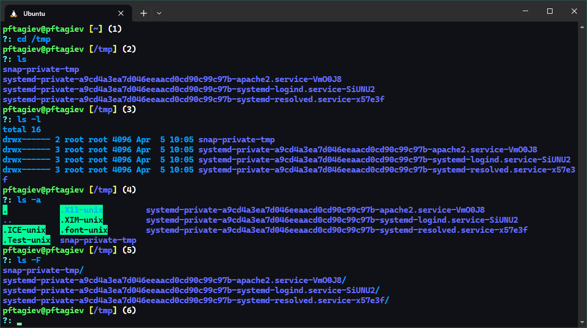{#fig:002}

Посмотрим есть ли в этой папке скрытые файлы, добавив опцию `-a`{.bash}. Как видно на рис. [-@fig:002] они есть.
Теперь, наконец, узнаем тип этих файлов добавив флаг `-F`{.bash}, в соответсвии с табл. [-@tbl:001] это каталоги.

: Символы определяющие тип файла {#tbl:001}

|Тип файла|Символ|
|:-:|:-:|
|Каталог|`/`|
|Исполняемый файл|`*`|
|Ссылка|`@`|

## Файл cron

Перейдем в каталог `/var/spool/`{.bash} как того требует задание. И с помощью комбинации команд 
`ls`{.bash} и `grep`{.bash} узнаем есть ли в этом каталоге файл `cron`{.bash}. Результат можно увидеть на рис. [-@fig:003]

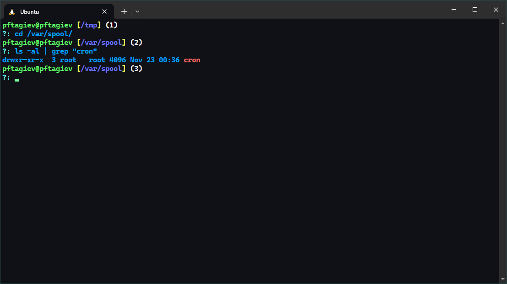{#fig:003}

## Домашний каталог

Вернемся в домашний каталог используя `cd`{.bash} без аргументов. Выведем его содержимое командой `ls -alF`.
Как видно на рис. [-@fig:004] всеми файлами этой директории владеет пользователь `pftagiev`{.bash}, а директорией
выше уже пользователь `root`{.bash}. 

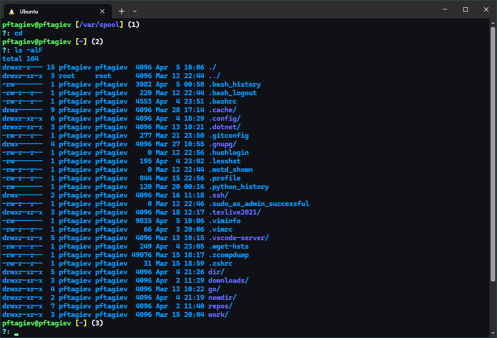{#fig:004}

## Использование mkdir, rmdir и rm

Разберем что происходит на рис. [-@fig:005], с помощью списка где каждый пункт соответствует `prompt`{.bash} на изображении.

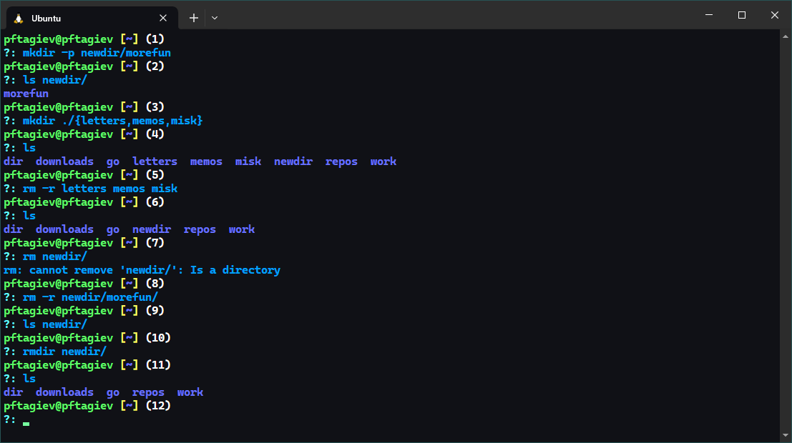{#fig:005}

1. Создадим каталог `~/newdir/morefun` командой `mkdir` с ключем `-p`, который означает создать все родительские\
каталоги для конечного каталога.
2. Проверим что конеченый каталог был создан.
3. Создадим одной командой каталоги `letters, memos, misk`{.bash}.
4. Проиверим их наличие.
5. Удалим каталоги `letters, memos, misk`{.bash} одной командой.
6. Проверим что каталоги были удалены.
7. Попробуем удалить ранее созданный каталог `~/newdir`{.bash} командой `rm`{.bash} без флагов. Неудача, система сообщает что не может удалить `~/newdir`{.bash} так как это каталог.
8. Удалим каталог `~/newdir/morefun` командой `rm -r` для рекурсивного удаления.
9. Проверим что `~/newdir/morefun` был удален.
10. Удалим `~/newdir/`{.bash} командой `rmdir`{.bash}.
11. Проверим что каталог был удален.

## Рекурсивный вывод команды ls

Требуется найти в документации к команде `ls`{.bash} флаг для вывода не только указанного каталога
но и всех его подкаталогов. Введем в терминале команду `man ls`{.bash} как показано на рис. [-@fig:007].

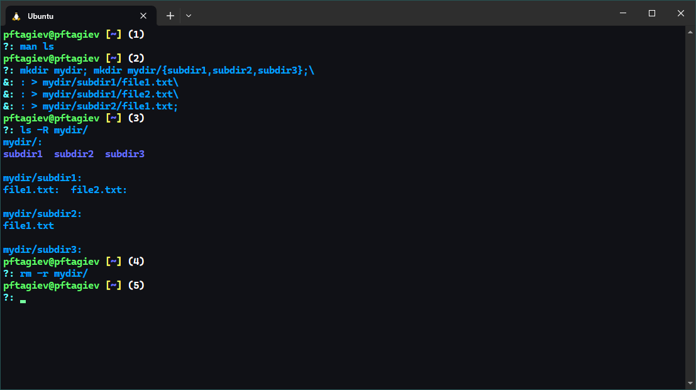{#fig:007}

Откроется документация к команде `ls`{.bash}. Воспользуемся поиском по документации введя `/то_что_ищем`{.bash}.
Как видно на рис. [-@fig:006] нам нужна опция `-R`{.bash}. На рис. [-@fig:007] в (3) можно увидеть использование этой опции.

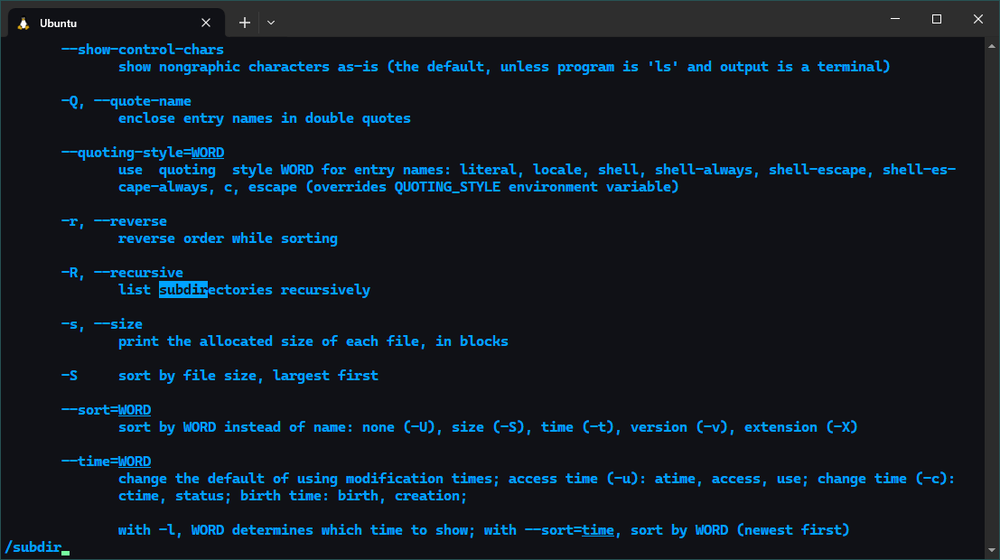{#fig:006}

## Сортировка вывода ls по времени последнего изменения

Снова воспользуемся документацией к команде `ls`{.bash}, но теперь введем в поиске фразу `sort by time`{.bash} (рис. [-@fig:008]).
Исходя из документации, чтобы отсортировать вывод `ls`{.bash} по времени последнего изменения нужно использовать ключ `-t`, пример использования
этого ключа можно увидеть на рис. [-@fig:009].

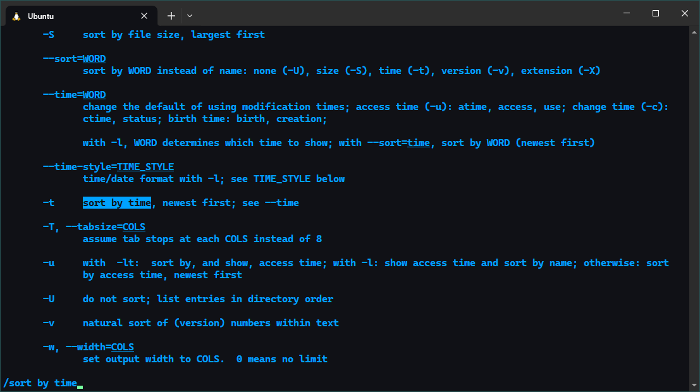{#fig:008}

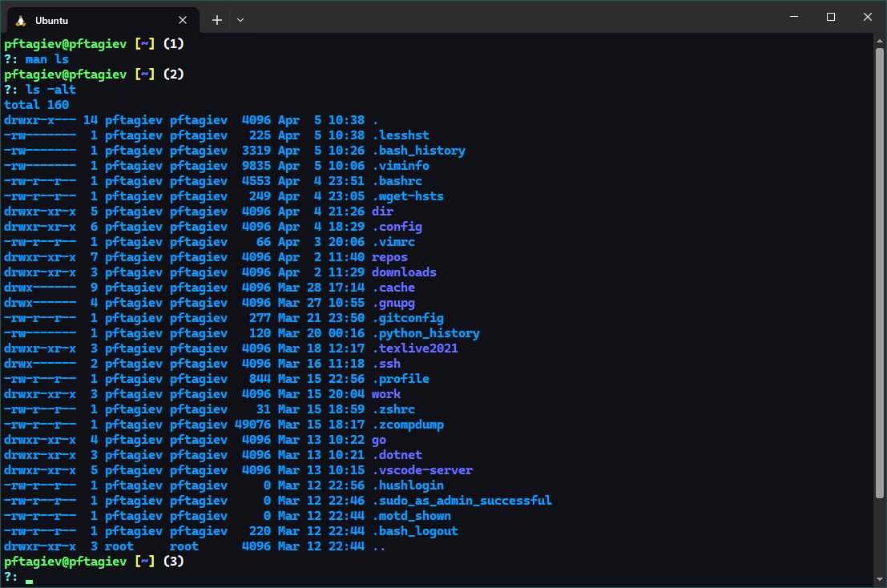{#fig:009}

## Документация к команде cd

К сожелению, так как команда `cd`{.bash} является встроенной для нее нельзя получить документацию
через утилиту `man` (рис. [-@fig:010] `pormpt`{.bash} `(1)` и `(2)`). Но можно получить короткую справку через
`help`{.bash}. Чуть позже мы разберем флаги `cd`{.bash}, которые вывела в терминал команда `help`{.bash}, но прежде нужно
понять что такое `symbolic link`{.bash}.

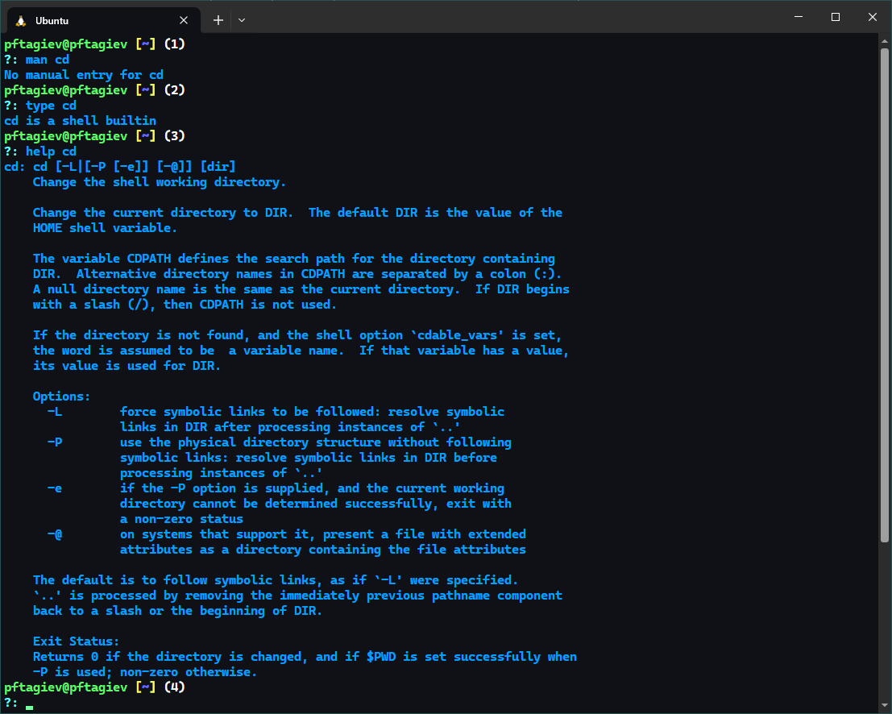{#fig:010}

Если проводить аналогию с Windows, то ***symlink*** или символические ссылки, это не что иное, как ярлыки.
В Linux ссылки бывают двух видов ***hard*** и ***soft*** в табл. [-@tbl:002] можно увидеть
их различия. 

: Различия ссылок {#tbl:002}

|SoftLink|HardLink|
|:-:|:-:|
|Ссылается как на файл так и на каталог|Ссылается только на файл|
|Просто следуют по пути до файла или каталога|Указывает на фактические данные файла в томе хранения|
|Указывает на файлы и каталоги как на локальных так и на внешних томах|Может указывать на файлы только в локальном томе|
|Не работает если файл или каталог были удалены|Работает после удаления файла|

***Hard*** ссылки создаются командой `ln <имя_таргета> <имя_ссылки>`{.bash}, ***soft*** ссылки создаются той же командой, но с флагом `-s`{.bash}.
Подробнее разобраться с ссылками можно, например, в [@hard_soft_links].

Вернемся к команде `cd`{.bash} и ее флагам (рис. [-@fig:010]).

- `-L`{.bash} - Переходить по символическим ссылкам. Данное поведение используется по умолчанию.
- `-P`{.bash} - Разыменовывать символические ссылки. В данном случае, если осуществляется переход на символическую ссылку, которая указывает на директорию, то в результате команда cd изменит текущую
рабочую директорию на директорию, указанную в качестве параметра
- `-P -e`{.bash} - Выйти с ошибкой, если директория, в которую осуществляется переход, не найдена.

## Документация к команде pwd

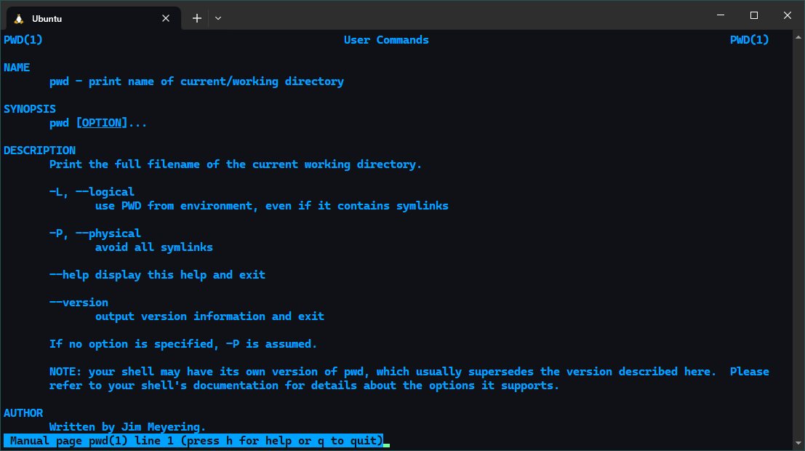{#fig:011}

Команда `pwd`{.bash} выводит в терминал текущую рабочую директорию. Разберем ее основные флаги, котороые показаны на рис. [-@fig:011].

- `-L`{.bash} - Не разыменовывать символические ссылки. Если путь содержит символические ссылки, то выводить их без преобразования в исходный путь.
- `-P`{.bash} - Преобразовывать символические ссылки в исходные имена. Если путь содержит символические ссылки, то они будут преобразованы в названия исходных директорий, на которые они указывают.

## Документация к команде mkdir

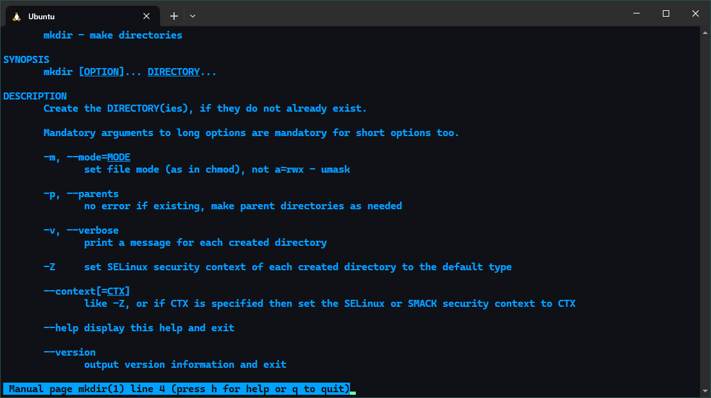{#fig:012}

`mkdir`{.bash} - создает каталог. Ее флаги можно увидеть на рис. [-@fig:012], их перевод ниже в виде списка.

- `-m`{.bash} - Устанавливает права доступа для создаваемой директории.
- `-p`{.bash} - Создать все директории, которые указаны внутри пути.\
Если какая-либо директория существует, то предупреждение об этом не выводится.
- `-v`{.bash} - Выводить сообщение о каждой создаваемой директории.
- `-Z`{.bash} - Установить контекст SELinux для создаваемой директории по умолчанию.
- `--context[-CTX]`{.bash} - Установить контекст SELinux для создаваемой директории в значение CTX.

## Документация к команде rmdir

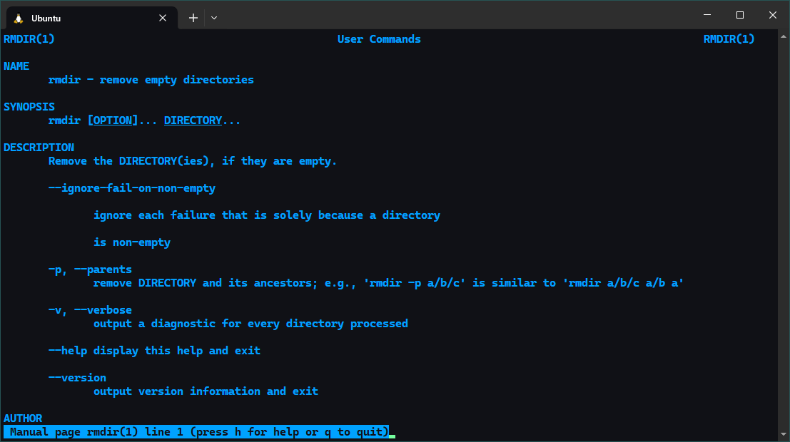{#fig:013}

`rmdir`{.bash} - удаляет пустые каталоги (рис. [-@fig:013]).

- `--ignore-fail-on-non-empty`{.bash} - Игнорировать неудачное удаление непустых каталогов.
- `-p`{.bash} - Удалить директорию и ее родительские директории.
- `-v`{.bash} - Вывод информации по каждой удаленной директории.

## Документация к команде rm

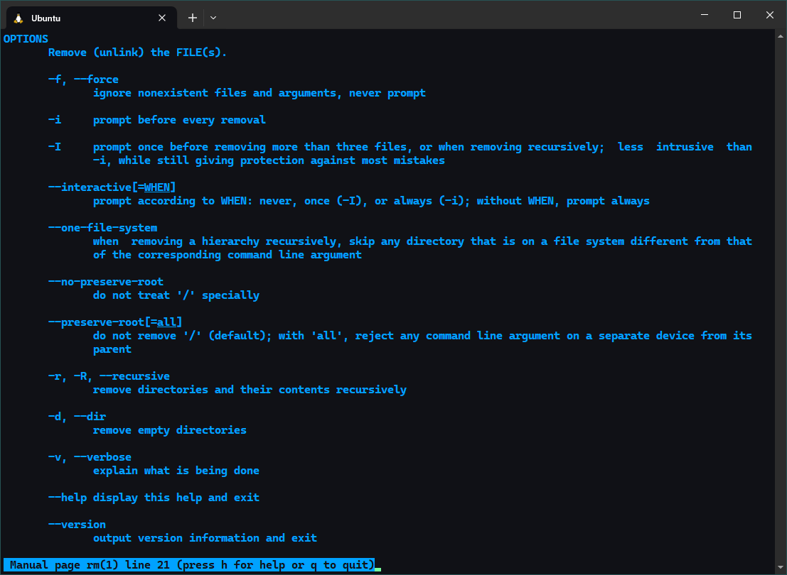{#fig:014}

Команда `rm`{.bash} - удаляет файлы и каталоги(если применить специальный флаг). 
Документация полученная командой `man`{.bash} на рис. [-@fig:014], ниже перевод.

- `-f`{.bash} - Игнорировать несуществующие файлы и аргументы. Никогда не выдавать запросы на подтверждение удаления.
- `-i`{.bash} - Выводить запрос на подтверждение удаления каждого файла.
- `-I`{.bash} - Выдать один запрос на подтверждение удаления всех файлов, если удаляется больше трех файлов или используется рекурсивное удаление.
- `--interactive[never|once|always]`{.bash} - аналог `-i`{.bash} и `-I`{.bash}.
- `--one-file-system`{.bash} - Во время рекурсивного удаления пропускать директории, которые находятся на других файловых системах.
- `--no-preserve-root`{.bash} - Если в качестве директории для удаления задан корневой раздел `/`{.bash}, то считать, что это обычная директория и начать выполнять удаление.
- `--preserve-root`{.bash} - Если в качестве директории для удаления задан корневой раздел `/`{.bash},\
то запретить выполнять команду rm над корневым разделом. Данное поведение используется по умолчанию.
- `-r`{.bash} - Удаление директорий и их содержимого. Рекурсивное удаление.
- `-d`{.bash} - Удалять пустые директории.
- `-v`{.bash} - Выводить информацию об удаляемых файлах.

## Модификация команд из history

Выведем на экран историю команд используя `history`{.bash}, как показано на рис. [-@fig:016].

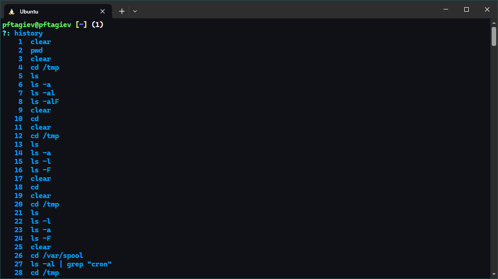{#fig:016}

Вызовем модифицированные команды из буфера команд как показано на рис. [-@fig:017] в `prompt` `(2)` - `(4)`.

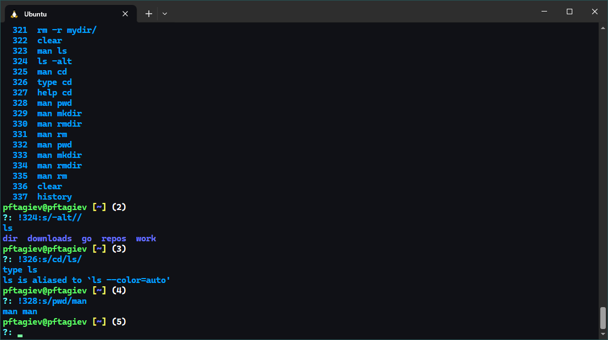{#fig:017}

# Ответы на контрольные вопросы

1. Что такое командная строка?\
Это способ взаимодействия между человеком и компьютером путём отправки компьютеру команд, представляющих собой последовательность символов. Команды интерпретируются с помощью специального интерпретатора, называемого оболочкой. Интерфейс командной строки противопоставляется системам управления программой на основе меню, а также различным реализациям графического интерфейса [@wiki_cmd].
2. При помощи какой команды можно определить абсолютный путь текущего каталога? Приведите пример.\
Это можно сделать при помощи команды `pwd`{.bash}. Например, находясь в каталоге `~/downloads`{.bash}, 
команда `pwd` выведет следующее\
`/home/имя_пользователя/downloads`{.bash}.
3. При помощи какой команды и каких опций можно определить только тип файлов и их имена в текущем каталоге? Приведите примеры.\
При помощи команды `ls`{.bash} с флагом `-F`{.bash}, пример можно увидеть на рис. [-@fig:002] в `prompt`{.bash} `(5)`.
4. Каким образом отобразить информацию о скрытых файлах? Приведите примеры.\
Для этого нужно испльзовать команду `ls`{.bash} с флагом `-a`{.bash}, пример уже встречался в отчете на рис. [-@fig:002] в `prompt`{.bash} `(4)`.
5. При помощи каких команд можно удалить файл и каталог? Можно ли это сделать одной и той же командой? Приведите примеры.\
Файл можно удалить командой `rm`{.bash}, каталог, если он пустой, удаляется командой `rmdir`{.bash}. Командой `rm`{.bash} можно удалить и каталог,
но нужно добавить флаг `-r`{.bash}.
6. Каким образом можно вывести информацию о последних выполненных пользователем командах?\
Можно использовать `history N`{.bash}, где `N` - количество последних команд.
7. Как воспользоваться историей команд для их модифицированного выполнения? Приведите пример.\
Нужно использовать конструкцию: `!номер_команды:s/паттерн/на_что_меняем/`{.bash}. Номер команды можно получить
при помощи команды `history`{.bash}. Пример использования можно увидеть на рис. [-@fig:017].
8. Приведите примеры запуска нескольких команд в одной строке.
    - `mkdir my_dir; cd my_dir; touch file.txt`{.bash}
    - `cd; ls -alF`{.bash}
    - `touch file.txt; mv file.txt ~`{.bash}
9. Дайте определение и приведите примеры символов экранирования.\
Экранирование символов - замена в тексте управляющих символов на соответствующие им последовательности символов[@escape_chars].
    - `mkdir my\ dir\ 1` - экранирование пробела при создании директории.
    - `echo \"text\"` - вывод текста в двойных кавычках.
10. Охаракатеризуйте вывод информации на экран после выполнения команды `ls`{.bash} с опцией `l`.\
Будет выведена подробна информация о каждом файле:
    - тип файла
    - право доступа
    - число ссылок 
    - владелец
    - размер
    - дата последней ревизии
    - имя каталога
11. Что такое относительный путь к файлу? Приведите примеры использования относительного и абсолютного пути при выполнении какой-либо команды.\
Оносительный путь всегда задается относительно рабочего каталога или активного приложения.
    - `cd ../../tmp/`{.bash} - такая команда, вызванная из домашнего каталога переместит нас в директорию `tmp/`{.bash} (пример использования относительного пути).
    - `cd /var/spool/`{.bash} - независимо от того в какой директории мы сейчас находимся, эта команда всегда переместит нас в `/var/spool/`{.bash} (пример использования абсолютного пути).
12. Как получить информацию об интересующей вас команде?\
Для этого существует команда `man <команда>`{.bash}. Eсли мануалов для текущей команды не существует, можно попробовать
получить краткую справку командой `help`{.bash}. У многих команд есть флаг `--help`{.bash}. 
13. Какая клавиша или комбинация клавиш служит для автоматического дополнения вводимых команд?\
Для автоматического дополнения команд можно использовать клавишу <kbd>TAB</kbd>.

# Выводы

В этой работе мы разоборали и использовали на практике основные команды терминала Linux. Узнали некоторые нюансы их применения.

# Список литературы{.unnumbered}

::: {#refs}
:::
