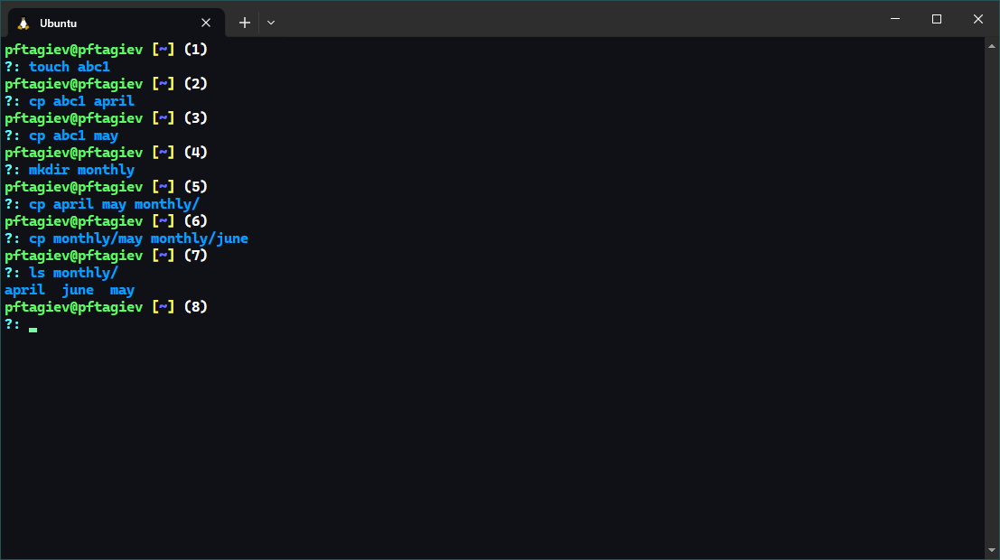
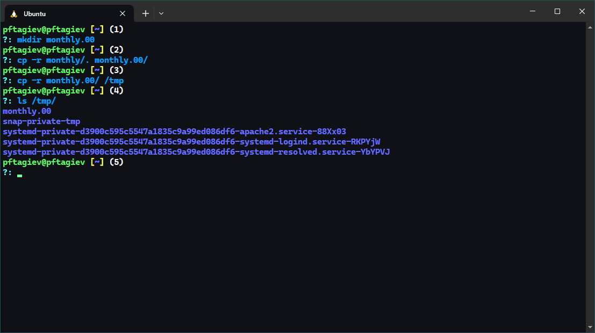
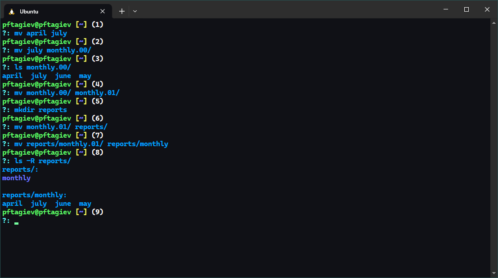
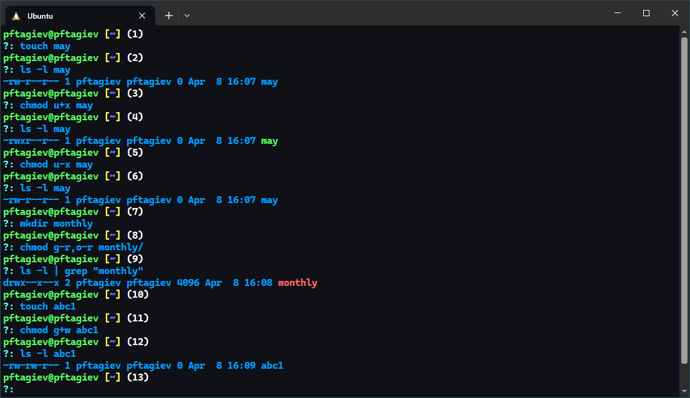
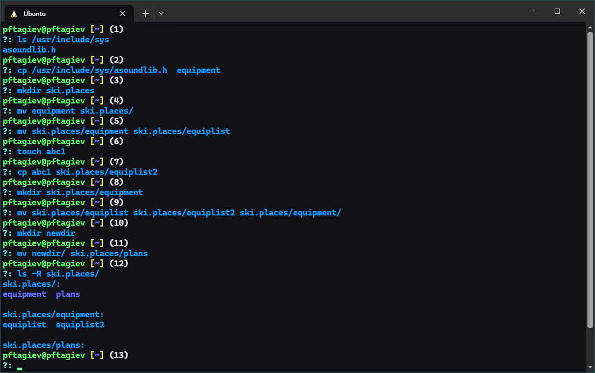
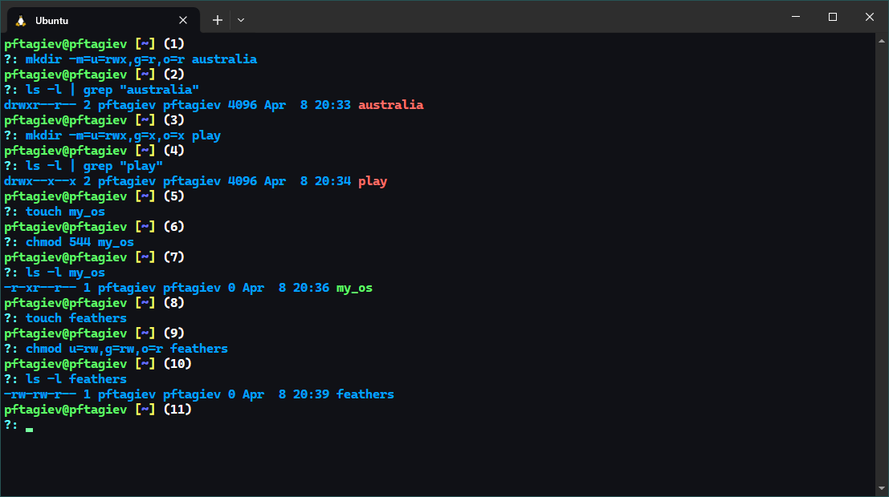
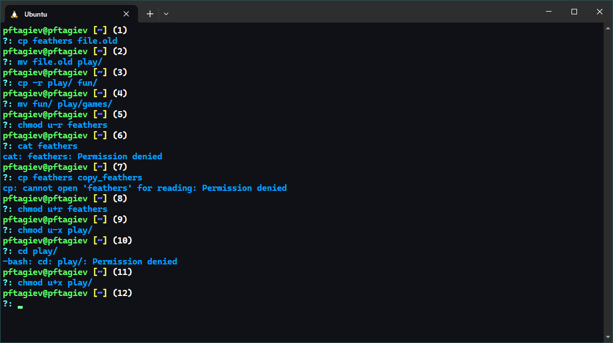
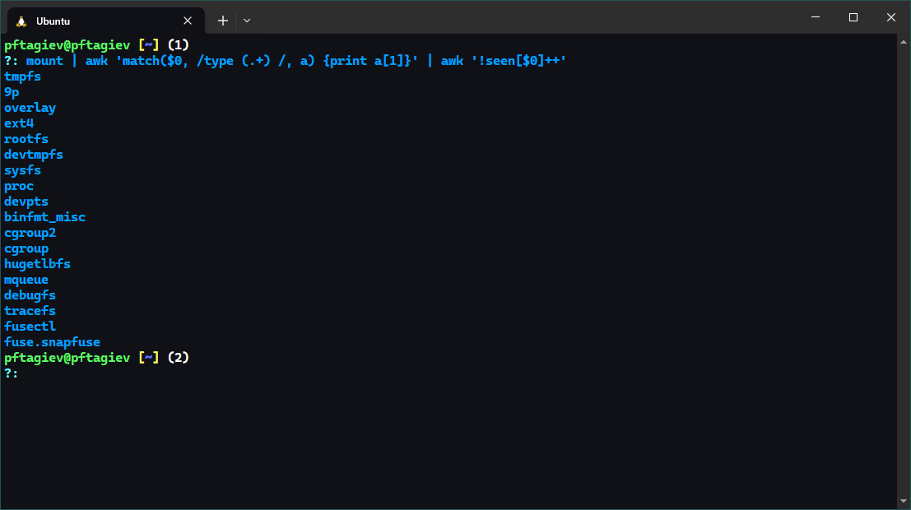

---
## Front matter
title: "Отчёт по лабораторной работе №5"
subtitle: "Анализ файловой структуры UNIX. Команды для работы с файлами и каталогами"
author: "Тагиев Павел Фаикович"

## Generic otions
lang: ru-RU
toc-title: "Содержание"

## Bibliography
bibliography: bib/cite.bib
csl: pandoc/csl/gost-r-7-0-5-2008-numeric.csl

## Pdf output format
toc: true # Table of contents
toc-depth: 2
lof: true # List of figures
lot: false # List of tables
fontsize: 12pt
linestretch: 1.5
papersize: a4
documentclass: scrreprt
## I18n polyglossia
polyglossia-lang:
  name: russian
  options:
	- spelling=modern
	- babelshorthands=true
polyglossia-otherlangs:
  name: english
## I18n babel
babel-lang: russian
babel-otherlangs: english
## Fonts
mainfont: PT Serif
romanfont: PT Serif
sansfont: PT Sans
monofont: PT Mono
mainfontoptions: Ligatures=TeX
romanfontoptions: Ligatures=TeX
sansfontoptions: Ligatures=TeX,Scale=MatchLowercase
monofontoptions: Scale=MatchLowercase,Scale=0.9
## Biblatex
biblatex: true
biblio-style: "gost-numeric"
biblatexoptions:
  - parentracker=true
  - backend=biber
  - hyperref=auto
  - language=auto
  - autolang=other*
  - citestyle=gost-numeric
## Pandoc-crossref LaTeX customization
figureTitle: "Рис."
tableTitle: "Таблица"
listingTitle: "Листинг"
lofTitle: "Список иллюстраций"
lotTitle: "Список таблиц"
lolTitle: "Листинги"
## Misc options
indent: true
header-includes:
  - \usepackage{indentfirst}
  - \usepackage{float} # keep figures where there are in the text
  - \floatplacement{figure}{H} # keep figures where there are in the text
---

# Цель работы

Ознакомление с файловой системой Linux, её структурой, именами и содержанием
каталогов. Приобретение практических навыков по применению команд для работы
с файлами и каталогами, по управлению процессами (и работами), по проверке 
использования диска и обслуживанию файловой системы.

# Задание

1. Выполните все примеры, приведенные в первой части описания лабораторной работы.
2. Выполните следующие действия, зафиксировав в отчёте по лабораторной работе
используемые при этом команды и результаты их выполнения:
    1. Скопируйте файл `/usr/include/sys/io.h` в домашний каталог и назовите его
    equipment. Если файла `io.h` нет, то используйте любой другой файл в каталоге
    `/usr/include/sys/` вместо него.
    2. В домашнем каталоге создайте директорию `~/ski.places`.
    3. Переместите файл equipment в каталог `~/ski.places`.
    4. Переименуйте файл `~/ski.places/equipment` в `~/ski.places/equiplist`.
    5. Создайте в домашнем каталоге файл `abc1` и скопируйте его в каталог
    `~/ski.places`, назовите его `equiplist2`.
    6. Создайте каталог с именем `equipment` в каталоге `~/ski.places`.
    7. Переместите файлы `~/ski.places/equiplist` и `equiplist2` в каталог
    `~/ski.places/equipment`.
    8. Создайте и переместите каталог `~/newdir` в каталог `~/ski.places` и назовите
    его `plans`.
3. Определите опции команды chmod, необходимые для того, чтобы присвоить перечисленным 
ниже файлам выделенные права доступа, считая, что в начале таких прав нет:
    1. `drwxr--r-- ... australia`{.bash}
    2. `drwx--x--x ... play`{.bash}
    3. `-r-xr--r-- ... my_os`{.bash}
    4. `-rw-rw-r-- ... feathers`{.bash}
4. Проделайте приведённые ниже упражнения, записывая в отчёт по лабораторной
работе используемые при этом команды:
    1. Просмотрите содержимое файла `/etc/passwd`.
    2. Скопируйте файл ~/feathers в файл `~/file.old`.
    3. Переместите файл `~/file.old` в каталог `~/play`.
    4. Скопируйте каталог `~/play` в каталог `~/fun`.
    5. Переместите каталог `~/fun`в каталог `~/play` и назовите его `games`.
    6. Лишите владельца файла `~/feathers` права на чтение.
    7. Что произойдёт, если вы попытаетесь просмотреть файл 
    `~/feathers` командой cat?
    8. Что произойдёт, если вы попытаетесь скопировать файл `~/feathers`?
    9. Дайте владельцу файла `~/feathers` право на чтение.
    10. Лишите владельца каталога `~/play` права на выполнение.
    11. Перейдите в каталог `~/play`. Что произошло?
    12. Дайте владельцу каталога `~/play` право на выполнение.
5. Прочитайте man по командам `mount`{.bash}, `fsck`{.bash}, `mkfs`{.bash}, `kill`{.bash} и 
кратко их охарактеризуйте, приведя примеры.

Задание и цель работы сформированы в соответствии с [@yamad].

# Теоретическое введение

Файловая структура - это организация данных на компьютере или в другой информационной системе,
которая определяет, как файлы и директории организованы и взаимодействуют друг с другом [@file_structures].

Для различных манипуляций с файловой структурой в Linux применяются специальные команды, которые будут
рассмотрены и использованы мной по ходу выполнения этой работы.

# Выполнение лабораторной работы

## Задание 1: Выполнение примеров из описания работы

### Пример 1

{#fig:001}

Разберем пример на рис. [-@fig:001] в виде списка, пункты которого ссылаются на промты терминала:

- `(1)-(3)` --- Скопирован файл `~/abc1` в файл `april` и в файл `may`.
- `(4)-(5)` --- Скопированы файлы `april` и `may` в каталог `monthly`.
- `(6)-(7)` --- Скопирован файл `monthly/may` в файл с именем `monthly/june`.

### Пример 2

{#fig:002}

Разбор рис. [-@fig:002] ниже.

- `(1)-(2)` --- Скопирован каталог `monthly` в каталог `monthly.00`.
- `(3)` --- Скопирован каталог `monthly.00` в каталог `/tmp`.

### Пример 3

{#fig:003}

Пояснения в виде списка к рис. [-@fig:003]:

- `(1)` --- Изменено название файла `april` на `july` в домашнем каталоге.
- `(2)-(3)` --- Перемещен файл `july` в каталог `monthly.00`.
- `(5)-(6)` --- Перемещен каталог `monthly.01` в каталог `reports`.
- `(7)` --- Переименован каталог `reports/monthly.01` в `reports/monthly`.

### Пример 4

{#fig:004}

Разбор примера 4 (рис. [-@fig:004]) ниже в виде списка.

- `(1)-(4)` --- Cоздан файл `~/may` с правом выполнения для владельца.
- `(5)-(6)` --- Владелец файла `~/may` лишен права на выполнение.
- `(7)-(9)` --- Cоздан каталог `monthly` с запретом на чтение для 
членов группы и всех остальных пользователей
- `(10)-(12)` --- Cоздан файл `~/abc1` с правом записи для членов группы.

## Задание 2: Работа с файлами и каталогами

{#fig:005}

Выполненое задание 2 можно увидеть на рис. [-@fig:005], его разбор ниже в виде списка.

- `(1)-(2)` --- В каталоге `/usr/include/sys/` на моей системе не нашлось файла `io.h`, поэтому
я скопировал файл `asoundlib.h`.
- `(3)` --- В домашней директори создадим каталог `ski.places`.
- `(4)` --- Переместим файл `equipment` в каталог `~/ski.places`.
- `(5)` --- Переименуем файл `~/ski.places/equipment` в `~/ski.places/equiplist`.
- `(6)-(7)` --- Создадим в домашнем каталоге файл `abc1` и 
скопируем его в каталог `~/ski.places`, назвав `equiplist2`.
- `(8)` --- Создадим каталог с именем `equipment` в каталоге `~/ski.places`.
- `(9)` --- Переместим файлы `~/ski.places/equiplist` и `equiplist2` в каталог
`~/ski.places/equipment`.
- `(10)-(11)` --- Создадим и переместим каталог `~/newdir` в каталог 
`~/ski.places` и назовем его `plans`.
- `(12)` --- Итоговая структура папки `~/ski.places/`.

## Задание 3: Определения флагов комады chmod

Требуется определить какие фалги нужны команде `chmod`, чтобы задать
файлам следующие права доступа:

1. `drwxr--r-- ... australia`{.bash}
2. `drwx--x--x ... play`{.bash}
3. `-r-xr--r-- ... my_os`{.bash}
4. `-rw-rw-r-- ... feathers`{.bash}

{#fig:006}

Необходимые флаги можно увидеть на рис. [-@fig:006] в `(1)`, `(3)`, `(6)` и `(9)`.

## Задание 4: Права доступа и просмотр файлов

Посмотрим содержимое файла `/etc/passwd` используя команду `cat`{.bash} (рис. [-@fig:007]).

{#fig:007}

{#fig:008}

Оставшуюся часть задания можно увидеть на рис. [-@fig:008].

- `(1)` --- Скопируем файл `~/feathers` в файл `~/file.old`.
- `(2)` --- Переместим файл `~/file.old` в каталог `~/play`.
- `(3)` --- Скопируем каталог `~/play` в каталог `~/fun`.
- `(4)` --- Переместим каталог `~/fun` в каталог `~/play` и назовем его `games`.
- `(5)` --- Лишим владельца файла `~/feathers` права на чтение.
- `(6)` --- Как видно, теперь мы не можем прочитать этот файд командой `cat`, 
система выдает ошибку `Permission denied`{.bash} (доступ запрещен).
- `(7)` --- Попытаясь **скопировать** файл `~/feathers` мы получим все ту же ошибку --- `Permission denied`{.bash}.
- `(8)` --- Вернем владельцу файла `~/feathers` право на исполнение.
- `(9)` --- Лишим владельца каталога `~/play` права на выполнение.
- `(10)` --- Теперь попытаясь перейти в этот каталог привычной нам командой `cd`{.bash}, 
мы получим ошибку `Permission denied`{.bash}.
- `(11)` --- Вернем владельцу каталога `~/play` право на выполнение.

## Задание 5: Просмотр документации mount, fsck, mkfs и kill

Прочитав документацию предложенную командой `man` по командам 
`mount`{.bash}, `fsck`{.bash} `mkfs`{.bash} и `kill`{.bash} (рис. [-@fig:009;-@fig:010;-@fig:011;-@fig:012]),
я подготовил краткое описание этих команд, оформленное в виде списка.

- `mount`{.bash} --- Эта команда в ОС Linux используется для подключения 
файловых систем к директориям в иерархии файловой системы. Она позволяет монтировать 
различные устройства и ресурсы, такие как жесткие диски, сетевые диски, USB-накопители и т. д., 
в определенные точки монтирования. Пример использования: `sudo mount /dev/sdb1 /mnt`{.bash}, пример 
монтирует раздел `/dev/sdb1` на точку монтирования `/mnt`.
- `fsck`{.bash} --- Используется для проверки и исправления ошибок файловых систем в 
Linux операционных системах, таких как Linux. Она анализирует структуру файловой 
системы и исправляет обнаруженные ошибки, такие как поврежденные индексы или блоки данных.
Пример использования: `sudo fsck /dev/sda1`{.bash}. Пример запускает `fsck` для проверки 
файловой системы на разделе `/dev/sda1`.
- `mkfs`{.bash} --- Используется для создания новой файловой системы на определенном устройстве
или разделе. Эта команда позволяет форматировать устройство с выбранной файловой системой,
такой как ext4, NTFS, или FAT32. Пример: `sudo mkfs -t ext4 /dev/sdb1`{.bash}. Этот пример 
создает новую файловую систему типа `ext4` на разделе `/dev/sdb1`. 
- `kill`{.bash} --- Используется для отправки сигналов процессам, что может привести к завершению 
или изменению поведения процесса. Пример использования: `kill -9 111`. Пример отправит
сигнал `SIGKILL` процессу с `PID 111`, что немедленно его завершит. 

{#fig:009}

{#fig:010}

{#fig:011}

{#fig:012}

# Ответы на контрольные вопросы

{#fig:013}

1. Дайте характеристику каждой файловой системе, существующей на жёстком диске
компьютера, на котором вы выполняли лабораторную работу (увидеть какие файловые системы существуют 
на моем диске можно на рис. [-@fig:013]).
    - `tmpfs` --- Временное файловое хранилище во многих Unix-подобных ОС. 
    Предназначена для монтирования файловой системы, но размещается в ОЗУ вместо физического диска.
    - `9p` --- Протокол файловой системы Plan 9 --- сетевой протокол, разработанный для распределённой
    операционной системы Plan 9 для организации соединения компонентов операционной системы Plan 9. 
    - `overlay` --- Это файловая система в Linux, которая позволяет объединять несколько 
    каталогов в один общий видимый для пользователя. Она используется для создания "наложенных" 
    файловых систем, в которых содержимое одной файловой системы помещается поверх другой, при 
    этом исходные файловые системы остаются неизменными. OverlayFS поддерживается ядром Linux и 
    широко используется в контейнерной виртуализации, такой как *Docker*.
    - `ext4` --- Это традиционная файловая система, используемая в операционной системе Linux.
    Она является улучшенной версией файловой системы ext3 и включает в себя множество 
    улучшений, таких как повышенная производительность, возможность работы с более 
    крупными файлами и файловыми системами, повышенная отказоустойчивость и улучшенное 
    журналирование. Ext4 позволяет эффективно организовывать данные на диске, обеспечивает 
    надежность и предоставляет высокую производительность как для обычных пользователей, 
    так и для серверных систем. Она широко используется в дистрибутивах Linux и обеспечивает 
    надежное хранение данных.
    - `rootfs` --- Это корневая файловая система в операционной системе Linux. 
    Она представляет собой начальную файловую систему, которая монтируется в 
    начале загрузки системы и содержит основные директории и файлы, необходимые 
    для запуска системы.
    - `devtmpfs` --- Это виртуальная файловая система, которая обеспечивает 
    динамическое управление файлами устройств в системе Linux.
    - `sysfs` --- виртуальная файловая система в операционной системе Linux. 
    Экспортирует в пространство пользователя информацию ядра Linux о присутствующих 
    в системе устройствах и драйверах. 
    - `proc` --- Специальная файловая система, используемая в Linux. Позволяет получить 
    доступ к информации из ядра о системных процессах. Необходима для выполнения 
    таких команд как `ps`{.bash}, `w`{.bash}, `top`{.bash}. Обычно её монтируют на `/proc`.
    - `devpts` --- Эта файловая система обеспечивает интерфейс для устройства 
    псвдотерминала (pty), который обычно монтируется в точке монтирования `/dev/pts`.
    - `binfmt_misc` --- Позволяет системе определять, каким образом исполнять файлы с 
    нестандартными форматами. С помощью `binfmt_misc` можно настраивать обработку исполняемых
    файлов различных форматов, не поддерживаемых по умолчанию операционной системой.
    - `cgroup` ---  Позволяет ограничивать и управлять ресурсами, потребляемыми группой процессов. 
    `cgroup` позволяет назначить ограничения по использованию CPU, памяти, дискового пространства 
    и других ресурсов для определенных процессов или групп процессов.
    - `cgroup2` --- это новая версия файловой системы контроля групп в ядре Linux, 
    предназначенная для ограничения и управления ресурсами процессов. 
    - `hugetblfs` --- Это специальная файловая система в Linux, которая предназначена для 
    управления большими страницами памяти (Huge Pages). Она позволяет выделить большие 
    страницы памяти (обычно размером 2 МБ или 1 ГБ) для определенных процессов или приложений, 
    что может улучшить производительность.
    - `mqueue` --- Позволяет процессам обмениваться сообщениями друг с другом. 
    Этот механизм позволяет создавать очереди сообщений, которые могут использоваться 
    для передачи данных между различными процессами. Каждое сообщение в очереди имеет 
    определенный тип и приоритет.
    - `debugfs` ---  Это виртуальная файловая система в ядре Linux, которая предназначена 
    для отладки и диагностики ядра и устройств.
    - `tracefs` --- Это файловая система в ядре Linux, предназначенная для отслеживания 
    и анализа действий ядра.
    - `fusectl` --- Это виртуальная файловая система, предназначенная для управления 
    монтированием и размонтированием файловых систем в пространстве пользователя.
    - `fuse.snapfuse` --- это файловая система, предназначенная для монтирования 
    образов снимков диска (snapshots) в качестве файловой системы. Она работает 
    на базе технологии FUSE (Filesystem in Userspace), что позволяет ей работать 
    независимо от ядра операционной системы.
2. Приведите общую структуру файловой системы и дайте характеристику каждой 
директории первого уровня этой структуры (для ответа на этот вопрос использовался [@wiki_fhs]).
    - `/bin` --- В этой директории хранятся основные исполняемые файлы, 
    необходимые для загрузки и функционирования операционной системы. К ним обычно 
    относятся утилиты командной строки, такие как `ls`, `cp`, `mv` и др.
    - `/boot` --- В этой директории находятся файлы, необходимые для загрузки 
    операционной системы, включая ядро Linux, файлы конфигурации 
    загрузчика, и другие компоненты загрузки.
    - `/dev` --- Эта директория содержит специальные файлы, представляющие 
    устройства в системе. Каждое устройство, подключенное к системе, представлено 
    в виде файла здесь, что позволяет программам взаимодействовать с ними как с файлами.
    - `/etc` ---  В этой директории хранятся системные конфигурационные файлы. 
    Важные файлы конфигурации, такие как `/etc/passwd`, `/etc/hosts` и другие, находятся здесь.
    - `/home` ---  Это домашние директории пользователей. Каждый пользователь имеет 
    свою собственную поддиректорию здесь, где он может хранить свои файлы и настройки.
    - `/lib` ---  В этой директории содержатся разделяемые библиотеки, необходимые 
    для работы программ в системе. Эти библиотеки используются программами во время выполнения.
    - `/media` --- Эта директория используется для монтирования временных съемных носителей.
    - `/mnt` --- Аналогично `/media`, эта директория используется для монтирования 
    временных файловых систем и других устройств.
    - `/opt` ---  В этой директории обычно устанавливаются дополнительные программы или 
    приложения, не входящие в стандартный дистрибутив операционной системы.
    - `/proc` ---  Эта директория представляет виртуальную файловую систему, 
    которая содержит информацию о текущих процессах и системных ресурсах.
    - `/root` --- Домашняя директория суперпользователя.
    - `/run` --- В этой директории хранятся временные файлы, созданные во время загрузки 
    системы, такие как PID-файлы и сокеты.
    - `/sbin` ---  Аналогично `/bin`, содержит исполняемые файлы, но обычно 
    доступен только администраторам системы.
    - `/srv` ---  Эта директория используется для данных, специфичных для различных 
    служб или сервисов, запущенных на системе.
    - `/tmp` --- Временная директория, предназначенная для хранения 
    временных файлов, созданных программами во время их работы. 
    Файлы здесь могут быть удалены при перезагрузке системы.
    - `/usr` --- Эта директория содержит пользовательские программы и файлы, 
    включая исполняемые файлы, библиотеки, заголовочные файлы и другие ресурсы.
    - `/var` --- В этой директории хранятся изменяющиеся данные системы, 
    такие как журналы системных событий, временные файлы, 
    базы данных, почтовые ящики и другие.
3. Какая операция должна быть выполнена, чтобы содержимое некоторой файловой
системы было доступно операционной системе?\
Для того чтобы содержимое файловой системы было доступно операционной системе Linux, 
необходимо выполнить `mount`{.bash} данной файловой системы. 
4. Назовите основные причины нарушения целостности файловой системы.
Как устранить повреждения файловой системы?
    - Причинами могут послужить:
        - Ошибки в работе жесткого диска.
        - Неправильное завершение работы приложений или операционной системы.
        - Неправильное использование команд для работы с файловой системой.
        - Неожиданное отключение питания или сбой в работе системы.
    - Для устранения повреждений файловой системы можно использовать слелующие методы:
        - Проверка и восстановление файловой системы с помощью утилиты `fsck`.
        - Перезагрузка системы в режиме восстановления и выполнение проверки и восстановления файловой системы.
        - Восстановление файлов с помощью резервных копий, если они были созданы заранее.
5. Как создаётся файловая система?
Файловая система в ОС Linux создается командой `mkfs`{.bash}. Пример: `sudo mkfs -t ext4 /dev/sdb`{.bash}.
6. Дайте характеристику командам для просмотра текстовых файлов.
    - `cat`{.bash} --- Выводит содержимое файла в терминал. Эта команда удобна для просмотра файлов небольшого размера.
    - `less`{.bash} --- Команда для постраничного просмотра файла. 
    - `head`{.bash} --- Выводит первые строки файла, по умолчанию первые 10 строк.
    - `tail`{.bash} --- Выводит последние строки файла, по умолчанию последние 10 строк.
7. Приведите основные возможности команды `cp`{.bash} в Linux.\
Команда `cp`{.bash} используется для копирования файлов и каталогов. 
Например: `cp file1 file2 file3 ~/mydir`{.bash}.
8. Приведите основные возможности команды `mv`{.bash} в Linux\
Команды `mv`{.bash} предназначены для перемещения и переименования файлов
и каталогов. Переименование файла: `mv old_name new_name`{.bash}
9. Что такое права доступа? Как они могут быть изменены?\
Права доступа в Linux определяют, какие пользователи или группы пользователей 
имеют доступ к определенным файлам или каталогам, а 
также какие действия они могут с ними выполнять: чтение, запись, выполнение.
Чтобы изменить права доступа можно использовать команду `chmod`{.bash}.
Пример использования команды: `chmod u=rwx,g+rx file.txt`{.bash}.

# Выводы

В этой работе мы познакомились с устройством файловой системы ОС Linux и командами для взаимодействия с ней.
Научились копировать и перемещать файлы, а также задавать им права доступа.

# Список литературы{.unnumbered}

::: {#refs}
:::
