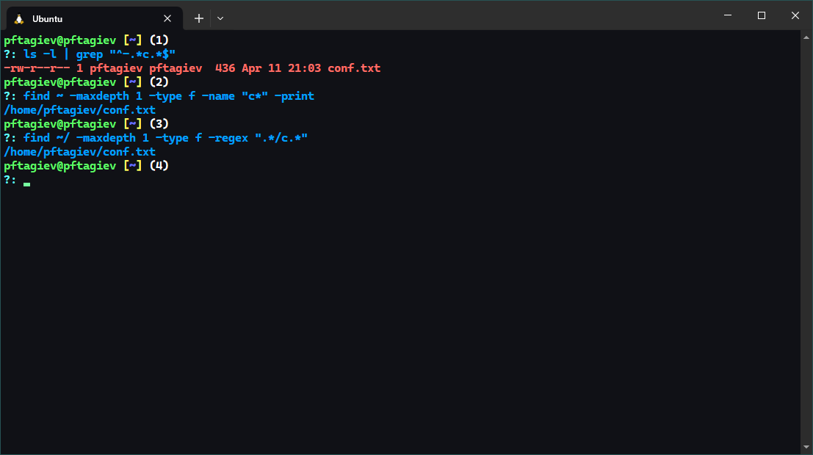
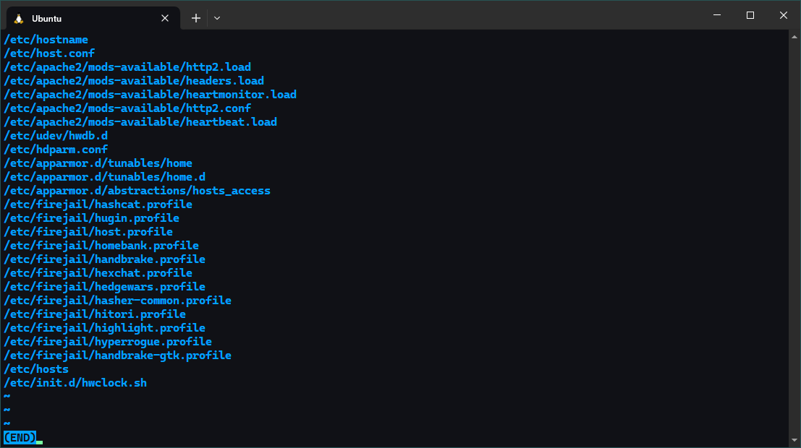
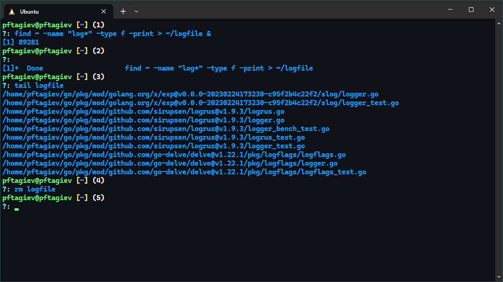
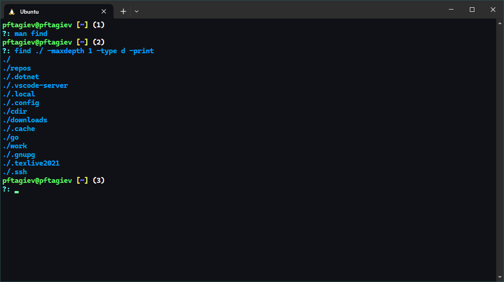

---
## Front matter
title: "Отчёт по лабораторной работе №6"
subtitle: "Поиск файлов. Перенаправление ввода-вывода. Просмотр запущенных процессов"
author: "Тагиев Павел Фаикович"

## Generic otions
lang: ru-RU
toc-title: "Содержание"

## Bibliography
bibliography: bib/cite.bib
csl: pandoc/csl/gost-r-7-0-5-2008-numeric.csl

## Pdf output format
toc: true # Table of contents
toc-depth: 2
lof: true # List of figures
lot: false # List of tables
fontsize: 12pt
linestretch: 1.5
papersize: a4
documentclass: scrreprt
## I18n polyglossia
polyglossia-lang:
  name: russian
  options:
    - spelling=modern
    - babelshorthands=true
polyglossia-otherlangs:
  name: english
## I18n babel
babel-lang: russian
babel-otherlangs: english
## Fonts
mainfont: PT Serif
romanfont: PT Serif
sansfont: PT Sans
monofont: PT Mono
mainfontoptions: Ligatures=TeX
romanfontoptions: Ligatures=TeX
sansfontoptions: Ligatures=TeX,Scale=MatchLowercase
monofontoptions: Scale=MatchLowercase,Scale=0.9
## Biblatex
biblatex: true
biblio-style: "gost-numeric"
biblatexoptions:
  - parentracker=true
  - backend=biber
  - hyperref=auto
  - language=auto
  - autolang=other*
  - citestyle=gost-numeric
## Pandoc-crossref LaTeX customization
figureTitle: "Рис."
tableTitle: "Таблица"
listingTitle: "Листинг"
lofTitle: "Список иллюстраций"
lotTitle: "Список таблиц"
lolTitle: "Листинги"
## Misc options
indent: true
header-includes:
  - \usepackage{indentfirst}
  - \usepackage{float} # keep figures where there are in the text
  - \floatplacement{figure}{H} # keep figures where there are in the text
---

# Цель работы

Ознакомление с инструментами поиска файлов и фильтрации текстовых данных.
Приобретение практических навыков: по управлению процессами (и заданиями), по
проверке использования диска и обслуживанию файловых систем [@yamad].

# Задание

1. Осуществите вход в систему, используя соответствующее имя пользователя.
2. Запишите в файл `file.txt` названия файлов, содержащихся в каталоге `/etc`{.bash}. 
Допишите в этот же файл названия файлов, содержащихся в вашем домашнем каталоге.
3. Выведите имена всех файлов из `file.txt`{.bash}, имеющих расширение `.conf`{.bash}, после чего
запишите их в новый текстовой файл `conf.txt`{.bash}.
4. Определите, какие файлы в вашем домашнем каталоге имеют имена, начинавшиеся
с символа `c`{.bash}? Предложите несколько вариантов, как это сделать.
5. Выведите на экран (по странично) имена файлов из каталога `/etc`{.bash}, начинающиеся
с символа `h`{.bash}.
6. Запустите в *фоновом режиме* процесс, который будет записывать в файл `~/logfile`
файлы, имена которых начинаются с `log`.
7. Удалите файл `~/logfile`.
8. Запустите из консоли в *фоновом режиме* редактор `gedit`{.bash}.
9. Определите идентификатор процесса `gedit`{.bash}, используя команду `ps`{.bash}, конвейер и фильтр
`grep`{.bash}. Как ещё можно определить идентификатор процесса?
10. Прочтите справку `man`{.bash} команды `kill`{.bash}, после чего используйте её для завершения
процесса `gedit`{.bash}.
11. Выполните команды `df`{.bash} и `du`{.bash}, предварительно получив более подробную информацию
об этих командах, с помощью команды `man`{.bash}.
12. Воспользовавшись справкой команды `find`{.bash}, выведите имена всех директорий, 
имеющихся в вашем домашнем каталоге.

# Теоретическое введение

В процессе работы с файловой системой Linux часто возникает необходимость 
в поиске определенных файлов по различным критериям, таким как имя файла, 
размер, тип и т.д. Мы рассмотрим различные инструменты командной строки, такие 
как `find`{.bash} и `grep`{.bash}, которые позволяют эффективно выполнять поиск файлов.

Перенаправление ввода-вывода --- еще один мощный механизм командной строки, 
который позволяет изменять потоки данных между программами и файлами.
Мы изучим основные способы перенаправления ввода-вывода, такие как 
использование символов перенаправления `>` `>>`, `<<` `<` и `|`, а также их 
применение в различных сценариях.

Для эффективного управления системой важно иметь возможность просматривать 
информацию о текущих процессах, запущенных на компьютере. Мы ознакомимся с 
командами `ps`{.bash}, `top`{.bash} и `htop`{.bash}, которые предоставляют 
информацию о процессах и ресурсах системы в реальном времени.

# Выполнение лабораторной работы

## Использование операторов перенаправления

Запишем в файл `file.txt` названия файлов в содержащихся в каталоге `/etc`.
Допишем в этот файл названия файлов, содержащихся в нашем домашнем каталоге.
Так как в задании не указано нужно ли записывать в `file.txt` содержимое 
и вложенных в `/etc` и `~` каталогов, я указал опции `--maxdepth` глубину `1`.
Проделаное можно увидеть на рис. [-@fig:001] на промтах `(1)` и `(2)`.

{#fig:001}

Выведем имена всех файлов из `file.txt` имеющих расширение `.conf`, после чего запишем
эти имена в файл `conf.txt`{.bash} (рис. [-@fig:001] промты `(3)` и `(4)`).

## Поиск файлов

Задание требует определить, какие ***файлы*** в нашем домашнем каталоге имеют имена начинающиеся
с символа `c`{.bash}. Несколько вариантов того, как это сделать можно увидеть на рис. [-@fig:002].

{#fig:002}

Далее нужно постранично вывести файлы из каталога `/etc` имена которых 
начинаются с символа `h` (рис. [-@fig:003;-@fig:004]).

{#fig:003}

{#fig:004}

## Запуск работы

Запустим в *фоновом режиме* процесс, который будет записывать в файл `~/logfile` файлы,
имена которых начинаются с `log`. Убедимся что процесс отработал правильно выведя
последние `10` строк файла `logfile` командой `tail`. Затем удалим его, как того 
требует задание (рис. [-@fig:005]). 

{#fig:005}

## Команды ps и kill

В терминале запустим редактор `gedit` в *фоновом режиме* как показано на рис. [-@fig:006].
На моей системе следует запускать `gedit` с правами суперпользователя, почему это 
так можно узнать в [@stack_exchange]. Определим `PID` процесса `gedit` используя комбинацию команд
`ps`{.bash} и `grep`{.bash}, так же можно использовать `pgrep <имя>`{.bash}, который производит поиск шаблона
по списку процессов, т. е. является аналогом комбинации `ps aux | grep "имя"`{.bash}. Или можно вевести запущенные работы 
командой `jobs`{.bash} (рис. [-@fig:008]).

{#fig:006}

{#fig:008}

Воспользовавшись документацией к команде `kill`{.bash} (рис. [-@fig:007]). Завершим процесс 
`gedit` как показано на рис. [-@fig:008] на промте `(5)` (так как я запустил `gedit` с правами суперпользователя,
чтобы завершить процесс тоже нужны эти права).

{#fig:007}

## Команда df

Воспользовавшись документацией к команде `df`{.bash} (рис. [-@fig:009]), запустим ее с флагом `-h` для вывода
размеров монтированных файловых систем в человекочитаемом формате (рис. [-@fig:010]).

{#fig:010}

{#fig:009}

## Команда du

Откроем документацию к команде `du`{.bash} (рис. [-@fig:011]). Узнав новые для себя опции воспользуемся этой
командой чтобы узнать размер каталога `/tmp`{.bash} как показано на рис. [-@fig:012]. Флаг `-s` означает
***summarize*** т. е. сумма размеров всех файлов и каталогов, `-h` --- уже знакомый нам флаг ***human readable format***.
Для каталога  `/tmp` запускать эту команду нужно с правами суперпользователя так как там могут встретиться 
файлы котрые запрещено читать кому-то кроме пользователя `root`.

{#fig:012}

{#fig:011}

## Имена всех директорий в домашнем каталоге

Прочитав документацию к команде `find`{.bash} (рис. [-@fig:013]), становится ясно что можно указать тип файлов для которых будет
производиться поиск. Для директорий нужно указать флаг `-type` со значением `d`, еще я указал глубину поиска `1`, чтобы искать
только в домашней директории и не учитывать вложенные каталоги. Результат можно увидеть на рис. [-@fig:014].

{#fig:013}

{#fig:014}

# Ответы на контрольные вопросы

1. Какие потоки ввода вывода вы знаете?
    - `stdin`{.bash} --- Стандартный поток ввода (по умолчанию: клавиатура), файловый дескриптор `0`.
    - `stdout`{.bash} --- Стандартный поток вывода (по умолчанию: консоль), файловый дескриптор `1`.
    - `stderr`{.bash} ---  Стандартный поток вывод сообщений об ошибках (по умолчанию: консоль), файловый дескриптор `2`.
2. Объясните разницу между операцией `>` и `>>`.
    - `>` --- Перенаправление вывода в файл, содержимое файла будет перезаписано.
    - `>>` --- Перенаправление вывода в файла, новая информация будет добавляться в конец файла.
3. Что такое конвейер?\
Конвейер или пайп служит для объединения простых команд или утилит в цепочки, 
в которых результат работы предыдущей команды передаётся последующей. 
Синтаксис следующий: `команда 1 | команда 2`, это означает что вывод `команды 1` будет
передан на ввод `команде 2`.
4. Что такое процесс? Чем это понятие отличается от программы?\
Процесс - это экземпляр программы, который выполняется на компьютере в определенный 
момент времени. Программа, с другой стороны, представляет собой статический набор 
инструкций и данных, который сохранен на диске и ожидает выполнения.
5. Что такое `PID` и `GID`?
    - `PID` --- Это уникальный числовой идентификатор, присваиваемый операционной системой 
    каждому процессу при его создании. `PID` используется для идентификации и управления процессами 
    в системе. Когда вы запускаете программу или команду в терминале, операционная система назначает 
    ей уникальный `PID`, который может быть использован для мониторинга, завершения или взаимодействия 
    с процессом.
    - `GID` --- Это числовой идентификатор, связанный с определенной группой пользователей на 
    операционной системе. Каждый пользователь может принадлежать одной или нескольким группам, 
    и `GID` используется для определения принадлежности пользователей к этим группам. `GID` может 
    использоваться для управления правами доступа к файлам и ресурсам, которые принадлежат 
    определенной группе пользователей.
6. Что такое задачи и какая команда позволяет ими управлять?\
Задачами называются запущенные фоном программы, например `gedit &`{.bash}. 
Ими можно управлять с помощью команды `jobs`, которая выводит список запущенных в данный момент задач.
Для завершения задачи необходимо выполнить команду `kill %номер_задачи`{.bash}.
7. Найдите информацию об утилитах `top`{.bash} и `htop`{.bash}. Каковы их функции?\
Утилиты `top`{.bash} и `htop`{.bash} это в первую очередь, более удобная альтернатива командам 
`ps` и `kill`. Интерфейс обеих утилит можно увидеть на рис. [-@fig:015;-@fig:016]. Ниже можно увидеть
более подробную информацию по этим утилитам:
    - `top` --- это утилита которая 
    предоставляет информацию о запущенных процессах и 
    использовании системных ресурсов. Она отображает список 
    процессов в реальном времени, упорядоченных по использованию 
    процессора по умолчанию. `top` предоставляет информацию о загрузке 
    процессора, памяти, `swap-памяти`, а также общее количество 
    процессов и их состояние. Пользователь может взаимодействовать с `top`, 
    например, изменять порядок сортировки, убивать процессы и так далее, 
    используя различные команды [@wiki_top].
    - `htop` --- это интерактивная утилита командной строки, которая предоставляет 
    более удобный и информативный способ отображения информации о 
    процессах и ресурсах системы по сравнению с `top`. Она предоставляет аналогичную 
    информацию о процессах, загрузке процессора, памяти и других системных 
    ресурсах, но с более удобным интерфейсом и возможностями. `htop` позволяет пользователю 
    взаимодействовать с процессами и ресурсами через графический интерфейс в терминале, 
    что делает ее более удобной и интуитивно понятной для использования. Она поддерживает 
    прокрутку, цветовую кодировку, динамическое обновление и другие функции, которые делают 
    мониторинг и управление процессами более эффективными [@wiki_htop].
8. Назовите и дайте характеристику команде поиска файлов. Приведите примеры использования этой команды.\
Для поиска файлов используется команда `find`{.bash}. `find`{.bash} --- это мощная утилита командной строки, 
которая предназначена для поиска файлов и директорий в файловой системе на основе различных критериев. 
Далее можно увидеть несколько примеров ее использования:
    - `find ~ -maxdepth 1 -type f -name "*rc" -print`{.bash} --- Найти все файлы в домашней директории, которые
    заканчиваются на `rc`.
    - `sudo find /etc -name ".*" -type f -print`{.bash} --- Вывести скрытые файлы директории `/etc` и всех 
    директорий вложенных в нее.
    - `find ~ -maxdepth 1 -type f -exec head -1 {} \;`{.bash} --- Вывести первую строку каждого файла в домашней директории.
9. Можно ли по контексту (содержанию) найти файл? Если да, то как?\
Да можно, для этого нужно использовать команду `grep`{.bash}.
Например команда `grep -rn "int main()" --include=*.{c,cpp}`{.bash}
выведет имена всех файлов с расширением `.c` и `.cpp`, 
где встретилась строка `"int main()"`{.bash}.
10. Как определить объем свободной памяти на жёстком диске?\
Можно воспользоваться командой `df` с флагом `-h` (***human-readable*** --- человекочитаемый формат), 
она выведет список всех монтированных файловых систем. В этом списке в колонке `Avail`{.bash} 
будет написано количество сводобной памяти. 
11. Как определить объем вашего домашнего каталога?\
Можно воспользоваться командой `du ~ -hs`{.bash}, где флаг `-h` означает ***human-readable***,
а флаг `-s` ***summarize***, т. е. выводить суммарный объем директории.
12. Как удалить зависший процесс?\
Зависший процесс может быть удален командой `kill`{.bash} с флагом `-9`{.bash} или 
с флагом `-s`{.bash} и значением `KILL`{.bash}. Например, `kill -s KILL <id_процесса>`{.bash}.
Узнать `id` процесса можно выведя их список в терминал с помощью команды `ps aux`{.bash}. Также можно
передать этот список через пайп утилите `grep`{.bash}, чтобы разобрать его регулярным выражением и найти `id` нужного
процесса. Пример: `ps aux | grep -i "my_app"`{.bash}.

{#fig:015}

{#fig:016}

# Выводы

В этой работе мы более подробно разобрали работу с файлами в Linux. Научились перенаправлять вывод
специальными операторами, познакомились с мощьной утилитой `find`{.bash} и использовали ее на практике.
Научились запускать процессы в фоне и управлять ими.

# Список литературы{.unnumbered}

::: {#refs}
:::
