---
## Front matter
title: "Отчёт по лабораторной работе №7"
subtitle: "Командная оболочка Midnight Commander"
author: "Тагиев Павел Фаикович"

## Generic otions
lang: ru-RU
toc-title: "Содержание"

## Bibliography
bibliography: bib/cite.bib
csl: pandoc/csl/gost-r-7-0-5-2008-numeric.csl

## Pdf output format
toc: true # Table of contents
toc-depth: 2
lof: true # List of figures
lot: true # List of tables
fontsize: 12pt
linestretch: 1.5
papersize: a4
documentclass: scrreprt
## I18n polyglossia
polyglossia-lang:
  name: russian
  options:
    - spelling=modern
    - babelshorthands=true
polyglossia-otherlangs:
  name: english
## I18n babel
babel-lang: russian
babel-otherlangs: english
## Fonts
mainfont: PT Serif
romanfont: PT Serif
sansfont: PT Sans
monofont: PT Mono
mainfontoptions: Ligatures=TeX
romanfontoptions: Ligatures=TeX
sansfontoptions: Ligatures=TeX,Scale=MatchLowercase
monofontoptions: Scale=MatchLowercase,Scale=0.9
## Biblatex
biblatex: true
biblio-style: "gost-numeric"
biblatexoptions:
  - parentracker=true
  - backend=biber
  - hyperref=auto
  - language=auto
  - autolang=other*
  - citestyle=gost-numeric
## Pandoc-crossref LaTeX customization
figureTitle: "Рис."
tableTitle: "Таблица"
listingTitle: "Листинг"
lofTitle: "Список иллюстраций"
lotTitle: "Список таблиц"
lolTitle: "Листинги"
## Misc options
indent: true
header-includes:
  - \usepackage{indentfirst}
  - \usepackage{float} # keep figures where there are in the text
  - \floatplacement{figure}{H} # keep figures where there are in the text
---

# Цель работы

Освоение основных возможностей командной оболочки `Midnight Commander`. Приобретение навыков практической 
работы по просмотру каталогов и файлов; манипуляций с ними.


# Задание

## Задание по mc

1. Изучите информацию о `mc`, вызвав в командной строке man `mc`.
2. Запустите из командной строки `mc`, изучите его структуру и меню.
3. Выполните несколько операций в mc, используя управляющие клавиши (операции с панелями; выделение/отмена выделения файлов,\
копирование/перемещение файлов, получение информации о размере и правах доступа на файлы и/или каталоги и т. п. ).
4. Выполните основные команды меню левой (или правой) панели. Оцените степень подробности вывода информации о файлах.
5. Используя возможности подменю Файл, выполните:
    - просмотр содержимого текстового файла;
    - редактирование содержимого текстового файла (без сохранения результатов
    редактирования);
    - создание каталога;
    - копирование в файлов в созданный каталог.
6. С помощью соответствующих средств подменю Команда осуществите:
    - поиск в файловой системе файла с заданными условиями (например, файла
    с расширением `.c` или `.cpp`, содержащего строку `main`);
    - выбор и повторение одной из предыдущих команд;
    - переход в домашний каталог;
    - анализ файла меню и файла расширений.
7. Вызовите подменю Настройки. Освойте операции, определяющие структуру экрана `mc`
(Full screen, Double Width, Show Hidden Files и т.д.) [@yamad].

## Задание по встроенному редактору mc

1. Создайте текстовой файл `text.txt`.
2. Откройте этот файл с помощью встроенного в `mc` редактора.
3. Вставьте в открытый файл небольшой фрагмент текста, скопированный из любого
другого файла или Интернета.
4. Проделайте с текстом следующие манипуляции, используя горячие клавиши:
    1. Удалите строку текста.
    2. Выделите фрагмент текста и скопируйте его на новую строку.
    3. Выделите фрагмент текста и перенесите его на новую строку.
    4. Сохраните файл.
    5. Отмените последнее действие.
    6. Перейдите в конец файла (нажав комбинацию клавиш) и напишите некоторый
    текст.
    7. Перейдите в начало файла (нажав комбинацию клавиш) и напишите некоторый
    текст.
    8. Сохраните и закройте файл
5. Откройте файл с исходным текстом на некотором языке программирования (например C или Java)
6. Используя меню редактора, включите подсветку синтаксиса, если она не включена,
или выключите, если она включена [@yamad].

# Теоретическое введение

_Командная оболочка_ — интерфейс взаимодействия пользователя с операционной системой и программным обеспечением посредством команд.

_Midnight Commander_ (или `mc`) — псевдографическая командная оболочка для UNIX/Linux
систем. Для запуска `mc` необходимо в командной строке набрать `mc` и нажать **Enter**.

Далее мы подробно рассмотрим функционал `Midnight Commander`.

# Выполнение лабораторной работы

## Справка по и mc и его запуск

Изучим справку предоставленную командой `man`{.bash} по `Midnight Commander` (рис. [-@fig:001]) и запустим `mc`.

{#fig:001}

Мы увидим две рабочие панели на которых, в данный момент, отображается наша домашняя директория (рис. [-@fig:002]). 

{#fig:002}

Над панелями располагается меню доступа. Под панелями в самом низу расположены управляющие кнопки которые ассоциированы с функциональными
клавишами **F1** - **F10**. Их назначение можно увидть в табл. [-@tbl:001]. Над ними располагается командная строка.

: Описание функциональных клавиш {#tbl:001}

|Клавиша|Назначение|
|:-|:-|
|**F1**|Вызов контекстно-зависимой подсказки|
|**F2**|Вызов пользовательского меню|
|**F3**|Просмотр содержимого файла|
|**F4**|Редактирование файла|
|**F5**|Копирование файлов|
|**F6**|Перенос файлов|
|**F7**|Создание подкаталога|
|**F8**|Удаление файлов|
|**F9**|Вызов меню mc|
|**F10**|Выход из mc|

## Использование управляющих клавиш {#sec:001}

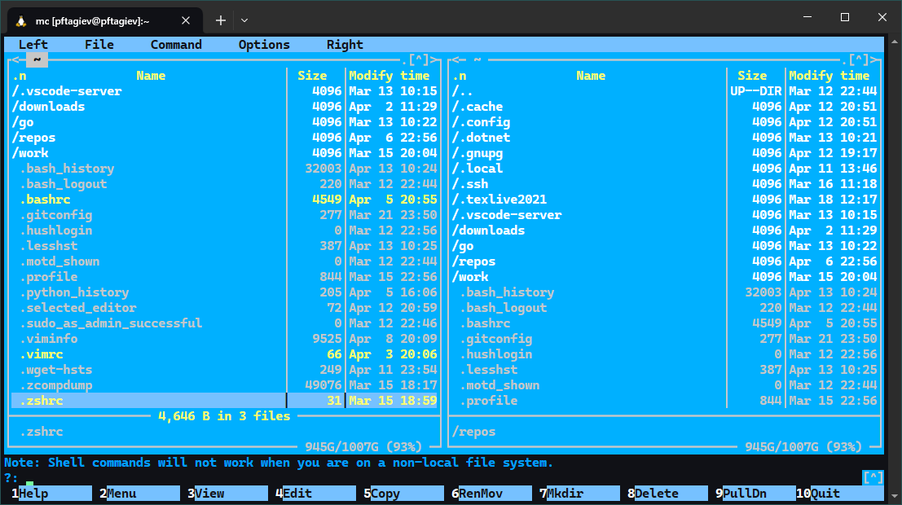{#fig:003}

Выделим комбинацией клавиш **CTRL** + **t** файлы `.bashrc`{.bash}, `.vimrc`{.bash}, `zshrc`{.bash}, как показано на рис. [-@fig:003].
Переключимся на правую панель клавишей **TAB**, создадим папку `rcdir` (рис. [-@fig:004]) и перейдем в нее. Клавишей **TAB** вернемся 
на левую панель и скопируем выделенные ранее файлы в папку `rcdir` (рис. [-@fig:005]). Чтобы узнать размер файлов в директории `rcdir`
установим выделение в правой панели на `/..` и нажмем комбинацию клавиш **CTRL** + **SPACE**. Результаты можно увидеть на рис. [-@fig:006].

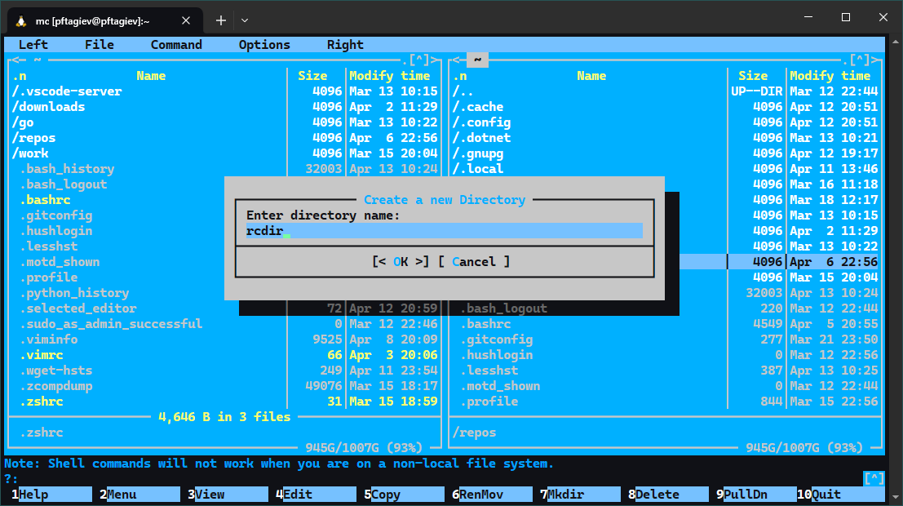{#fig:004}

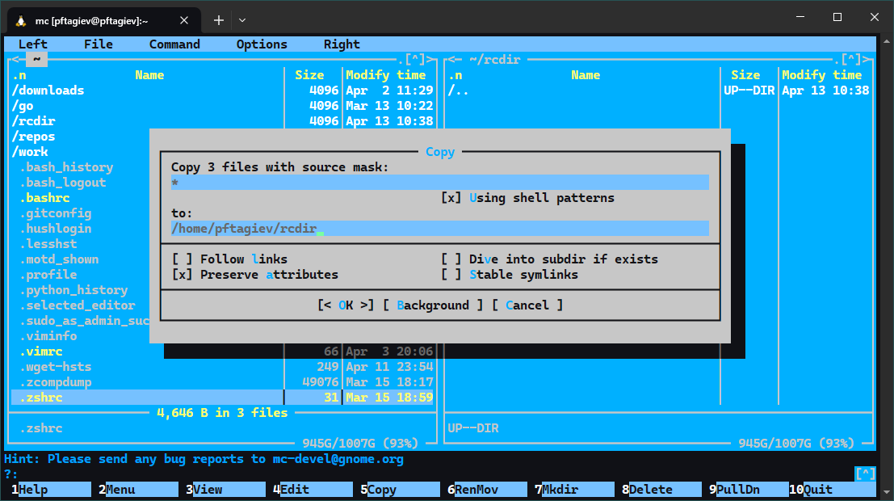{#fig:005}

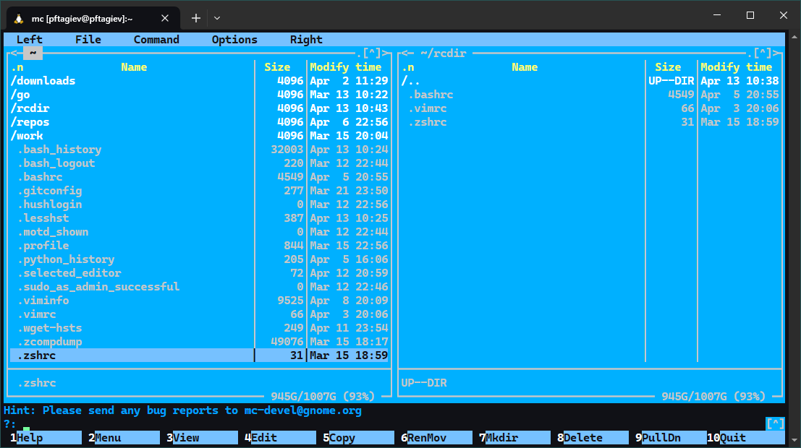{#fig:006}

Посмотрим какие права доступа у файла `.bashrc`. Для этого выделим его и воспользуемся комбинацией 
клавиш **CTRL** + **x** **c**, результат на рис. [-@fig:007].

{#fig:007}

Поменяем местами панели нажав **CTRL** + **u** (рис. [-@fig:008]) и перейдем в каталог выше т. е. в `~`, 
удалим ранее созданную папку `rcdir` (рис. [-@fig:009]).

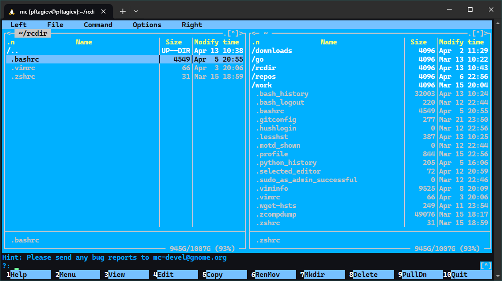{#fig:008}

{#fig:009}

## Основные команды меню панелей

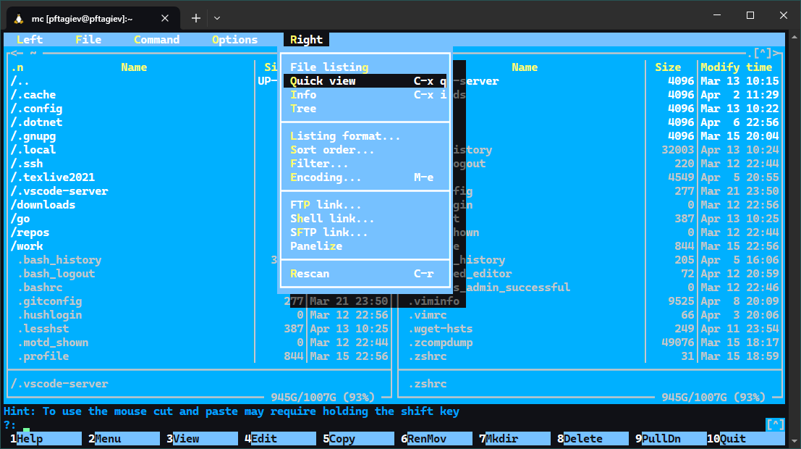{#fig:010}

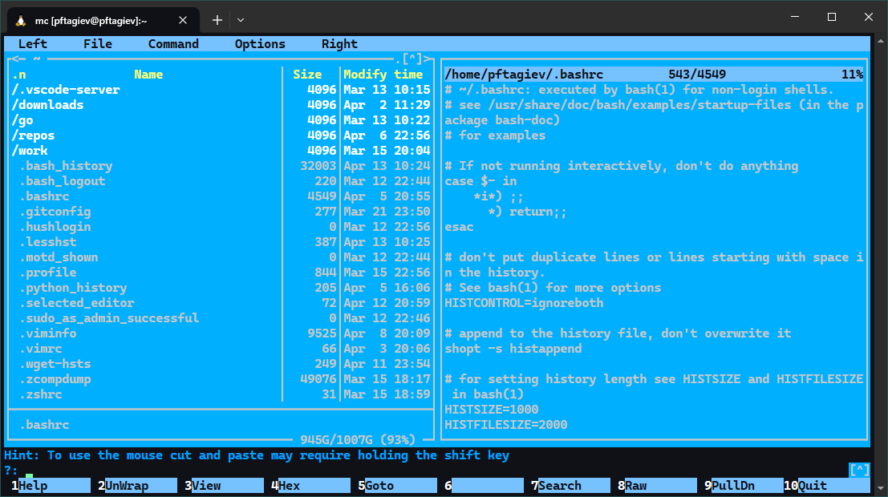{#fig:011}

Будем рассматривать это меню на примере правой панели. Целиком меню правой панели можно увидеть на рис. [-@fig:010].
После выбора пункта `Quick view` на правой панели будет отображаться содержимое файла, выделенного на левой панели,
как показано на рис. [-@fig:011]. Это достаточно удобно, но, к сожалению, открытый таким образом файл можно только читать,
запись недоступна.

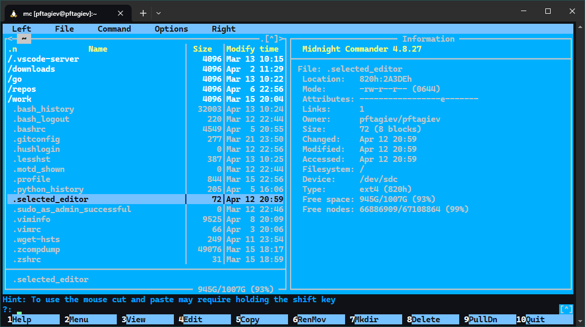{#fig:013}

Выберем пункт `Info` из меню на рис. [-@fig:010]. Теперь на правой панели отображается достаточно подробная 
информация о выбраном на левой панели файле (рис. [-@fig:013]).

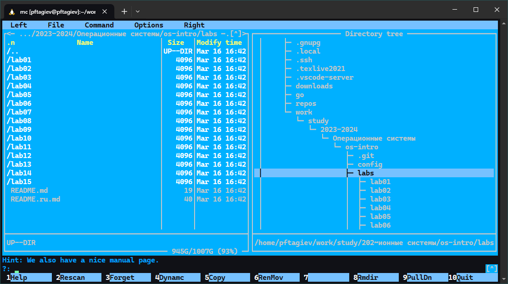{#fig:015}

Рассмотрим пункт `Tree` из меню на рис. [-@fig:010]. Он отображает структуру папок в виде дерева, 
которое можно увидеть на [-@fig:015]. Переключившись на панель с деревом, с ним можно будет взаимодействовать: 
содержимое папки выбранное внтури дерева будет отображаться на соседней панели. 

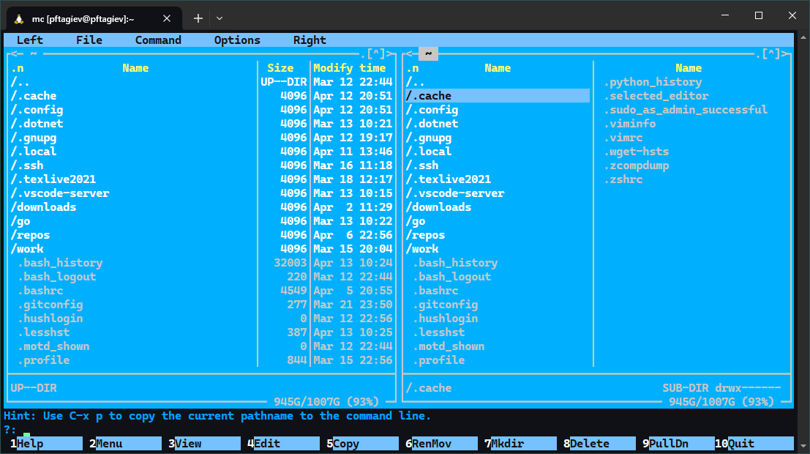{#fig:017}

Изменим формат отображения списка в правой панели, для этого воспользуемся пунктом `Listing format` из меню на рис. [-@fig:010].
Затем в открывшемся окне выберем `Brief file list`, оставим стандартное значение `2`. Результат можно увидеть на рис. [-@fig:017],
как видно, теперь список делится на две колонки.

## Подменю File

{#fig:0018.5}

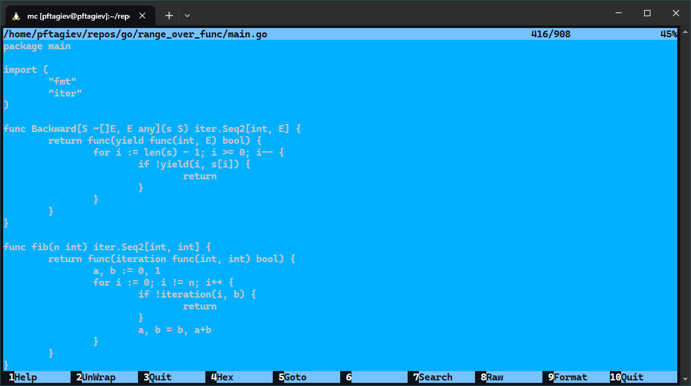{#fig:018}

То как выглядит подменю `File` можно увидеть на рис. [-@fig:0018.5].
Воспользуемся им чтобы открыть файл `main.go` в режиме просмотра, или же 
можно просто нажать клавишу **F3**. Открытый в режиме просмотра файл можно увидеть на рис. [-@fig:018].
Выйдем из режима просмотра нажав клавишу **F10**.

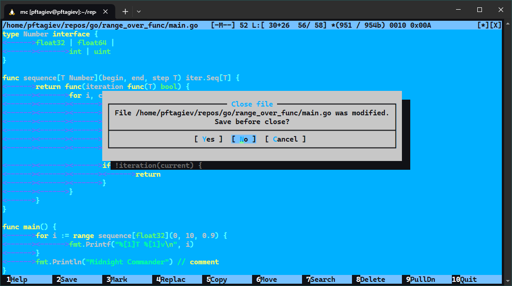{#fig:020}

В том же подменю на рис. [-@fig:0018.5], выберем пункт `Edit` или нажмем клавишу **F4**, предварительно
выбрав файл. Мы открыли файл в режиме редактирования, немного изменим его добавив строку:
```go
fmt.Println("Midnight Commander") // comment
```
Выйдем, нажав клавишу **F10** не сохранив изменения (рис. [-@fig:020]).

Создание каталога и копирование файлов в него было рассмотрено мной в разделе [-@sec:001], поэтому
я не буду рассматривать этот функционал повторно здесь.

## Подменю Command

{#fig:021}

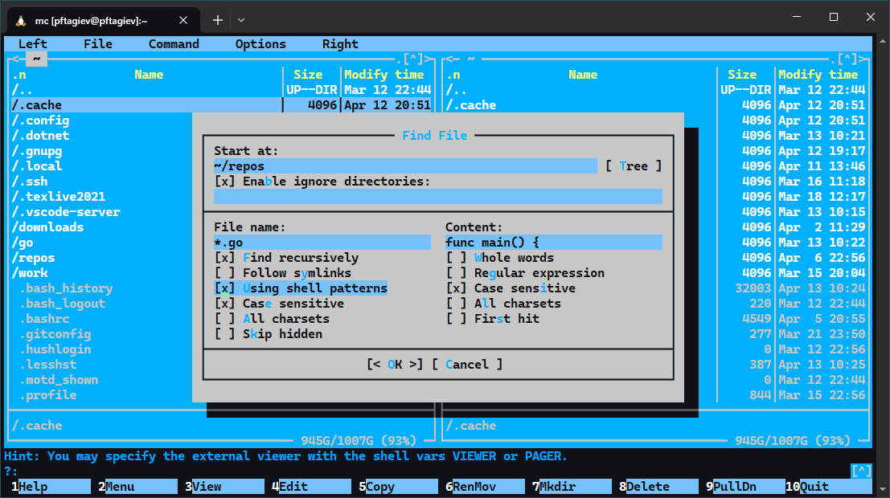{#fig:022}

Ознакомиться с подменю `Command` можно взглянув на рис. [-@fig:021]. Выберем пункт `Find file`,
так как по заданию требуется осуществить поиск по контексту. Мы будем искать файлы в директории `~/repos`, имена
которых соответствуют маске `*.go`{.bash} и имеют строку "`func main() {`{.go}" (рис. [-@fig:022]). Результаты поиска
можно увидеть на рис. [-@fig:023].

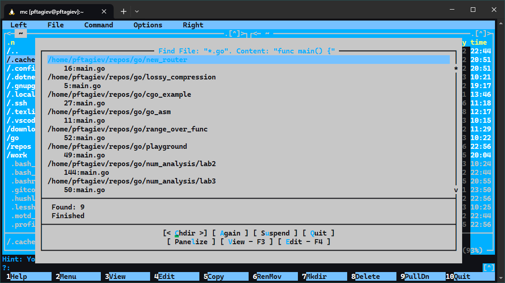{#fig:023}

Откроем историю команд, для этого выберм пункт `Command history` в меню на рис. [-@fig:021] или нажмем комбинацию клавиш
**ALT** + **h**. Выберм команду `echo "file.txt" > file.txt`{.bash} (рис. [-@fig:025]) и исполним ее, 
результат можно увидеть на рис. [-@fig:026].

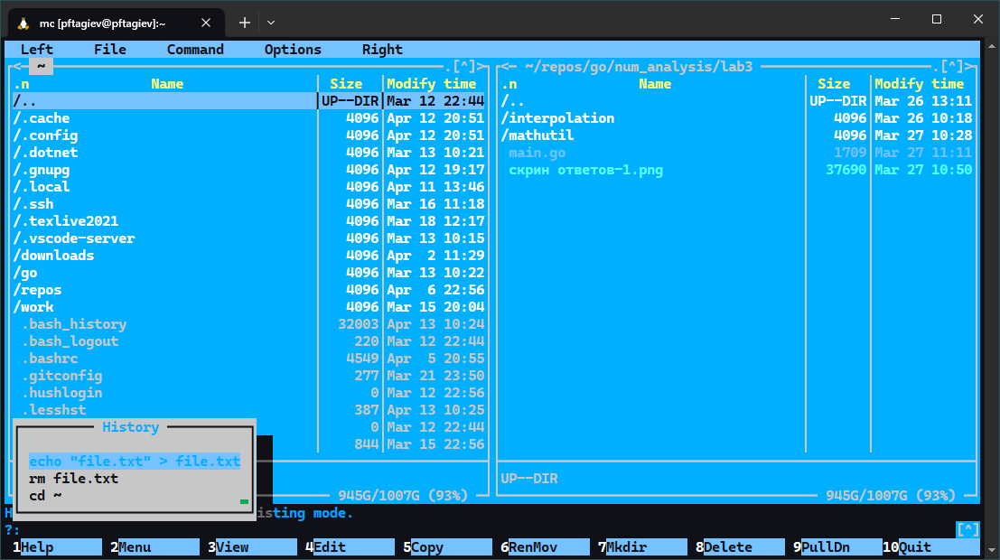{#fig:025}

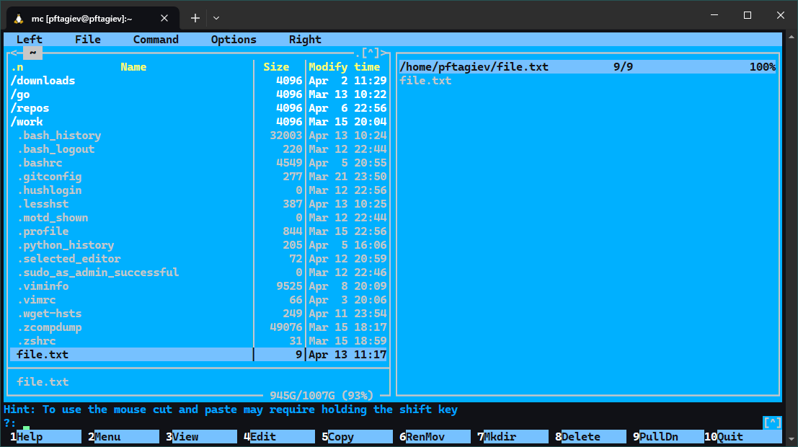{#fig:026}

{#fig:027}

Следуя заданию перейдем в домашний каталог, для этого используем комбинацию клавиш **ALT** + **c**. 
Введем в открывшемся окне `~` (рис. [-@fig:027]) и нажмем **ENTER**.

Далее рассмотрим файл меню и файл расширений. Доступ к ним можно получить через все то же меню `Command` 
через пунты `Edit menu file` и `Edit extension file` соответственно. Рассмотрим сначало файл меню. Как видно
на рис. [-@fig:030], он представляет из себя не что иное, как набор `shell`{.bash} скриптов. То же из себя
представляет и файл расширений на рис. [-@fig:029].

{#fig:030}

{#fig:029}

## Подменю Options

{#fig:032}

Подменю `Options` имеет вид как на рис. [-@fig:032]. Оно используется для изменения внешнего вида 
`Midnight Commander`. Использование пунктов предоставляемых этим меню можно увидеть на рис. 
[-@fig:031;-@fig:033;-@fig:034;-@fig:035;-@fig:036].

{#fig:031}

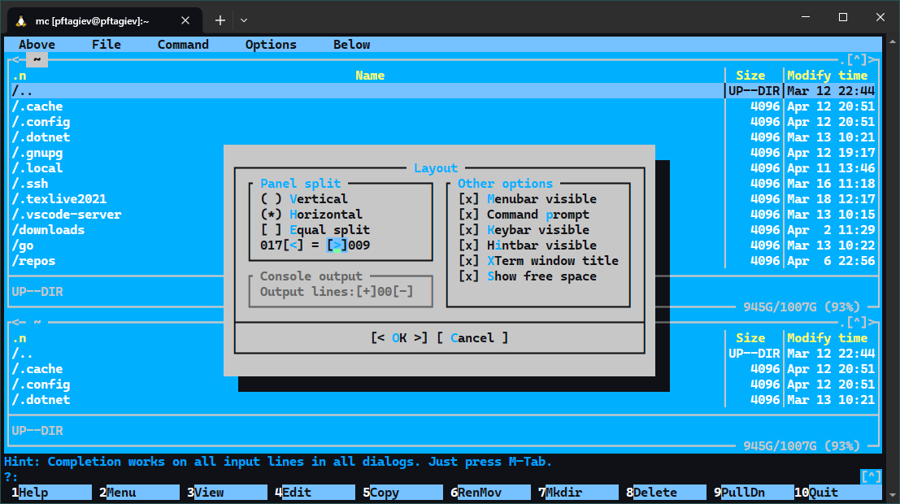{#fig:033}

{#fig:034}

{#fig:035}

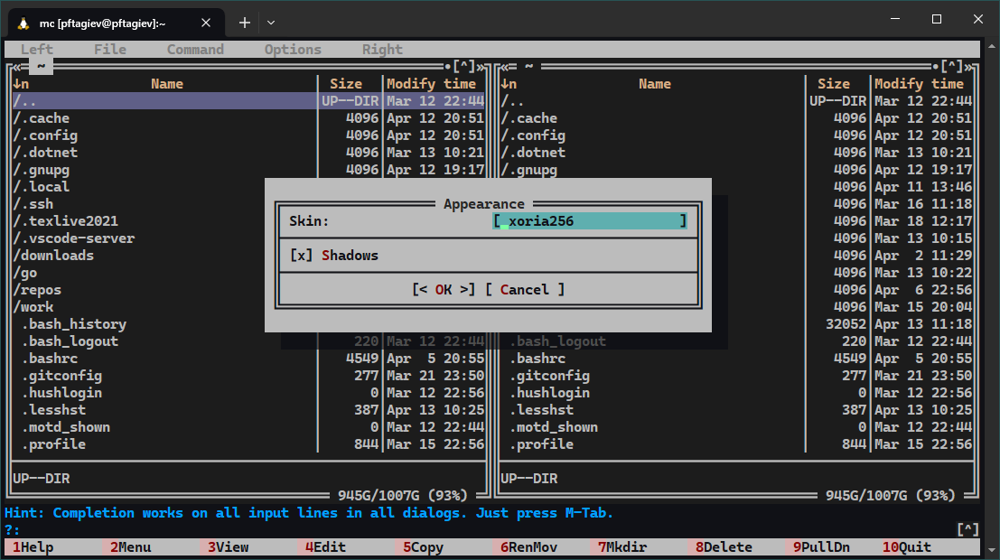{#fig:036}

## Использование встроенного редактора

: Горячие клавиши встроенного редактора `mc` {#tbl:002}

|Клавиша|Назначение|
|:-|:-|
|**CTRL** + **y**|удалить строку|
|**CTRL** + **u**|отмена последней операции|
|**INS**|вставка/замена|
|**F7**|поиск (можно использовать регулярные выражения)|
|**SHIFT** + **F7**|повтор последней операции поиска|
|**F4**|замена|
|**F3**|первое нажатие — начало выделения, второе — окончание выделения|
|**F5**|копировать выделенный фрагмент|
|**F6**|переместить выделенный фрагмент|
|**F8**|удалить выделенный фрагмент|
|**F2**|записать изменения в файл|
|**F10**|выйти из редактора|

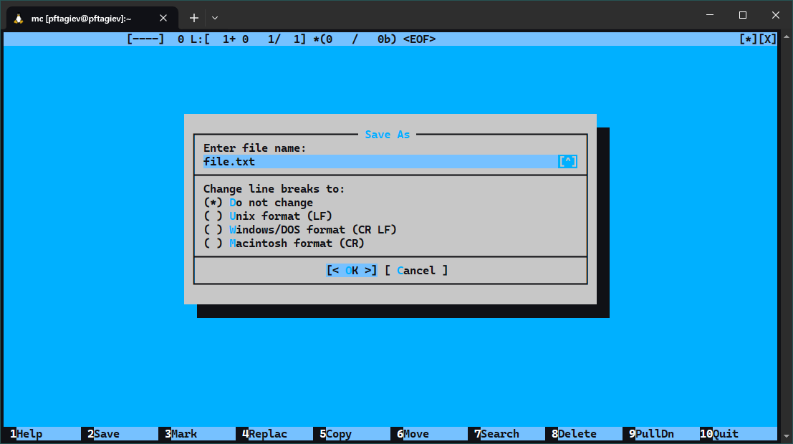{#fig:037}

Создадим новый файл используя комбинацию клавиш **SHIFT** + **F4**, сохраним его с именем `file.txt` (рис. [-@fig:037]). 
Затем вставим текст, который будем редактировать (рис. [-@fig:038]).

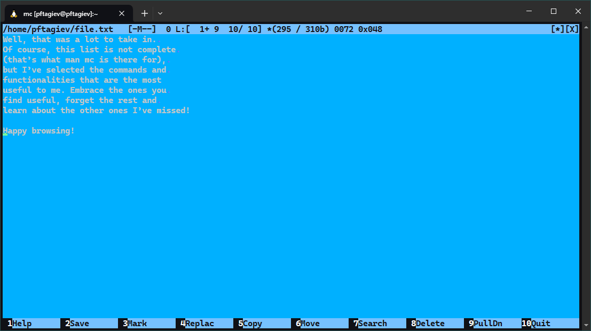{#fig:038}

Удалим последнюю строку файла, используя комбинацию клавиш **CTRL** + **y**, результат можно увидеть на рис. [-@fig:039].
Теперь выделим текст, для этого поставим курсор в начале фрагмента, нажем **F3**, затем перейдем в конец фрагмента и повторно нажмем **F3**. 
Перейдем на новую строку и копируем выделенный фрагмент клавишей **F5**.
Результат можно увидеть на рис. [-@fig:040].

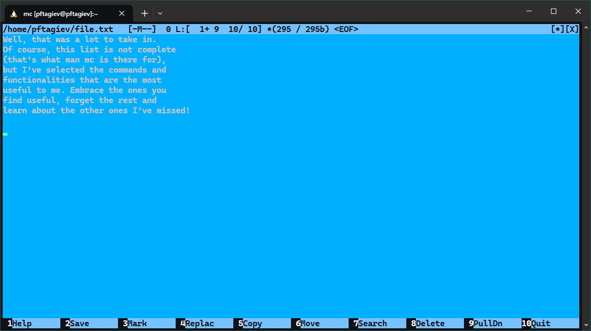{#fig:039}

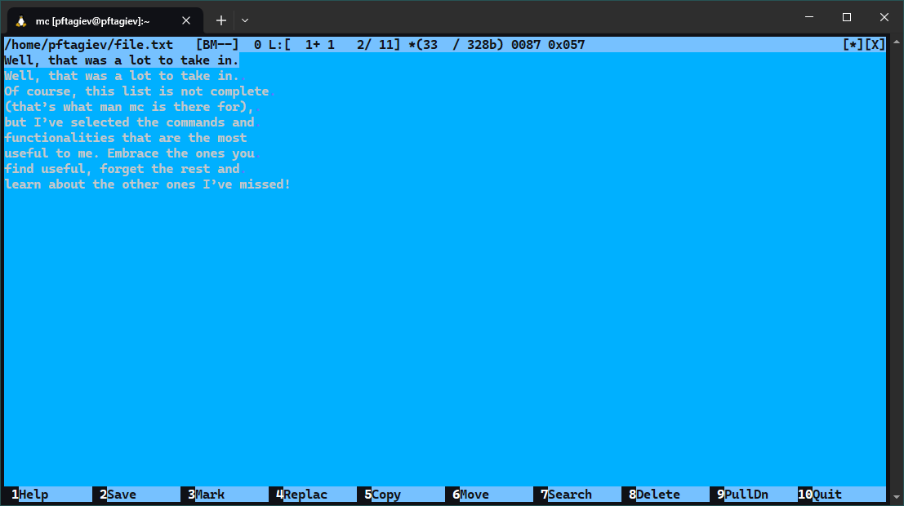{#fig:040}

Вновь выбираем фрагмент клавишей **F3** уже знакомым нам способом, переносим курсор к нужному месту в тексте, и нажимаем **F6**, 
чтобы переместить выделенный ранее фрагмент (рис. [-@fig:041]). Сохраним файл (рис. [-@fig:042]).

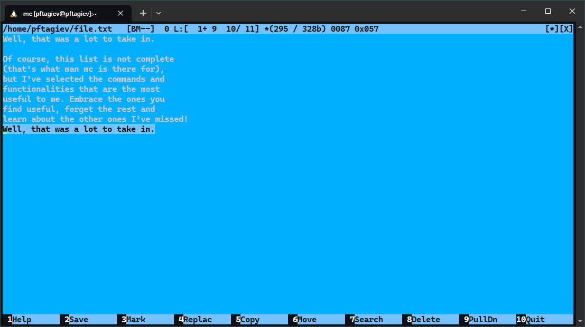{#fig:041}

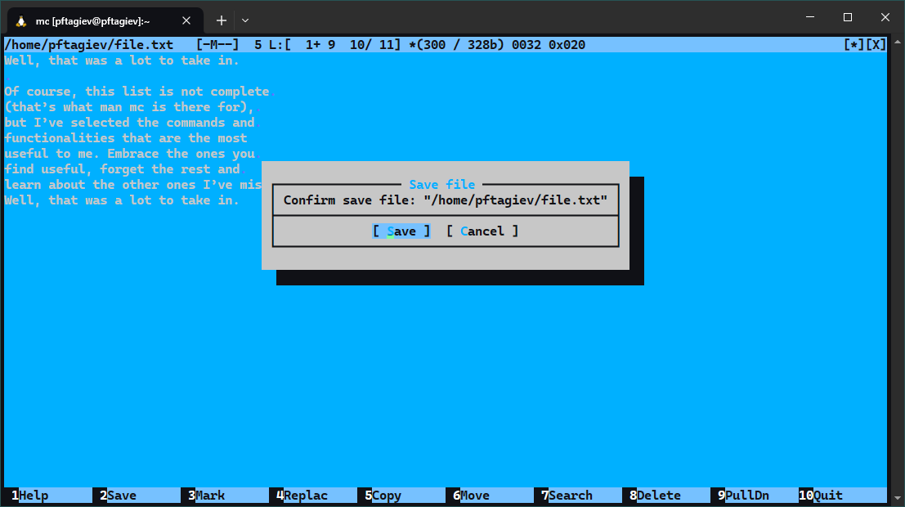{#fig:042}

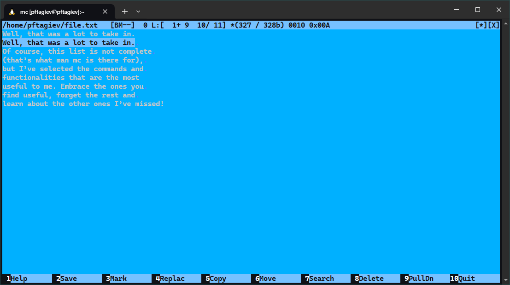{#fig:043}

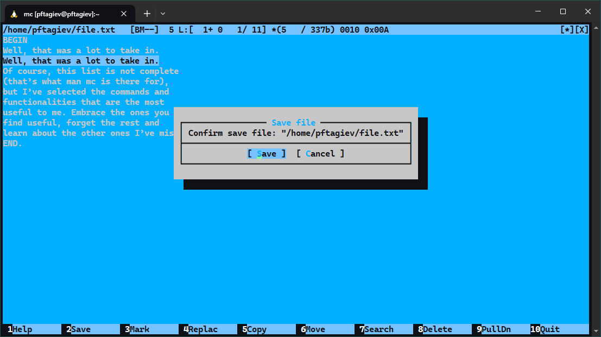{#fig:045}

Отменим последнее действие комбинацией **CTRL** + **u** (рис. [-@fig:043]). Перенесем курсор в конец файла
используя **CTRL** + **END** напишем `END.`. Теперь перейдем в начало файла комбинацией **CTRL** + **HOME**
и напишем слово `BEGIN`. Выйдем из редактора используя клавишу **F10** попутно сохранив файл, как показано на рис. [-@fig:045].

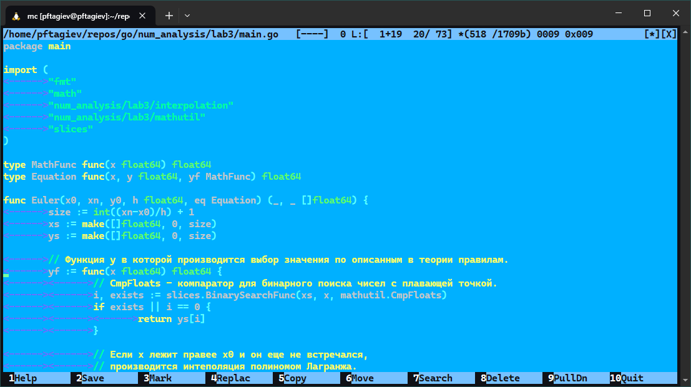{#fig:047}

Откроем файл с кодом на языке программирования _Go_ в стандартном редакторе `Midnight Commander`. Включим подсветку синтаксиса
комбинацией клавиш **CTRL** + **s** (рис. [-@fig:047]).

При выполнении этой лабораторной помимо [@yamad], также использовались [@midnight;@pandoc_crossref].

# Ответы на контрольные вопросы

1. Какие режимы работы есть в `mc`. Охарактеризуйте их.\
В `Midnight Commander` существуют следующие режимы работы:
    1. Панельный режим (Panel mode): Этот режим является основным для `Midnight Commander`. 
    Он представляет собой интерфейс, разделенный на две панели, каждая из которых отображает 
    содержимое различных директорий. Пользователь может перемещаться между файлами и 
    директориями, копировать, перемещать, удалять и редактировать файлы, используя 
    соответствующие команды и клавиши быстрого доступа.
    2. Командный режим (Command mode): В этом режиме пользователь может вводить 
    команды непосредственно в командную строку `Midnight` Commander, аналогично 
    обычной командной строке `Unix`. Этот режим предоставляет доступ к широкому 
    спектру команд и опций `Midnight Commander`, таких как поиск файлов, изменение 
    прав доступа, архивация и многое другое. Командный режим удобен для выполнения 
    специализированных операций, которые могут быть неудобны или невозможны в панельном режиме.
    3. Режим просмотра файла (Viewer mode): Этот режим предназначен для просмотра 
    содержимого файлов непосредственно внутри Midnight Commander, без необходимости 
    открывать их во внешних приложениях. Пользователь может использовать клавиши 
    быстрого доступа для навигации по файлу, поиска определенных строк и выполнения 
    других действий. Режим просмотра файлов удобен для быстрого просмотра содержимого 
    текстовых файлов, просмотра и редактирования конфигурационных файлов и т.д.
2. Какие операции с файлами можно выполнить как с помощью команд `shell`{.bash}, так и с помощью меню 
(комбинаций клавиш) `mc`? Приведите несколько примеров.
    - ***Создание файла***. В `Midnight Commander` создать файл можно комбинацией клавиш **SHIFT** + **F4**,
    альтернатива в `shell`{.bash} --- команда `touch`{.bash}.
    - ***Создание директории***. Чтобы создать директорию в `mc` нужно использовать клавишу **F7**, в
    `shell`{.bash} для этих задач существует команда `mkdir`{.bash}.
    - ***Поиск файла по контексту***. В `mc` для этой цели есть `Find file`, который находится в подменю `Command`.
    В `shell` можно использовать команду `grep`{.bash}.
3. Опишите структуру меню левой (или правой) панели `mc`, дайте характеристику командам.
    - `File listing` --- Отображение списка файлов на панели.
    - `Quick view` --- Отображение содержимого файла на панели.
    - `Info` --- Информация о файле или директории на панели.
    - `Tree` --- Отображение дерева директорий.
    - `Listing format...` --- Задание формата отображения списка.
    - `Sort order...` --- Позволяет настроить порядок сортировки файлов и директорий в текущей панели.
    - `Filter...` --- Предоставляет возможность фильтровать отображаемые файлы и директории в текущей 
    панели на основе определенных критериев.
    - `Encoding...` --- Предоставляет возможность выбрать кодировку, которая будет 
    использоваться для отображения содержимого файлов в текстовом редакторе внутри `mc`.
    - `FTP link...` ---  Предоставляет возможность создания _FTP-ссылки_ на выбранный файл или директорию. 
    Это позволяет быстро создавать ссылки на файлы или папки, расположенные на удаленных _FTP-серверах_, 
    и использовать их для обмена файлами между различными компьютерами через сеть.
    - `Shell link...` --- Создание символической ссылки.
    - `SFTP link...` --- Предоставляет возможность создания _SFTP-ссылок_ на выбранный файл или директорию, 
    что позволяет обмениваться файлами между компьютерами через защищенное соединение _SSH_.
    - `Panelize` --- Позволяет создавать панельные сценарии для быстрого выполнения серии действий 
    с выбранными файлами или директориями.
    - `Rescan` --- Используется для обновления содержимого текущей панели. Пункт меню `Rescan` особенно 
    полезен, когда вы работаете с файлами на удаленном сервере через протоколы, такие как _SSH_ или _FTP_, 
    и хотите убедиться, что отображаемая информация в `mc` соответствует актуальному состоянию файловой 
    системы на сервере.
4. Опишите структура меню `File` в `mc`, дайте характеристику командам.
    - `View` --- Просмотр выбранного файла.
    - `View file...` --- Просмотр указанного файла.
    - `Filtered view` --- Предоставляет возможность просмотра содержимого каталога с использованием 
    фильтрации. Когда вы выбираете этот пункт меню, `mc` открывает диалоговое окно, где вы можете 
    настроить фильтр для просмотра файлов и директорий в текущем каталоге.
    - `Edit` --- Редактирование файла.
    - `Copy` --- Копирование файла или директории.
    - `Chmod` --- Изменение прав доступа файла или директории.
    - `Link` --- Позволяет создавать символические ссылки на файлы или директории. Когда вы выбираете 
    этот пункт меню, `mc` предоставляет возможность создать символическую ссылку на выбранный файл 
    или директорию в текущем каталоге.
    - `Symlink` --- Представляет собой опцию, позволяющую создавать символические ссылки на файлы или 
    директории в текущем каталоге. Когда пользователь выбирает этот пункт меню, `mc` запрашивает имя и 
    путь к файлу или директории, на которые будет создана символическая ссылка.
    - `Relative symlink` --- Представляет собой опцию, позволяющую создавать относительные символические 
    ссылки на файлы или директории в текущем каталоге. Относительные символические ссылки содержат путь 
    к целевому файлу или директории относительно расположения символической ссылки.
    - `Edit symlink` --- Представляет собой опцию, которая позволяет редактировать существующую символическую ссылку. 
    Когда пользователь выбирает этот пункт меню для символической ссылки, `mc` открывает текстовый редактор, 
    где пользователь может изменить путь, на который указывает символическая ссылка.
    - `Chown` --- Представляет собой опцию, которая позволяет изменить владельца и/или группу 
    файла или директории. Когда пользователь выбирает этот пункт меню для файла или директории, 
    - `mc` открывает диалоговое окно, где можно указать нового владельца и/или группу для выбранного элемента.
    - `Advanced chown` --- Представляет собой расширенную опцию для изменения владельца и/или группы файла 
    или директории. Этот пункт меню обеспечивает более широкий набор функций и 
    возможностей по сравнению с обычным `Chown`.
    - `Chattr` --- представляет собой опцию, которая позволяет изменять расширенные атрибуты файла 
    или директории в Linux, используя утилиту `chattr`. Эти атрибуты могут включать такие 
    параметры, как "защита от удаления", "только для чтения" и другие.
    - `Rename/Move` --- Аналогично команде `mv`, т. е. перемещает или переименовывает файл.
    - `Mkdir` --- Аналогично команде `mkdir`, создает директорию.
    - `Delete` --- Удаляет директорию или файл.
    - `Quick cd` --- Переход к указанной директории.
    - `Select group` --- Предоставляет возможность выбора группы файлов или директорий на основе 
    определенных критериев. Этот функционал позволяет пользователю быстро выбирать файлы и 
    директории, которые соответствуют определенным условиям или шаблонам.
    - `Unselect group` --- Предоставляет возможность снять выделение с группы выбранных файлов 
    или директорий. Этот функционал полезен, когда пользователь хочет отменить выбор 
    определенных элементов после того, как они были выбраны.
    - `Invert selection` --- Предоставляет возможность инвертировать текущий список выбранных файлов и директорий. 
    Это означает, что все выбранные элементы становятся невыбранными, а все 
    невыбранные элементы становятся выбранными.
5. Опишите структуру меню `Command` в `mc`, дайте характеристику командам.
    - `User menu` --- Список пользовательских команд.
    - `Directory tree` --- Дерево каталогов.
    - `Find file` --- Поиск файла по контексту.
    - `Swap panels` --- Своп панелей.
    - `Switch panels on/off` --- Включение/отключение отображения панелей.
    - `Compare directories` --- Сравнение директорий.
    - `Compare files` --- Сравнение файлов.
    - `External panelize` --- Представляет собой функцию, которая позволяет пользователю выполнить 
    панелирование текущего файла или директории с использованием внешней программы или скрипта.
    - `Show directory sizes` --- Реальный размер директории.
    - `Command history` --- История команд.
    - `Viewed/edited files history` --- Представляет собой функцию, которая позволяет пользователям просматривать 
    историю файлов, которые они просматривали или редактировали в процессе работы с `mc`.
    - `Directory hotlist` --- Представляет собой функцию, которая позволяет пользователям сохранять 
    и быстро переходить к часто используемым директориям.
    - `Active VFS list` --- Функция, которая позволяет пользователям просматривать и управлять
    виртуальными файловыми системами, подключенными или активными в `mc`.
    - `Background jobs` --- Это функция, которая позволяет выполнять операции в фоновом 
    режиме, не блокируя основной интерфейс программы. Это особенно полезно при выполнении 
    длительных операций или операций, которые могут занять значительное время.
    - `Screen list` --- Представляет собой функцию, которая позволяет пользователям 
    управлять множеством открытых экранов внутри программы. 
    Это особенно полезно при работе с несколькими файлами или директориями одновременно.
    - `Undelete files` --- Позволяет восстанавливать файлы, которые были удалены в процессе 
    работы с программой. Это особенно полезно в случае случайного удаления 
    или если пользователь хочет вернуть удаленный файл (работает только с ext2fs).
    - `Edit extension file` --- Редактировать файл расширений.
    - `Edit menu file` --- Редактировать файл пользовательского меню.
    - `Edit highlighting group file` --- Редактировать файл группы подсветки который используется 
    для настройки цветовой схемы при редактировании файлов во встроенном текстовом редакторе. 
    Этот файл обычно называется `syntax`, и он содержит информацию о том, какие цвета должны 
    использоваться для различных типов синтаксиса, таких как ключевые слова, комментарии, строки и т. д.
6. Опишите структуру меню `Options` в `mc`, дайте характеристику командам.
    - `Configuration...` --- Предоставляет доступ к различным настройкам программы, которые позволяют 
    пользователю настраивать внешний вид, поведение и функциональность `mc`.
    - `Layout...` --- Настройка отображения панелей.
    - `Panel options...` --- Предоставляет доступ к настройкам, которые определяют поведение и внешний вид 
    файловых панелей в программе.
    - `Confirmation...` --- настройка, которая определяет, когда и какие операции требуют 
    подтверждения от пользователя перед выполнением. Это помогает предотвратить случайное 
    выполнение опасных или необратимых действий.
    - `Appearance...` --- Изменение темы и включение/выключение теней.
    - `Display bits...` --- Позволяет пользователю выбирать, какие атрибуты файлов будут отображаться при просмотре файлового списка.
    - `Learn keys...` --- Проверка/изучение горячих клавиш.
    - `Virtual FS...` --- Настройка виртуальной файловой системы.
    - `Save setup` --- Сохранение настроек.
7. Назовите и дайте характеристику встроенным командам `mc`.\
Ответ на этот вопрос можно увидеть в табл. [-@tbl:001].
8. Назовите и дайте характеристику командам встроенного редактора `mc`.\
Ответ можно увидеть в табл. [-@tbl:002]
9. Дайте характеристику средствам `mc`, которые позволяют создавать меню, определяемое пользователем.
    1. ***Пользовательские действия***: Пользовательские меню в `mc` позволяют определять 
    собственные действия, которые могут быть выполнены по нажатию соответствующей 
    клавиши. Это может быть выполнение одной команды или последовательности команд.
    2. ***Гибкость конфигурации***: Пользовательские меню можно настраивать и изменять в 
    соответствии с потребностями пользователя. Можно добавлять, удалять или 
    изменять элементы меню в любое время.
    3. ***Комбинация команд***: В пользовательских меню можно задавать не только отдельные 
    команды, но и целые последовательности действий. Это позволяет создавать комплексные 
    операции, которые можно выполнить одним нажатием клавиши.
    4. ***Поддержка макросов и переменных***: `mc` позволяет использовать макросы и переменные 
    в пользовательских меню, что делает их более гибкими и мощными. Это позволяет 
    создавать динамические меню, которые могут адаптироваться к различным ситуациям.
10. Дайте характеристику средствам `mc`, которые позволяют выполнять действия, определяемые пользователем, над текущим файлом.
    1. ***Встроенный текстовый редактор***: `mc` включает в себя встроенный текстовый редактор, который 
    позволяет просматривать и редактировать текстовые файлы без необходимости выхода из программы. 
    Это удобно для быстрого просмотра или внесения небольших изменений в файлы.
    2. ***Команды просмотра и редактирования***: `mc` позволяет открывать файлы во встроенных или внешних 
    редакторах или просмотрщиках. Это дает пользователям возможность выбирать подходящий для них 
    инструмент для работы с файлами.
    3. ***Команды копирования, перемещения и удаления***: `mc` предоставляет возможность 
    копирования, перемещения и удаления файлов и каталогов, позволяя пользователям управлять 
    своими файлами и организовывать их в файловой системе.
    4. ***Поддержка пользовательских команд***: `mc` позволяет пользователям настраивать 
    и добавлять собственные команды, которые могут быть выполнены над текущим файлом. 
    Это позволяет адаптировать программу под конкретные потребности пользователей и 
    автоматизировать повторяющиеся задачи.
    5. ***Использование расширений и плагинов***: `mc` поддерживает использование расширений и 
    плагинов, которые могут добавлять дополнительную функциональность для работы с файлами. 
    Это позволяет пользователям расширять возможности программы в соответствии с их потребностями.
    6. ***Команды архивации и разархивации***: `mc` позволяет создавать и распаковывать архивы различных 
    форматов непосредственно из интерфейса программы, обеспечивая удобный способ управления 
    архивированными файлами.

# Выводы

В этой лабораторной работе мы познакомились с основными функциями мощной командной оболочки `Midnight Commander`.
Приобрели практические навыки по работе с ней.

# Список литературы{.unnumbered}

::: {#refs}
:::
