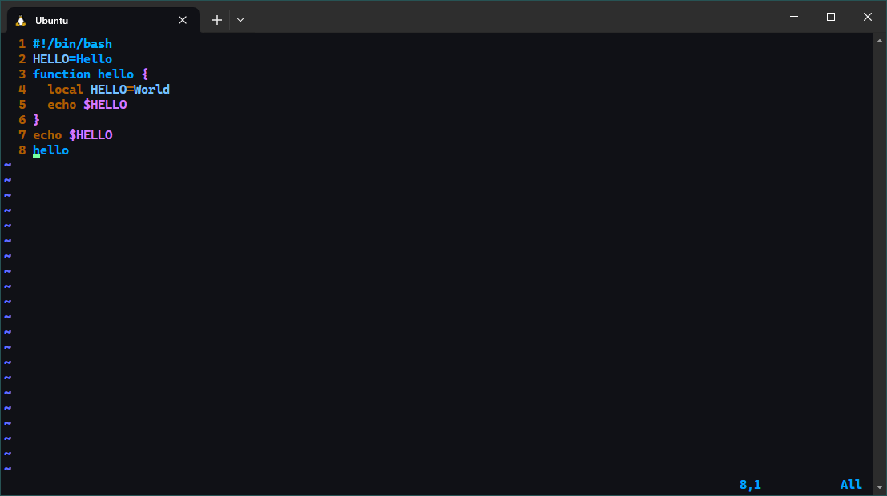

---
## Front matter
title: "Отчёт по лабораторной работе №8"
subtitle: "Текстовой редактор vi"
author: "Тагиев Павел Фаикович"

## Generic otions
lang: ru-RU
toc-title: "Содержание"

## Bibliography
bibliography: bib/cite.bib
csl: pandoc/csl/gost-r-7-0-5-2008-numeric.csl

## Pdf output format
toc: true # Table of contents
toc-depth: 2
lof: true # List of figures
lot: false # List of tables
fontsize: 12pt
linestretch: 1.5
papersize: a4
documentclass: scrreprt
## I18n polyglossia
polyglossia-lang:
  name: russian
  options:
    - spelling=modern
    - babelshorthands=true
polyglossia-otherlangs:
  name: english
## I18n babel
babel-lang: russian
babel-otherlangs: english
## Fonts
mainfont: PT Serif
romanfont: PT Serif
sansfont: PT Sans
monofont: PT Mono
mainfontoptions: Ligatures=TeX
romanfontoptions: Ligatures=TeX
sansfontoptions: Ligatures=TeX,Scale=MatchLowercase
monofontoptions: Scale=MatchLowercase,Scale=0.9
## Biblatex
biblatex: true
biblio-style: "gost-numeric"
biblatexoptions:
  - parentracker=true
  - backend=biber
  - hyperref=auto
  - language=auto
  - autolang=other*
  - citestyle=gost-numeric
## Pandoc-crossref LaTeX customization
figureTitle: "Рис."
tableTitle: "Таблица"
listingTitle: "Листинг"
lofTitle: "Список иллюстраций"
lotTitle: "Список таблиц"
lolTitle: "Листинги"
## Misc options
indent: true
header-includes:
  - \usepackage{indentfirst}
  - \usepackage{float} # keep figures where there are in the text
  - \floatplacement{figure}{H} # keep figures where there are in the text
---

# Цель работы

Познакомиться с операционной системой Linux. Получить практические навыки работы с 
редактором `vi`, установленным по умолчанию практически во всех дистрибутивах [@yamad].

# Задание

Задания сформированы в соответствии с [@yamad].

## Задание 1. Создание нового файла с использованием vi

1. Создайте каталог с именем `~/work/os/lab08`.
2. Перейдите во вновь созданный каталог.
3. Вызовите `vi` и создайте файл `hello.sh`:
```sh
    vi hello.sh
```
4. Нажмите клавишу **i** и введите следующий текст:
```sh
    #!/bin/bash
    HELL=Hello
    function hello {
      LOCAL HELLO=World
      echo $HELLO
    }
    echo $HELLO
    hello
```
5. Нажмите клавишу **ESC** для перехода в _командный режим_ после завершения ввода
текста.
6. Нажмите **:** для перехода в _режим последней строки_ и внизу вашего экрана появится
приглашение в виде двоеточия.
7. Нажмите **w** (записать) и **q** (выйти), а затем нажмите клавишу **ENTER** для сохранения
вашего текста и завершения работы.
8. Сделайте файл исполняемым:
```sh
    chmod +x hello.sh
```

## Задание 2. Редактирование существующего файла

1. Вызовите `vi` на редактирование файла:
```sh
    vi ~/work/os/lab08/hello.sh
```
2. Установите курсор в конец слова `HELL` второй строки.
3. Перейдите в _режим вставки_ и замените на `HELLO`. Нажмите **ESC** для возврата в _командный режим_.
4. Установите курсор на четвертую строку и сотрите слово `LOCAL`.
5. Перейдите в _режим вставки_ и наберите следующий текст: `local`, нажмите **ESC** для
возврата в _командный режим_.
6. Установите курсор на последней строке файла. Вставьте после неё строку, содержащую
следующий текст: `echo $HELLO`{.sh}.
7. Нажмите **ESC** для перехода в _командный режим_.
8. Удалите последнюю строку.
9. Введите команду отмены изменений **u** для отмены последней команды.
10. Введите символ **:** для перехода в _режим последней строки_. Запишите произведённые
изменения и выйдите из `vi`.

# Теоретическое введение

В большинстве дистрибутивов Linux в качестве текстового редактора по умолчанию
устанавливается интерактивный экранный редактор `vi` _(Visual display editor)_.

Редактор `vi` имеет три режима работы:

- _командный режим_ --- предназначен для ввода команд редактирования и навигации по редактируемому файлу;
- _режим вставки_ --- предназначен для ввода содержания редактируемого файла;
- _режим последней строки_ --- используется для записи изменений в файл и выхода из редактора.

Для вызова редактора `vi` необходимо указать команду `vi` и имя редактируемого файла: `vi <имя_файла>`{.sh}

При этом в случае отсутствия файла с указанным именем будет создан такой файл.

Переход в _командный режим_ осуществляется нажатием клавиши **ESC** . Для выхода из
редактора vi необходимо перейти в _режим последней строки_: находясь в командном
режиме, нажать **SHIFT**+**;** (по сути символ **:** — двоеточие), затем:

- набрать символы **wq**, если перед выходом из редактора требуется записать изменения в файл;
- набрать символ **q** (или **q!**), если требуется выйти из редактора без сохранения.

**Замечание**. Следует помнить, что `vi` различает прописные и строчные буквы при наборе
(восприятии) команд [@yamad].

# Выполнение лабораторной работы

## Задание 1. Создание нового файла с использованием vi

{#fig:002}

Следуя заданию создадим каталог `~/work/os/lab08`, затем перейдем в него и создадим файл `hello.sh` через `vi` 
(этот шаг можно увидеть на рис. [-@fig:002] на промтах `(1)-(3)`). Уже находясь в редакторе нажмем клавишу **i**,
чтобы перейти в _режим вставки_ и наберем требуемый текст (рис. [-@fig:001]).

После того как текст был набран перейдем в _командный режим_ нажав клавишу **ESC**, из него перейдем в _режим последней строки_
нажав на клавиатуре символ **:**. Наберем **wq** (рис. [-@fig:001]) и нажмем клавишу **ENTER**, чтобы записать файл и выйти из него.

На рис. [-@fig:002] в промтах `(4)-(6)` можно увидеть задание права на исполнение файла `hello.sh`. А в промте `(7)` вывод сохраненного
файла командой `cat`.

{#fig:001}

## Задание 2. Редактирование существующего файла

Снова откроем созданный ранее файл `hello.sh` командой: 
```sh
  vi ~/work/os/lab08/hello.sh
```
Переместим курсор на вторую строку, например клавишами **j** или **k**, потом нажмем **w** для переноса
курсора в конец слова `HELL` и войдем в _режим вставки_ клавишей **i**. Заменим слово `HELL` на `HELLO`, 
результат можно увидеть на рис. [-@fig:003]. Нажмем **ESC** чтобы вернуться в _командный режим_.

{#fig:003}

{#fig:004}

Находясь в _командном режиме_ наберем `4`**G**, чтобы перейти к четвертой строке файла. Затем **wd**, чтобы удалить
слово `LOCAL` в буфер (рис. [-@fig:004]). Перейдем в _режим вставки_ клавишей **i** и наберем текст: `local`, как на рис. [-@fig:005]. 
После вернемся в командный режим с помощью **ESC**.

{#fig:005}

{#fig:006}

{#fig:007}

Теперь перейдем на последнюю строку нажав **G**, затем скопируем текст со строки `7` перейдя в _режим последней строки_ 
и введя **7y** (рис. [-@fig:006]). Вставим скопированную строку нажав **p**, 
результат на рис. [-@fig:007]. Удалим последнюю строку введя **dd** (рис. [-@fig:008]). Отменим последнее действие
введя **u** (рис. [-@fig:009]).

{#fig:008}

{#fig:009}

Сохраним и выйдем из файла набрав в _режиме последней строки_ **wq** (рис. [-@fig:010]) и нажав **ENTER** .

{#fig:010}

# Ответы на контрольные вопросы

1. Дайте краткую характеристику режимам работы редактора `vi`{.sh}.
    - _командный режим_ --- предназначен для ввода команд редактирования и навигации по редактируемому файлу;
    - _режим вставки_ --- предназначен для ввода содержания редактируемого файла;
    - _режим последней строки_ --- используется для записи изменений в файл и выхода из редактора.
2. Как выйти из редактора, не сохраняя произведённые изменения?\
Нужно использовать команду **q!**, в _режиме последней строки_.
3. Назовите и дайте краткую характеристику командам позиционирования.
    - **k** --- переход на одну строку вверх;
    - **j** --- переход на одну строку вниз;
    - **h** --- переход на один символ влево;
    - **l** --- переход на оидн символ вправо;
    - **0** --- переход в начало строки;
    - **$** --- переход в конец строки;
    - **gg** --- переход в начало файла;
    - **G** --- переход в конец файла;
    - `n`**G** --- переход на строку с номером `n`;
    - **CTRL** + **d** --- перейти на пол-экрана вперед;
    - **CTRL** + **u** --- перейти на пол-экрана назад;
    - **CTRL** + **f** --- перейти на страницу вперед;
    - **CTRL** + **b** --- перейти на страницу назад;
    - **w** --- перейти на слово вперед;
    - `n`**w** --- перейти на `n` слов вперед;
    - **b** --- перейти на слово назад;
    - `n`**b** --- перейти на `n` слов назад;
4. Что для редактора `vi`{.sh} является словом?\
В `vi`{.sh}, словом считается последовательность символов, разделенных пробелами, табуляциями, 
переносами строки, или другими символами, которые считаются разделителями слов 
(например, точка, запятая, точка с запятой и т.д.).
5. Каким образом из любого места редактируемого файла перейти в начало (конец)
файла?\
Для перехода в начало файла можно использовать **gg**, для перехода в конец **G**.
6. Назовите и дайте краткую характеристику основным группам команд редактирования.
    - Вставка текста:
        - **а** --- вставить текст после курсора;
        - **A** --- вставить текст в конец строки;
        - **i** --- вставить текст перед курсором;
        - `n`**i** --- вставить текст `n` раз;
        - **I** ---  вставить текст в начало строки.
    - Вставка строки:
        - **o** ---  вставить строку под курсором;
        - **O** --- вставить строку над курсором.
    - Удаление текста:
        - **x** --- удалить один символ в буфер;
        - **dw** --- удалить одно слово в буфер;
        - **d$** --- удалить в буфер текст от курсора до конца строки;
        - **d0** --- удалить в буфер текст от начала строки до позиции курсора;
        - **dd** --- удалить в буфер одну строку;
        - `n`**dd** --- удалить в буфер `n` строк.
    - Отмена и повтор произведённых изменений:
        - **u** --- отменить последнее изменение;
        - **.** --- повторить последнее изменение.
    - Копирование текста в буфер:
        - **Y** --- скопировать строку в буфер;
        - `n`**Y** --- скопировать `n` строк в буфер;
        - **yw** --- скопировать слово в буфер.
    - Вставка текста из буфера:
        - **p** --- вставить текст из буфера после курсора;
        - **P** --- вставить текст из буфера перед курсором.
    - Замена текста:
        - **cw** --- заменить слово;
        - `n`**cw** --- заменить `n` слов;
        - **c$** --- заменить текст от курсора до конца строки;
        - **r** --- заменить слово;
        - **R** --- заменить текст.
7. Необходимо заполнить строку символами `$`. Каковы ваши действия?\
Находясь в _командном режиме_ переместим курсор в начало строки, затем воспользуемся
командой **c$**, чтобы очистить ее. После находясь в _режиме вставки_ можно начать заполнять строку долларами.
Еще `vi`{.sh} поддерживает *макросы*, с помощью которых можно автоматизировать этот процесс, 
но их использование выходит за рамки этой работы. 
8. Как отменить некорректное действие, связанное с процессом редактирования?\
Перейти в _командный режим_ и воспользоваться командой **u**.
9. Назовите и дайте характеристику основным группам команд режима последней строки.
    - Копирование и перемещение текста:
        - **:**`n,m`**d** --- удалить строки с `n` по `m`;
        - **:**`i,j`**m**`k` --- переместить строки с `i` по `j`, начиная со строки `k`;
        - **:**`i,j`**t**`k` --- копировать строки с `i` по `j` в строку `k`;
        - **:**`i,j`**w** `имя_файла` --- записать строки с `i` по `j` в файл с именем `имя_файла`.
    - Запись в файл и выход из редактора:
        - **:w** --- записать изменённый текст в файл, не выходя из `vi`{.sh};
        - **:w** `имя_файла` --- записать изменённый текст в новый файл с именем `имя_файла`;
        - **:w!** `имя_файла` --- записать изменённый текст в файл с именем `имя_файла`;
        - **:wq** --- записать изменения в файл и выйти из `vi`{.sh};
        - **:q** --- выйти из редактора `vi`{.sh};
        - **:q!** --- выйти из редактора без записи;
        - **:e!** --- вернуться в _командный режим_, отменив все изменения, произведённые
        со времени последней записи.
10. Как определить, не перемещая курсора, позицию, в которой заканчивается строка?\
Можно включить опцию: `sel list`, для отображения невидимых символов. 
Конец строки будет отмечен знаком доллара.
11. Выполните анализ опций редактора `vi`{.sh} (сколько их, как узнать их назначение и т.д.).\
Вевести список всех опций можно введя в _режиме последней строки_ команду `:set all`. Открыть документацию
ко всем опциям можно командой `:help set`, чтобы найти информацию по конкретной команде нужно использовать поиск
`/имя_команды`. Подробнее можно узнать в [@vi_web_docs].
12. Как определить режим работы редактора `vi`{.sh}?
Чтобы определить текущий режим работы `vi`{.sh}, достаточно просто взглянуть на последнюю строку редактора.
    - Если вы видите надпись `-- INSERT --`, значит вы находитесь в _режиме вставки_.
    - Если вы видите символ **:**, значит вы находитесь в _режиме последней строки_.
    - Если ничего не отображается, значит это _командный режим_.
13. Постройте граф взаимосвязи режимов работы редактора `vi`{.sh}.\
Построенный граф можно увидеть на рис. [-@fig:011].

{#fig:011}

# Выводы

В этой работе мы получили практические навыки по работе с `vi`{.sh}, одним из 
самых популярных текстовых редаторов в Unix-подобных ОС.

# Список литературы{.unnumbered}

::: {#refs}
:::
