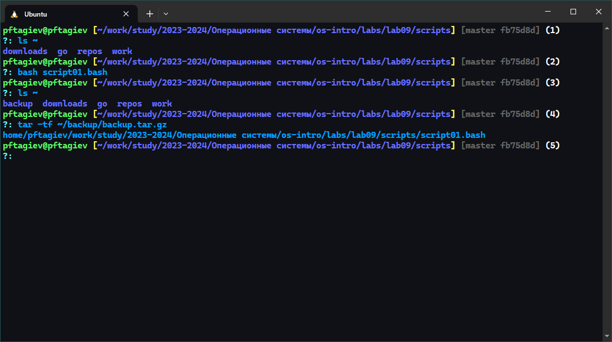
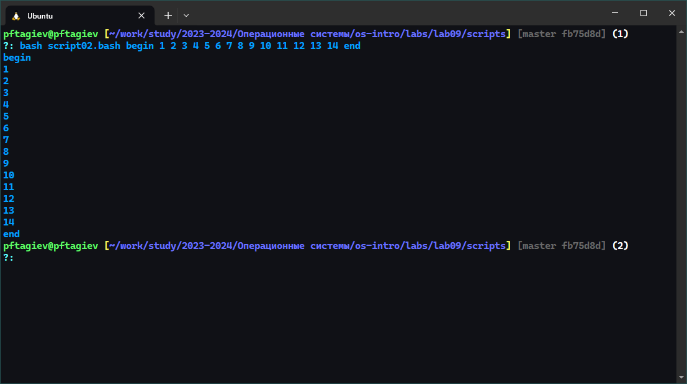
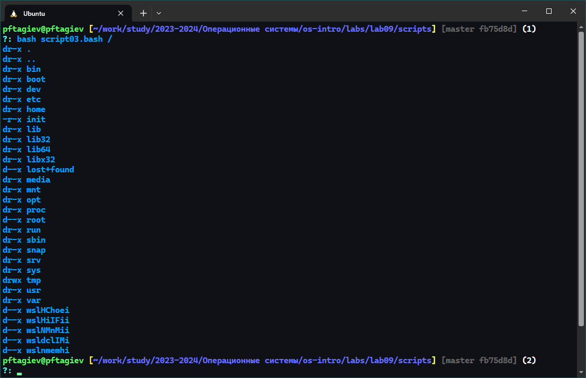
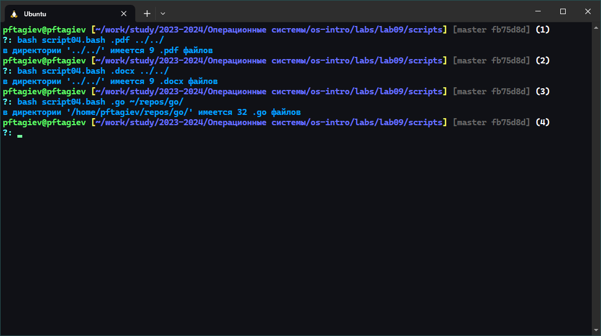

---
## Front matter
title: "Отчёт по лабораторной работе №9"
subtitle: "Программирование в командном процессоре ОС UNIX. Командные файлы"
author: "Тагиев Павел Фаикович"

## Generic otions
lang: ru-RU
toc-title: "Содержание"

## Bibliography
bibliography: bib/cite.bib
csl: pandoc/csl/gost-r-7-0-5-2008-numeric.csl

## Pdf output format
toc: true # Table of contents
toc-depth: 2
lof: true # List of figures
lot: false # List of tables
fontsize: 12pt
linestretch: 1.5
papersize: a4
documentclass: scrreprt
## I18n polyglossia
polyglossia-lang:
  name: russian
  options:
    - spelling=modern
    - babelshorthands=true
polyglossia-otherlangs:
  name: english
## I18n babel
babel-lang: russian
babel-otherlangs: english
## Fonts
mainfont: PT Serif
romanfont: PT Serif
sansfont: PT Sans
monofont: PT Mono
mainfontoptions: Ligatures=TeX
romanfontoptions: Ligatures=TeX
sansfontoptions: Ligatures=TeX,Scale=MatchLowercase
monofontoptions: Scale=MatchLowercase,Scale=0.9
## Biblatex
biblatex: true
biblio-style: "gost-numeric"
biblatexoptions:
  - parentracker=true
  - backend=biber
  - hyperref=auto
  - language=auto
  - autolang=other*
  - citestyle=gost-numeric
## Pandoc-crossref LaTeX customization
figureTitle: "Рис."
tableTitle: "Таблица"
listingTitle: "Листинг"
lofTitle: "Список иллюстраций"
lotTitle: "Список таблиц"
lolTitle: "Листинги"
## Misc options
indent: true
header-includes:
  - \usepackage{indentfirst}
  - \usepackage{float} # keep figures where there are in the text
  - \floatplacement{figure}{H} # keep figures where there are in the text
---

# Цель работы

Изучить основы программирования в оболочке ОС UNIX/Linux. Научиться писать
небольшие командные файлы [@yamad].

# Задание

1. Написать скрипт, который при запуске будет делать резервную копию самого себя (то
есть файла, в котором содержится его исходный код) в другую директорию `backup`
в вашем домашнем каталоге. При этом файл должен архивироваться одним из архиваторов 
на выбор `zip`{.bash}, `bzip2`{.bash} или `tar`{.bash}. Способ использования команд архивации
необходимо узнать, изучив справку.
2. Написать пример командного файла, обрабатывающего любое произвольное число
аргументов командной строки, в том числе превышающее десять. Например, скрипт
может последовательно распечатывать значения всех переданных аргументов.
3. Написать командный файл — аналог команды `ls`{.bash} (без использования самой этой команды и команды `dir`{.bash}). 
Требуется, чтобы он выдавал информацию о нужном каталоге
и выводил информацию о возможностях доступа к файлам этого каталога.
4. Написать командный файл, который получает в качестве аргумента командной строки
формат файла (`.txt`, `.doc`, `.jpg`, `.pdf` и т.д.) и вычисляет количество таких файлов
в указанной директории. Путь к директории также передаётся в виде аргумента командной строки.

# Теоретическое введение

Командный процессор (командная оболочка, интерпретатор команд _shell_) --- это программа, позволяющая пользователю взаимодействовать с операционной системой
компьютера. В операционных системах типа _UNIX/Linux_ наиболее часто используются
следующие реализации командных оболочек:

- оболочка _Борна_ (_Bourne shell_ или _sh_) --- стандартная командная оболочка _UNIX/Linux_,
содержащая базовый, но при этом полный набор функций;
- _С-оболочка_ (или _csh_) --- надстройка на оболочкой _Борна_, использующая _С_-подобный
синтаксис команд с возможностью сохранения истории выполнения команд;
- оболочка Корна (или _ksh_) --- напоминает оболочку _С_, но операторы управления программой совместимы с операторами оболочки _Борна_;
- _BASH_ — сокращение от _Bourne Again Shell_ (опять оболочка Борна), в основе своей совмещает свойства оболочек 
_С_ и _Корна_ (разработка компании _Free Software Foundation_).

_POSIX_ (_Portable Operating System Interface for Computer Environments_) --- набор стандартов
описания интерфейсов взаимодействия операционной системы и прикладных программ.
Стандарты _POSIX_ разработаны комитетом _IEEE_ (_Institute of Electrical and Electronics Engineers_) для обеспечения 
совместимости различных _UNIX/Linux-подобных_ операционных систем и переносимости прикладных программ на уровне исходного кода.
_POSIX-совместимые_ оболочки разработаны на базе оболочки _Корна_.
Рассмотрим основные элементы программирования в оболочке _bash_. В других оболочках большинство команд будет совпадать с описанными ниже [@yamad].

# Выполнение лабораторной работы

Чтобы не выдавать права на исполнение каждому написанному скрипту, я буду исполнять
их передавая напрямую интерпретатору _bash_: `bash имя_скрипта`{.bash}. Если все же нужно выдать
права на исполнение это можно сделать командой `chmod +x имя_скрипта`{.bash}.

## Задание 1

{#fig:001}

На лист. [-@lst:script01] можно увидеть код скрипта, который делает резервную копию самого себя.
Он создает архив утилитой `tar`{.bash}, в директории `~/backup/`. 

На рис. [-@fig:001] можно увидеть результат работы этого скрипта. В промте `(2)` вызывается сам скрипт, а в промте `(4)`
выводится содержимое созданного архива. 

```{#lst:script01 .bash caption="Скрипт создающий резервную копию себя"}
#! /usr/bin/bash

backup=~/backup

# создаю директорию для архива
mkdir -p $backup

# realpath нужен чтобы скрипт архивировался
# не зависимо от того из какого каталога его вызывают
# путь возвращаемый realpath абсолютный
script=$(realpath $0)

# удаление лидирующего слеша и
# обрамление строки кавычками,
# чтобы можно было работать с путями
# в которых встречаются пробелы и
# русские буквы
script=\'${script#/}\'

# eval - исполнить строку
eval tar -zc -f $backup/backup.tar.gz -C / $script
```

## Задание 2

{#fig:002}

В этом задании нужно написать скрипт который выводит аргументы командной строки на экран. 
Сам скрипт можно увидеть на лист. [-@lst:script02], результат на рис. [-@fig:002]

```{#lst:script02 .bash caption="Вывод аргументов командной строки на экран"}
#! /usr/bin/bash

# построчный вывод аргументов командной строки
for i 
  do echo $i 
done
```

## Задание 3

{#fig:003}

По заданию требуется написать аналог команды `ls`{.bash}. Код скрипта находится на лист. [-@lst:script03].
На рис. [-@fig:003] можно увидеть как написанный скрипт выводит содержимое корневой директории, а так же типы файлов
и права доступа к ним, в формате принятом в _Linux_.

```{#lst:script03 .bash caption="Аналог команды ls"}
#! /usr/bin/bash

# если директория не указана работаем с текущей
cd ${1:-.}

# выводим и скрытые файлы
for file in .* *
do
    # выводит информацию о правах доступа
    # и типе файла в том же формате что и ls
    perm=(- - - -)
    [ -d $file ] && perm[0]=d
    [ -r $file ] && perm[1]=r
    [ -w $file ] && perm[2]=w
    [ -e $file ] && perm[3]=x
    perm=$(IFS= ; echo "${perm[*]}")
    echo $perm $file
done
```

## Задание 4

{#fig:004}

На лист. [-@lst:script04] можно увидеть код скрипта, который принимает расширение файла в формате: `.расширение`;
и директорию. Затем выводит количество файлов с заданным расширением в указанной директории (рис. [-@fig:004]).

```{#lst:script04 .bash caption="Подсчет файлов с заданным расширением"}
#! /usr/bin/bash

# проверяет что расширение соответсвует шаблону - '.расширение'
pattern=$1
if ! [[ $pattern =~ ^\..*$ ]]; then
  echo неверно задано расширение файла
  exit 1
fi

# если директория не указана работаем с текущей
dir=${2:-.}

total=$(find $dir -name "*$pattern" -type f | wc -l)
echo "в директории '$dir' имеется $total $pattern файлов"
```

# Ответы на контрольные вопросы

1. Объясните понятие командной оболочки. Приведите примеры командных оболочек. Чем они отличаются?\
Командная оболочка --- это программа, позволяющая пользователю взаимодействовать с операционной системой
компьютера. В _Unix/Linux_ часто используются следующие реализации командных оболочек:
    - _sh_ --- стандартная командная оболочка _UNIX/Linux_, содержащая базовый, но при этом полный набор функций;
    - _csh_ --- надстройка на оболочкой _Борна_, использующая _С_-подобный синтаксис команд с возможностью сохранения истории выполнения команд;
    - _bash_ --- сокращение от _Bourne Again Shell_ (опять оболочка Борна), в основе своей совмещает свойства оболочек _С_ и _Корна_ 
(разработка компании _Free Software Foundation_).
2. Что такое POSIX?\
_POSIX_ (_Portable Operating System Interface for Computer Environments_) --- это набор стандартов
описания интерфейсов взаимодействия операционной системы и прикладных программ.
Стандарты _POSIX_ разработаны комитетом _IEEE_ (_Institute of Electrical and Electronics Engineers_) для обеспечения 
совместимости различных _UNIX/Linux-подобных_ операционных систем и переносимости прикладных программ на уровне исходного кода.
_POSIX-совместимые_ оболочки разработаны на базе оболочки _Корна_.
3. Как определяются переменные и массивы в языке программирования _bash_?
    - Переменные: `имя_переменной=значение`
    - Массивы: `имя_массива=(элем1 элем2 элем3 ...)` или `declare -a имя_массива`{.bash}
4. Каково назначение операторов `let`{.bash} и `read`{.bash}?
    - Команда `let`{.bash} является показателем того, что последующие аргументы представляют собой выражение,
    подлежащее вычислению. Простейшее выражение — это единичный терм (term), обычно
    целочисленный.
    - Команда `read`{.bash} позволяет читать значения переменных со стандартного ввода. Например: `read a b c`{.bash}
5. Какие арифметические операции можно применять в языке программирования _bash_?\
В языке программирования _bash_ можно использовать следующие арифметические операции:
    - *Сложение*: `+`{.bash}
    - *Вычитание*: `-`{.bash}
    - *Умножение*: `*`{.bash}
    - *Деление*: `/`{.bash}
    - *Остаток от деления*: `%`{.bash}
    - *Возведение в степень*: `**`{.bash}
6. Что означает операция `(( ))`{.bash}?\
Эта конструкция во многом похожа на инструкцию `let`{.bash}, внутри `(( ))`{.bash} вычисляются арифметические выражения и возвращается их результат.
7. Какие стандартные имена переменных Вам известны?
    - `PATH`{.bash} --- значением этой переменной является список каталогов, в которых командный процессор 
    осуществляет поиск программы или команды, указанной в командной
    строке, в том случае, если указанное имя программы или команды не содержит ни
    одного символа `/`.
    - `PS1`{.bash} и `PS2`{.bash} --- предназначены для отображения промптера командного процессора.
    - `HOME`{.bash} --- имя домашнего каталога пользователя. Если команда `cd` вводится без аргументов, 
    то происходит переход в каталог, указанный в этой переменной.
    - `IFS`{.bash} --- последовательность символов, являющихся разделителями в командной строке,
    например, пробел, табуляция и перевод строки.
    - `MAIL`{.bash} --- командный процессор каждый раз перед выводом на экран промптера проверяет содержимое 
    файла, имя которого указано в этой переменной, и если содержимое
    этого файла изменилось с момента последнего ввода из него, то перед тем как вывести
    на терминал промптер, командный процессор выводит на терминал сообщение `You have mail`.
    - `TERM`{.bash} --- тип используемого терминала.
    - `LOGNAME`{.bash} --- содержит регистрационное имя пользователя, которое устанавливается
    автоматически при входе в систему.
8. Что такое метасимволы?\
Символы имеющие специальный смысл для командного процессора, например: `' < > * ? | \ " &`{.bash}.
9. Как экранировать метасимволы?\
Чтобы экранировать метасимвол (т.е. снять с него специальный смысл) можно использовать `\`.
Чтобы экранировать группу символов можно использовать _одинарные кавычки_.
10. Как создавать и запускать командные файлы?\
Создать обычный файл, например командой `touch`{.bash}. Добавить в первой строке 
шебанг `#!`{.bash}, после корого будет следовать путь к интерпретатору. Написать нужные команды.
Добавить файлу право исполняться: `chmod +x имя_файла`{.bash}. Запустить его `./имя_файла аргументы...`{.bash}.
Чтобы не добавлять шебанг и права на исполнение можно запускать скрипт передавая его
напрямую интерпретатору: `bash имя_файла`{.bash}.
11. Как определяются функции в языке программирования bash?\
Функцию можно определить так: `function имя() { тело }`{.bash} или короче `имя() { тело }`{.bash}.
12. Каким образом можно выяснить, является файл каталогом или обычным файлом?
Можно применить к файлу команду `test`{.bash}, с флагами:
    - `test -d файл`{.bash} --- истина, если `файл` существует и является каталогом.
    - `test -f файл`{.bash} --- истина, если `файл` существует и является обычным файлом.
13. Каково назначение команд `set`{.bash}, `typeset`{.bash} и `unset`{.bash}?
    - `set`{.bash} --- изменяет значения внутренних переменных сценария.
    - `typeset`{.bash} --- команды `declare`{.bash} и `typeset`{.bash} задают и/или накладывают ограничения на переменные.
    - `unset`{.bash} --- удаляет переменную, фактически устанавливает ее значение в `null`{.bash}. 
14. Как передаются параметры в командные файлы?\
Они присваиваются переменным `$1, $2, ... $n`{.bash}, чтобы получить например `12` аргумент 
нужно использовать синтаксис `${12}`{.bash}.
15. Назовите специальные переменные языка _bash_ и их назначение.
    - `$$`{.bash} --- **PID** текущего процесса.
    - `$0`{.bash} --- **Имя скрипта**.
    - `$1`{.bash} до `$9`{.bash} - **Позиционные параметры**, где `$1`{.bash} это первый аргумент, и так далее.
    - `$@`{.bash} --- **Все позиционные параметры** как отдельные слова.
    - `$*`{.bash} --- **Все позиционные параметры** как одна строка.
    - `$#`{.bash} --- **Количество позиционных параметров**.
    - `$?`{.bash} --- **Статус выхода** последней выполненной команды.
    - `$-`{.bash} --- **Текущие опции** для оболочки.
    - `$_`{.bash} --- **Последний аргумент** предыдущей команды.

# Выводы

В этой лабораторной работе мы научились работать с _bash-скриптами_. Познакомились с основными конструкциями языка _bash_.

# Список литературы{.unnumbered}

::: {#refs}
:::
