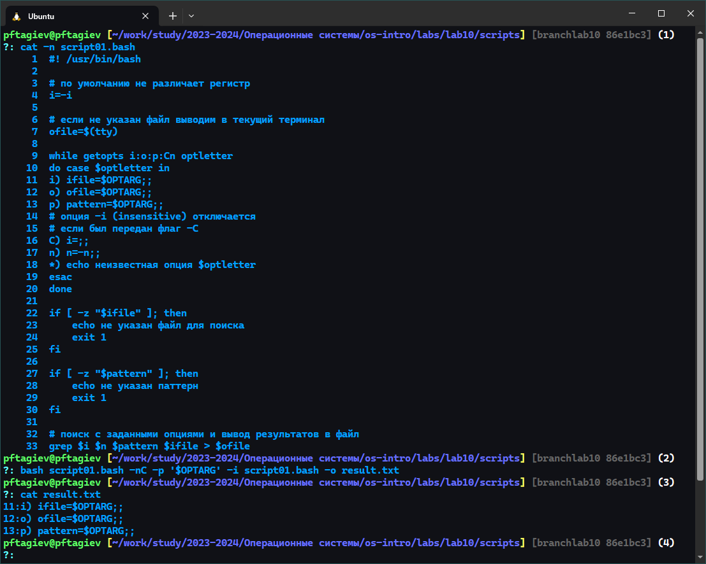
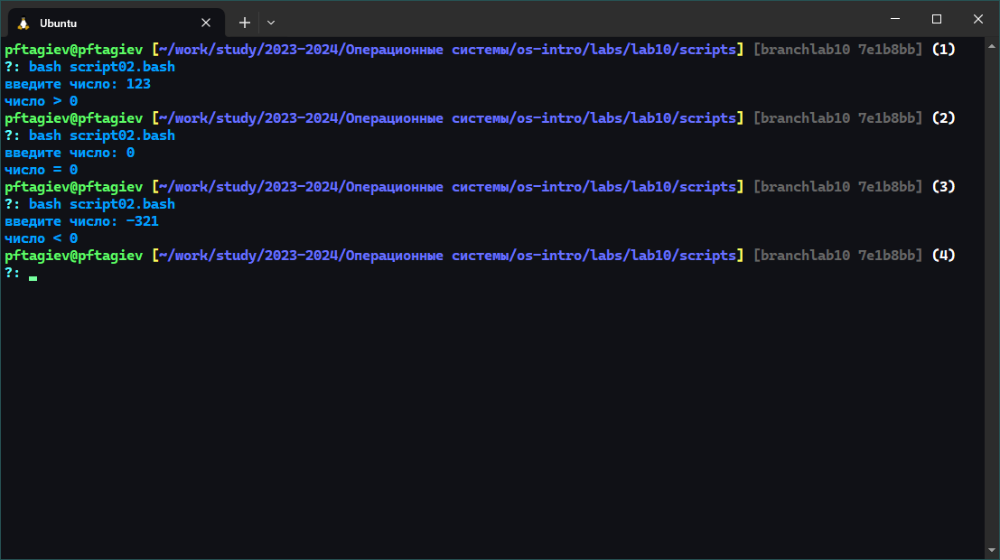
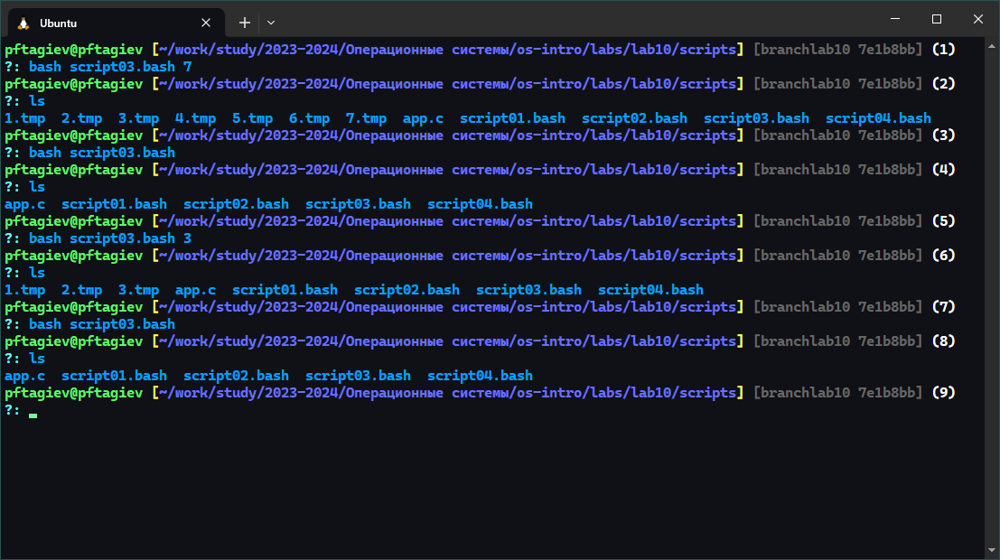
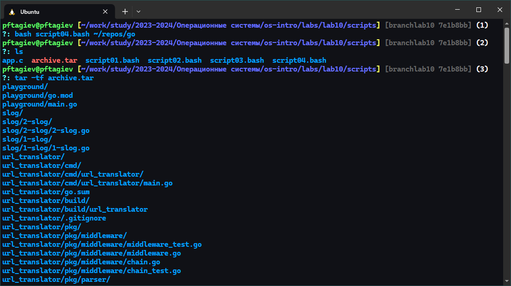

---
## Front matter
title: "Отчёт по лабораторной работе №10"
subtitle: "Программирование в командном процессоре ОС UNIX. Ветвления и циклы"
author: "Тагиев Павел Фаикович"

## Generic otions
lang: ru-RU
toc-title: "Содержание"

## Bibliography
bibliography: bib/cite.bib
csl: pandoc/csl/gost-r-7-0-5-2008-numeric.csl

## Pdf output format
toc: true # Table of contents
toc-depth: 2
lof: true # List of figures
lot: false # List of tables
fontsize: 12pt
linestretch: 1.5
papersize: a4
documentclass: scrreprt
## I18n polyglossia
polyglossia-lang:
  name: russian
  options:
    - spelling=modern
    - babelshorthands=true
polyglossia-otherlangs:
  name: english
## I18n babel
babel-lang: russian
babel-otherlangs: english
## Fonts
mainfont: PT Serif
romanfont: PT Serif
sansfont: PT Sans
monofont: PT Mono
mainfontoptions: Ligatures=TeX
romanfontoptions: Ligatures=TeX
sansfontoptions: Ligatures=TeX,Scale=MatchLowercase
monofontoptions: Scale=MatchLowercase,Scale=0.9
## Biblatex
biblatex: true
biblio-style: "gost-numeric"
biblatexoptions:
  - parentracker=true
  - backend=biber
  - hyperref=auto
  - language=auto
  - autolang=other*
  - citestyle=gost-numeric
## Pandoc-crossref LaTeX customization
figureTitle: "Рис."
tableTitle: "Таблица"
listingTitle: "Листинг"
lofTitle: "Список иллюстраций"
lotTitle: "Список таблиц"
lolTitle: "Листинги"
## Misc options
indent: true
header-includes:
  - \usepackage{indentfirst}
  - \usepackage{float} # keep figures where there are in the text
  - \floatplacement{figure}{H} # keep figures where there are in the text
  - \floatplacement{codelisting}{H}
---

# Цель работы

Изучить основы программирования в оболочке ОС UNIX. Научится писать более
сложные командные файлы с использованием логических управляющих конструкций
и циклов [@yamad].

# Задание

1. Используя команды `getopts`{.bash}, `grep`{.bash}, написать командный файл, который анализирует
командную строку с ключами:
	- `-iinputfile` --- прочитать данные из указанного файла;
	- `-ooutputfile` --- вывести данные в указанный файл;
	- `-pшаблон` --- указать шаблон для поиска;
	- `-C` --- различать большие и малые буквы;
	- `-n` --- выдавать номера строк.
	а затем ищет в указанном файле нужные строки, определяемые ключом `-p`.
2. Написать на языке Си программу, которая вводит число и определяет, является ли оно
больше нуля, меньше нуля или равно нулю. Затем программа завершается с помощью
функции `exit(n)`{.c}, передавая информацию в о коде завершения в оболочку. Командный файл должен вызывать эту программу и, проанализировав с помощью команды
`$?`{.bash}, выдать сообщение о том, какое число было введено.
3. Написать командный файл, создающий указанное число файлов, пронумерованных
последовательно от 1 до _N_ (например `1.tmp`, `2.tmp`, `3.tmp`, `4.tmp` и т.д.). Число файлов,
которые необходимо создать, передаётся в аргументы командной строки. Этот же командный файл должен уметь удалять все созданные им файлы (если они существуют).
4. Написать командный файл, который с помощью команды `tar`{.bash} запаковывает в архив
все файлы в указанной директории. Модифицировать его так, чтобы запаковывались
только те файлы, которые были изменены менее недели тому назад (использовать
команду `find`{.bash})

# Выполнение лабораторной работы

## Задание 1

{#fig:001}

Выполним первое задание. Требуется написать программу, для 
поиска в файле строк содержащих указанный шаблон.
Результат поиска нужно вывести в другой файл. 

Код написанной программы получился достаточно длинным, поэтому я разместил его в конце раздела
на лист. [-@lst:script01]. В комментариях можно увидеть пояснения к коду.

Разберем результат. На рис. [-@fig:001] в промте `(1)` в терминал выводится 
файл скрипта, для удобства каждая строка нумеруется. В промте `(2)` я вызываю
скрипт для поиска строки `$OPTARG`{.bash} в файле `script01.bash`{.bash}, результаты
вывожу в `result.txt`{.bash}. В самом конце можно увидеть результаты поиска, и сравнить
их с выводом промта `(1)`.

## Задание 2

```{#lst:C01 .c caption="Программа на Си"}
#include "stdlib.h"
#include "stdio.h"

int main() {
    printf("введите число: ");
    int num;
    scanf("%d", &num);
    exit(num < 0 ? 0 : num > 0 ? 1 : 2); 
    // return num < 0 ? 0 : num > 0 ? 1 : 2; 
    // ^^^ можно так ^^^ не нужно будет подключать stdlib
}
```

Напишем на языке Си программу, которая будет принимать число и в зависимости от него
возвращать разные коды завершения, через функцию `exit`{.c}. А именно, если число меньше
нуля, то вернется `0`, если оно больше нуля вернется `1`, если же оно равно нулю, то код 
возврата будет `2`. Код Си программы можно увидеть на лист. [-@lst:C01]

Теперь напишем скрипт, который будет вызывать нашу Си программу и обрабатывать ее код возврата (лист. [-@lst:script02]).
Пояснения к коду, как и в предыдущем задании, находятся в комментариях.

```{#lst:script02 .bash caption="Скрипт обрабатывающий код возврата"}
#! /usr/bin/bash

# собираем программу на Си если она не собрана
if ! [ -f app ]; then
    gcc app.c -o app
fi

# вызов собранной Си программы
./app

# получение кода завершения выполненной программы 
# и его обработка
case $? in
0) echo 'число < 0';;
1) echo 'число > 0';;
2) echo 'число = 0';;
esac
```

Результат работы скрипта можно увидть на рис. [-@fig:002].

{#fig:002}

## Задание 3

```{#lst:script03 .bash caption="Создание последовательности файлов"}
#! /usr/bin/bash

if [ -n "$1" ]; then 
    # файлы создаются если передано число
    eval touch {1..$1}.tmp
    # если ничего не передано удаляются по шаблону
    else find * -maxdepth 1 -type f -regex "^[1-9][0-9]*\.tmp$" -delete
fi
```

На лист. [-@lst:script03] можно увидеть выполненное третье задание. Если передать скрипту
число _N_, он создаст последовательность файлов: `1.tmp 2.tmp ... N.tmp`. Если вызвать его без
аргументов командной строки, он удалит все созданные файлы. Результат работы скрипта можно увидеть на рис. [-@fig:003]

{#fig:003}

## Задание 4

Требуется написать командный файл, который запаковывает в архив все файлы в указанной директори.
И модифицировать его так чтобы запаковывались только те файлы, которые были изменены менее недели
тому назад. 

```{#lst:script04 .bash caption="Создание архива"}
#! /usr/bin/bash

# создаю пустой архив
tar -c -f archive.tar -T /dev/null
# меняю рабочий каталог
cd $1
# все файлы, которые были изменены за последние 7 дней
# добавляются в созданный ранее архив
find * -mtime -7 -exec tar -u -f "$OLDPWD/archive.tar" {} \; 
```

На лист. [-@lst:script04] можно увидеть написанный командный файл. Так как модфифкация во второй части
задания требует минимальных изменений я написал скрипт сразу с ними.

{#fig:004}

Разберем результаты работы скрипта (рис. [-@fig:004]). В промте `(1)` вызывается
командный файл, в промте `(3)` я вывожу содержимое созданного архива.

```{#lst:script01 .bash caption="Поиск по файлу"}
#! /usr/bin/bash

# по умолчанию не различает регистр
i=-i

# если не указан файл выводим в текущий терминал
ofile=$(tty)

while getopts i:o:p:Cn optletter 
do case $optletter in
i) ifile=$OPTARG;;
o) ofile=$OPTARG;;
p) pattern=$OPTARG;;
# опция -i (insensitive) отключается
# если был передан флаг -C
C) i=;; 
n) n=-n;;
*) echo неизвестная опция $optletter
esac
done

if [ -z "$ifile" ]; then
    echo не указан файл для поиска
    exit 1
fi

if [ -z "$pattern" ]; then
    echo не указан паттерн
    exit 1
fi

# поиск с заданными опциями и вывод результатов в файл
grep $i $n $pattern $ifile > $ofile
```

# Контрольные вопросы

1. Каково предназначение команды `getopts`{.bash}?\
С помощью `getopts`{.bash} можно достаточно легко произвести разбор флагов переданных скрипту.
2. Какое отношение метасимволы имеют к генерации имён файлов?\
Метасимволы играют важную роль в генерации имен файлов, особенно в командных оболочках _Unix_ и _Linux_. Эти символы представляют собой специальные символы, которые интерпретируются оболочкой для выполнения шаблонного поиска и подстановки. Например:
    - `*`{.bash} --- соответствует любому количеству символов в имени файла.
    - `?`{.bash} --- соответствует ровно одному символу.
    - `[...]`{.bash} --- соответствуют любому одному символу из перечисленных в скобках. 
3. Какие операторы управления действиями вы знаете?
    - _Условные операторы_:
        - `if`{.bash}, `elif`{.bash} и `else`{.bash} --- позволяют выполнять команды, основываясь на условиях.
        - `case`{.bash} --- выбор действий в зависимости от значения переменной.
    - _Циклы_:
        - `for`{.bash} --- выполняет команды для списка значений.
        - `while`{.bash} --- цикл который выполняется пока условие истинно.
        - `until`{.bash} --- цикл который выполняется пока условие ложно.
4. Какие операторы используются для прерывания цикла?\
В Bash для прерывания циклов используются следующие операторы:
    - `break`{.bash} --- прерывает выполнение текущего цикла и передает управление на команду, 
    следующую за циклом. Вы можете указать `break n`{.bash}, где `n`{.bash} - это количество уровней цикла, которые нужно прервать.
    - `continue`{.bash} --- пропускает оставшуюся часть тела текущего цикла и переходит к следующей итерации. 
    Аналогично `break`{.bash}, можно использовать `continue n`{.bash} для пропуска итераций во вложенных циклах.
5. Для чего нужны команды `false`{.bash} и `true`{.bash}?\
Команды `true`{.bash} и `false`{.bash} в _Bash_ являются простыми утилитами, которые возвращают статус 
выхода. Они используются в скриптах и условных операторах для управления логикой выполнения.
    - `true`{.bash} всегда возвращает статус выхода `0`, что означает успех. 
    Эта команда может быть использована в местах, где требуется гарантированно успешный результат, например, 
    в бесконечных циклах `(while true; do ... done)`{.bash} или как заглушка для функции, которая еще не реализована.
    - `false`{.bash} всегда возвращает статус выхода `1`, что означает неудачу. 
    Эта команда может быть использована для преднамеренного вызова ошибки или как условие, которое никогда не будет выполнено.
6. Что означает строка `if test -f man$s/$i.$s`{.bash}, встреченная в командном файле?\
В этой строке проверяется существование файла `man$s/$i.$s`{.bash}, где `$s`{.bash} и `$i`{.bash} переменные
подставляющиеся в имя файла.
7. Объясните различия между конструкциями `while`{.bash} и `until`{.bash}.
    - `while`{.bash} --- цикл который выполняется пока условие истинно.
    - `until`{.bash} --- цикл который выполняется пока условие ложно.

# Выводы

В этой работе мы поближе познакомились с циклами в языке _bash_. Научились писать более сложные командные файлы
используя логические управляющие конструкции.

# Список литературы{.unnumbered}

::: {#refs}
:::
