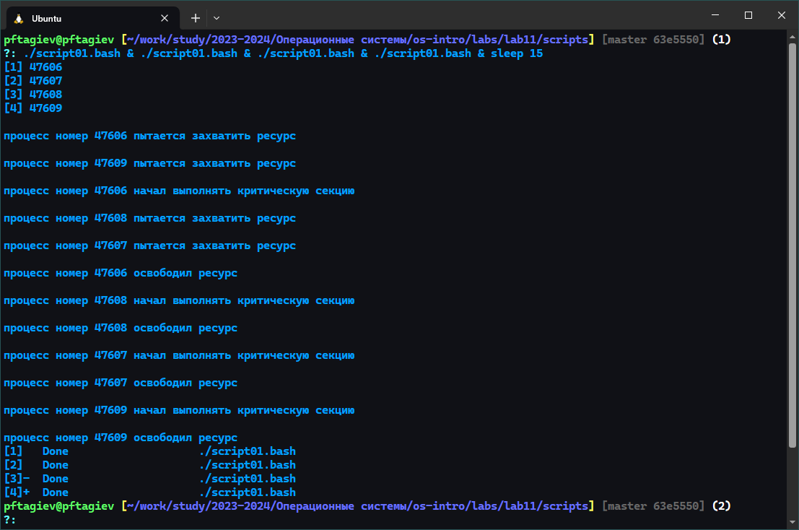

---
## Front matter
title: "Отчёт по лабораторной работе №11"
subtitle: "Программирование в командном процессоре ОС UNIX. Расширенное программирование"
author: "Тагиев Павел Фаикович"

## Generic otions
lang: ru-RU
toc-title: "Содержание"

## Bibliography
bibliography: bib/cite.bib
csl: pandoc/csl/gost-r-7-0-5-2008-numeric.csl

## Pdf output format
toc: true # Table of contents
toc-depth: 2
lof: true # List of figures
lot: false # List of tables
fontsize: 12pt
linestretch: 1.5
papersize: a4
documentclass: scrreprt
## I18n polyglossia
polyglossia-lang:
  name: russian
  options:
    - spelling=modern
    - babelshorthands=true
polyglossia-otherlangs:
  name: english
## I18n babel
babel-lang: russian
babel-otherlangs: english
## Fonts
mainfont: PT Serif
romanfont: PT Serif
sansfont: PT Sans
monofont: PT Mono
mainfontoptions: Ligatures=TeX
romanfontoptions: Ligatures=TeX
sansfontoptions: Ligatures=TeX,Scale=MatchLowercase
monofontoptions: Scale=MatchLowercase,Scale=0.9
## Biblatex
biblatex: true
biblio-style: "gost-numeric"
biblatexoptions:
  - parentracker=true
  - backend=biber
  - hyperref=auto
  - language=auto
  - autolang=other*
  - citestyle=gost-numeric
## Pandoc-crossref LaTeX customization
figureTitle: "Рис."
tableTitle: "Таблица"
listingTitle: "Листинг"
lofTitle: "Список иллюстраций"
lotTitle: "Список таблиц"
lolTitle: "Листинги"
## Misc options
indent: true
header-includes:
  - \usepackage{indentfirst}
  - \usepackage{float} # keep figures where there are in the text
  - \floatplacement{figure}{H} # keep figures where there are in the text
---

# Цель работы

Изучить основы программирования в оболочке ОС UNIX. Научиться писать более
сложные командные файлы с использованием логических управляющих конструкций
и циклов [@yamad].

# Задание

1. Написать командный файл, реализующий упрощённый механизм семафоров. Командный 
файл должен в течение некоторого времени `t1` дожидаться освобождения
ресурса, выдавая об этом сообщение, а дождавшись его освобождения, использовать
его в течение некоторого времени `t2<>t1`, также выдавая информацию о том, что
ресурс используется соответствующим командным файлом (процессом). Запустить
командный файл в одном виртуальном терминале в фоновом режиме, перенаправив
его вывод в другой (`> /dev/tty#`{.bash}, где `#`{.bash} — номер терминала куда перенаправляется
вывод), в котором также запущен этот файл, но не фоновом, а в привилегированном
режиме. Доработать программу так, чтобы имелась возможность взаимодействия трёх
и более процессов.

2. Реализовать команду `man`{.bash} с помощью командного файла. Изучите содержимое 
каталога `/usr/share/man/man1`{.bash}. В нем находятся архивы текстовых файлов, содержащих
справку по большинству установленных в системе программ и команд. Каждый архив
можно открыть командой `less`{.bash} сразу же просмотрев содержимое справки. Командный
файл должен получать в виде аргумента командной строки название команды и в виде
результата выдавать справку об этой команде или сообщение об отсутствии справки,
если соответствующего файла нет в каталоге `man1`{.bash}.

3. Используя встроенную переменную `$RANDOM`{.bash}, напишите командный файл, генерирующий 
случайную последовательность букв латинского алфавита. Учтите, что `$RANDOM`{.bash}
выдаёт псевдослучайные числа в диапазоне от `0` до `32767`.

# Выполнение лабораторной работы

## Задание 1

```{#lst:script01 .bash caption="Упрощенный механизм семафоров"}
#! /usr/bin/bash

semaphore_wait() {
    # атомарная проверка того что ресурс не занят
    while ! mkdir /tmp/$0.lock 2> /dev/null; do
        sleep 0.5 # ждем освобождения ресурса
    done
}

semaphore_signal() {
    rmdir /tmp/$0.lock
}

echo -e "\nпроцесс номер $$ пытается захватить ресурс"

semaphore_wait # попытка войти в критическую секцию

echo -e "\nпроцесс номер $$ начал выполнять критическую секцию"

sleep 2 # выполнение какой-то работы требующей сихронизации

semaphore_signal # выход из критической секции

echo -e "\nпроцесс номер $$ освободил ресурс"
```

На лист. [-@lst:script01] можно увидеть простейшую реализацию бинарного семафора или мьютекса [@Semaphore_wiki].
В качестве атомарной проверки внутри функции `semaphore_wait`{.bash} я использую команду `mkdir`{.bash} [@BashFAQ].
Эта команда удобна тем что при попытке создания директории с существующим именем она возвращает ошибку.

Проверка существования директории, ее создание при отсутствии и возврат кода в рамках одной команды
делает `mkdir`{.bash} прекрасной альтернативой атомарной инструкции _CAS_ [@CAS_wiki] из других языков.

{#fig:001}

Начнем выполнение первой части задания. Для удобства сделаем скрипт исполняемым как 
показано на рис. [-@fig:001] в промпте `(1)`, затем запустим его
в фоне перенаправив вывод в терминал `dev/pts/5`{.bash}. В терминале `dev/pts/5`{.bash}
запустим тот же командный файл в обычном режиме, как показано на рис. [-@fig:002].

Как видно все на том же рис. [-@fig:002] семафор работает корректно и критическую секцию исполняет только 
один запущенный экземпляр скрипта, пока другой ждет.

{#fig:002}

{#fig:003}

Пойдем дальше и запустим сразу четыре экземпляра скрипта, как показано на рис. [-@fig:003] в промте `(1)`.
Тут `sleep 15`{.bash} нужен чтобы терминал не создавал новый промпт 15 секунд и не мешал выводу
запущенных на фоне процессов. Как видно семафор отлично справляется с тремя и более процессами.

## Задание 2

```{#lst:script02 .bash caption="Реализация команды man"}
#! /usr/bin/bash

file=/usr/share/man/man1/$1.1.gz # путь к мануалам

if [ -f $file ]; then
    # если архив существует
    # читаем его и передаем
    # интерпретатору языка разметки roff
    # затем читаем его постранично
    zcat $file | groff -man -T utf8 -i | less
else
    echo Для $1 не существует справки
fi
```

В этом задании требуется написать простую реализацию команды `man`, для этого изучим
содержимое директории `/usr/share/man/man1`{.bash}, в которой хранятся архивы мануалов команд.
Как можно увидеть на рис. [-@fig:004] имя архива имеет следующий шаблон: `имя_команды.1.gz`.

Однако открывая архив просто передав его команде `less`{.bash}, как предлагается в задании,
я получил совсем не тот результат что ожидал. Как видно на рис. [-@fig:005] файлы мануалов
написаны с использованием специального языка разметки `roff`{.bash}. Поэтому, чтобы добиться
сопоставимого с командой `man`{.bash} вывода, прежде чем печатать файлы мануалов на экран их нужно
передать специальному интерпретатору `groff`{.bash}, что я и сделал в своей реализации 
команды `man`{.bash} на лист. [-@lst:script02].

{#fig:004}

{#fig:005}

Запустив данную реализацию команды `man`{.bash}, как показано на рис. [-@fig:007], мы получим
красивую, обработанную справку к реальной команде `man`{.bash} (рис. [-@fig:006]).

{#fig:007}

{#fig:006}

## Задание 3

```{#lst:script03 .bash caption="Генерация случайной последовательности"}
#! /usr/bin/bash

lowercase=(a b c d e f g h i j k l m n o p q r s t u v w x y z)
uppercase=(A B C D E F G H I J K L M N O P Q R S T U V W X Y Z)

# все буквы английского алфавита
letters=("${lowercase[@]}" "${uppercase[@]}")

result=

# по умолчанию длина последовательности 10
for ((i=${1:-10}; i--;)); do
    result+=${letters[$RANDOM%${#letters[@]}]}
done

echo $result
```

{#fig:008}

Следуя заданию, напишем командный файл, который генерирует случайную последовательность букв английского алфавита
используя встроенную переменную `$RANDOM`{.bash}. Реализацию можно увидеть на лист. [-@lst:script03], а пример использования
на рис. [-@fig:008].

# Контрольные вопросы

1. Найдите синтаксическую ошибку в следующей строке:\
`while [$1 != "exit"]`{.bash}\
Ошибка в том что после `[` и до `]` должен идти пробел, еще имеет смысл
обернуть `$1`{.bash} в _двойные кавычки_, чтобы эта переменная корректно обрабатывалась
даже если она содержит пробелы.
2. Как объединить (конкатенировать) несколько строк в одну?\
Есть множество способов конкатенации строк в _bash_, я разберу два основных.
Предположим у нас есть переменные `a` и `b`, чтобы добавить к строке `a` строку `b` справа
можно использовать следующий синтаксис: `a+=$b`{.bash}. Записать результат конкатенации в новую переменную
можно так: `c="$a$b"`{.bash}.
3. Найдите информацию об утилите `seq`{.bash}. Какими иными способами можно реализовать её функционал при программировании на bash?\
Утилита `seq`{.bash} используется для генерации последовательностей, ее можно использовать в циклах. 
Например: `for i in $(seq 0 2 10)`{.bash}, переменная `i` будет принимать значения от `0` до `10` включительно с шагом `2`.
Очевидно, что чтобы добиться похожего результата можно использовать _Си-подобный_ цикл `for`: `for ((i=0;i<=10;i+=2))`{.bash}
4. Какой результат даст вычисление выражения `$((10/3))?`{.bash}\
Результат будет `3`, так как будет выполнено целочисленное деление.
5. Укажите кратко основные отличия командной оболочки _zsh_ от _bash_.
    - _Интерактивность_: _zsh_ известен своими улучшенными интерактивными возможностями, такими как 
    более продвинутый автодополнение команд и файлов, что делает его более удобным для интерактивного использования.
    - _Темы и плагины_: _zsh_ поддерживает темы и плагины, что позволяет пользователям настраивать свой 
    рабочий интерфейс и расширять функциональность оболочки.
    - _Синтаксис_: _zsh_ обладает более гибким синтаксисом, включая улучшенные возможности для работы с массивами и ассоциативными массивами.
    - _Совместимость_: _zsh_ во многом совместим с _bash_, но включает множество дополнительных возможностей, которые могут не работать в _bash_ без изменений.
    - _Контекстное автодополнение_: _zsh_ предлагает более продвинутое контекстное
     автодополнение, которое может учитывать не только имена файлов и команд, но и их параметры.
    - _Модульность_: _zsh_ разработан с учётом модульности, что позволяет легко добавлять новые функции и интегрировать внешние скрипты.
6. Проверьте, верен ли синтаксис данной конструкции\
`for ((a=1; a <= LIMIT; a++))`{.bash}\
Да, синтаксис верен. В двойных круглых скобках можно использовать переменные без знака доллара.
7. Сравните язык _bash_ с какими-либо языками программирования. 
Какие преимущества у _bash_ по сравнению с ними? Какие недостатки?
    - Преимущества _bash_:
        - _Скорость разработки_: _bash-скрипты_ обычно проще и быстрее писать для простых задач, особенно для 
        автоматизации командной строки и системных операций.
        - _Встроенная поддержка UNIX-команд_: _bash_ нативно интегрируется с _UNIX-командами_ и утилитами, 
        что делает его мощным инструментом для системного администрирования.
        - _Портативность_: _bash-скрипты_ легко переносить между различными _UNIX-подобными_ системами без изменений.
    - Недостатки _bash_:
        - _Ограниченные возможности программирования_: _bash_ не имеет такого богатого набора функций 
        программирования, как _C++_ или _Python_, например, объектно-ориентированное программирование или обширные стандартные библиотеки.
        - _Медленная производительность_: Для сложных задач или задач, требующих интенсивных 
        вычислений, _bash_ может работать медленнее, чем _C++_ или _Python_.
        - _Сложность синтаксиса_: Некоторые аспекты синтаксиса _bash_ могут быть непривычными или запутанными
        для новичков, особенно при работе с текстовыми строками и файлами.

# Выводы

В этой лабораторной работе мы закрепили свои знания об основах программирования на языке _bash_.
Написав простейшие реализации семафора и команды `man`{.bash}, использовав переменную `$RANDOM`{.bash}
для генерации последовательности букв английского алфавита.

# Список литературы{.unnumbered}

::: {#refs}
:::
