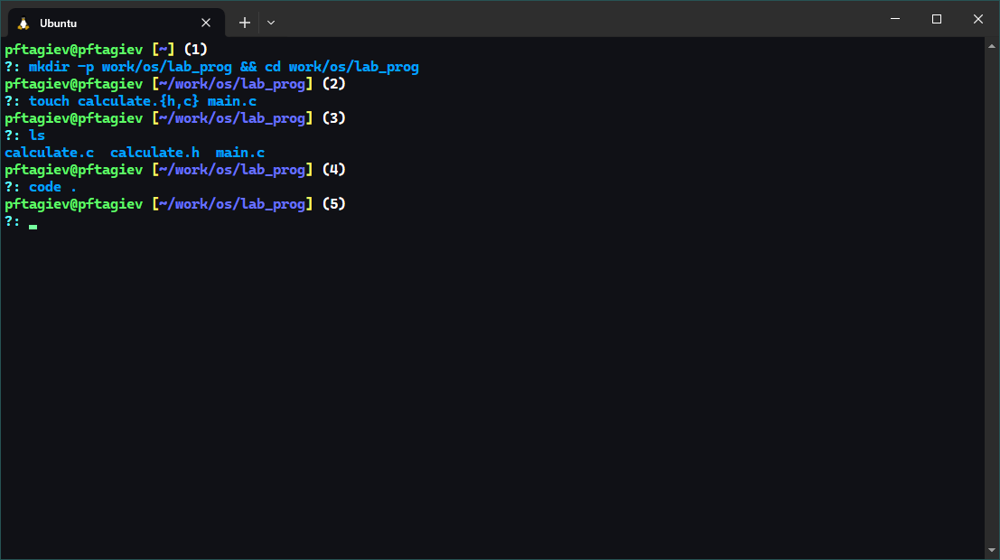
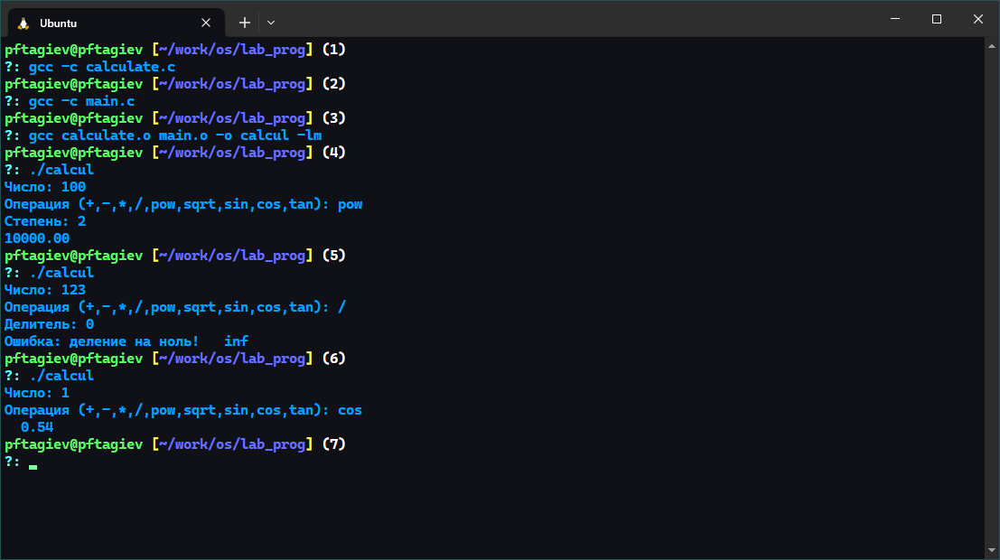
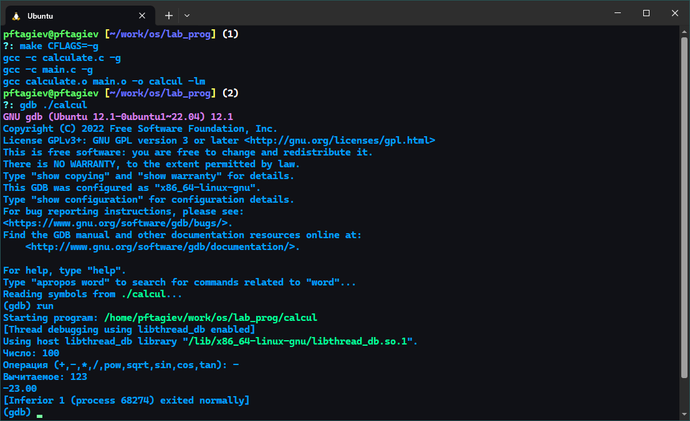
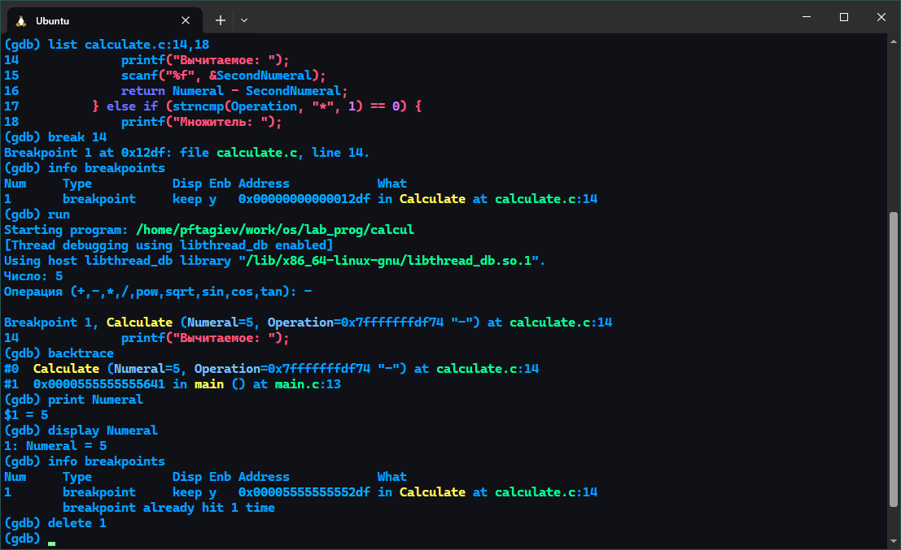

---
## Front matter
title: "Отчёт по лабораторной работе №12"
subtitle: "Средства для создания приложений в ОС UNIX"
author: "Тагиев Павел Фаикович"

## Generic otions
lang: ru-RU
toc-title: "Содержание"

## Bibliography
bibliography: bib/cite.bib
csl: pandoc/csl/gost-r-7-0-5-2008-numeric.csl

## Pdf output format
toc: true # Table of contents
toc-depth: 2
lof: true # List of figures
lot: false # List of tables
fontsize: 12pt
linestretch: 1.5
papersize: a4
documentclass: scrreprt
## I18n polyglossia
polyglossia-lang:
  name: russian
  options:
    - spelling=modern
    - babelshorthands=true
polyglossia-otherlangs:
  name: english
## I18n babel
babel-lang: russian
babel-otherlangs: english
## Fonts
mainfont: PT Serif
romanfont: PT Serif
sansfont: PT Sans
monofont: PT Mono
mainfontoptions: Ligatures=TeX
romanfontoptions: Ligatures=TeX
sansfontoptions: Ligatures=TeX,Scale=MatchLowercase
monofontoptions: Scale=MatchLowercase,Scale=0.9
## Biblatex
biblatex: true
biblio-style: "gost-numeric"
biblatexoptions:
  - parentracker=true
  - backend=biber
  - hyperref=auto
  - language=auto
  - autolang=other*
  - citestyle=gost-numeric
## Pandoc-crossref LaTeX customization
figureTitle: "Рис."
tableTitle: "Таблица"
listingTitle: "Листинг"
lofTitle: "Список иллюстраций"
lotTitle: "Список таблиц"
lolTitle: "Листинги"
## Misc options
indent: true
header-includes:
  - \usepackage{indentfirst}
  - \usepackage{float} # keep figures where there are in the text
  - \floatplacement{figure}{H} # keep figures where there are in the text
---

# Цель работы

Приобрести простейшие навыки разработки, анализа, тестирования и отладки приложений в ОС типа UNIX/Linux на примере создания на языке программирования
С калькулятора с простейшими функциями [@yamad].

# Задание

1. Провести сборку программы простейшего калькулятора
2. Произвести отладку программы используя `gdb`{.bash}
3. Изучить предупреждения линтера `splint`{.bash}

# Теоретическое введение

- _GNU Compiler Collection_ (обычно используется сокращение GCC) --- набор компиляторов для различных языков программирования, 
разработанный в рамках проекта GNU. GCC является свободным программным обеспечением, распространяется в том числе 
фондом свободного программного обеспечения (FSF) на условиях GNU GPL и GNU LGPL и является ключевым компонентом 
GNU toolchain. Он используется как стандартный компилятор для свободных UNIX-подобных операционных систем [@gcc_wiki].

- _GNU Debugger_ (GDB) --- переносимый отладчик проекта GNU, который работает на многих UNIX-подобных системах и умеет производить 
отладку многих языков программирования, включая Си, C++, Free Pascal, FreeBASIC, Ada, Фортран и Rust. GDB — свободное 
программное обеспечение, распространяемое по лицензии GPL [@gdb_wiki].

- _Splint_ (Secure Programming Lint) --- представляет собой инструмент программирования для статической проверки программ на 
языке Си на предмет уязвимостей безопасности и ошибок кодирования [@splint_wiki].

# Выполнение лабораторной работы

## Набор кода, компиляция и запуск

{#fig:001}

Создадим каталог `~/work/os/lab_prog` и перейдем в него, как показано на рис. [-@fig:001] на промпте `(1)`. Затем создадим файлы 
в которых будет располагаться исходный код нашего калькулятора (промпт `(2)`). После запустим редактор кода _VSCode_ (промпт `(4)`).

В созданных ранее файлах напишем код простейшего калкулятора, как показано на рис. [-@fig:002;-@fig:003;-@fig:004].

{#fig:002 width=85%}

{#fig:003 width=85%}

{#fig:004 width=85%}

Компиляцию набранной программы можно увидеть на рис. [-@fig:005] в промптах `(1)-(3)`. Проверку собранной
программы можно увидеть в промптах `(4)-(6)`, все на том же рис. [-@fig:005].

{#fig:005}

## Написание и разбор Makefile

{#fig:006 width=85%}

На рис. [-@fig:006] можно увидеть написанный `Makefile`. Давайте разберем его содержимое.
В строках _5_ - _7_ объявляются переменные с помощью которых можно влиять на процесс сборки
программы. Например, изменить компилятор (переменная `CC`) или включить дополнительные опциии 
(переменные `CFLAGS` и `LIBS`).

Далее объявленны таргеты сборки. `calculate.o` и `main.o`, создают объектные файлы, а таргет `calcul` компанует
созданные объектные файлы в исполняемый с именем `calcul`. Последний таргет `clean` очищает директорию от 
созданных объектных и временных файлов.

## Отладка программы с использованием GDB

{#fig:007}

Соберем написанную программу с флагом `-g`, чтобы компилятор добавил отладочную информацию.
Для этого напишем `make CFLAGS=-g`{.bash}, как показано на рис. [-@fig:007] в промпте `(1)`. Затем запустим
отладчик _GDB_ передав ему собранную программу. Все на том же рис. [-@fig:007] можно увидеть использование команды `run`{.bash}.

Посмотрим исходный код программы используя команду `list`{.bash} в разных вариациях (рис. [-@fig:008]).

Используем точки останова (рис. [-@fig:009], ориентируйтесь по приглашению оболочки: `(gdb)`{.bash}). 
Выведем кусочек программы командой `list`{.bash}, затем установим _breakpoint_ 
на строке _14_ (строка _14_ соответсвует строке _21_ в задании). Выведем информацию о имеющихся точках останова командой 
`info breakpoints`{.bash}. Затем запустим программу командой `run`{.bash}. Используя команду `backtrace`{.bash}, убедимся что
программа остановилась в момент прохождения точки останова. 

{#fig:008}

{#fig:009}

Теперь выведем значение переменной `Numeral` на экран, используя команду `print`{.bash}, как видно значение переменной равно _5_. 
Сравним вывод команды `print`{.bash} с выводом команды `display`{.bash}.

В заключение, удалим созданную точку останова и выйдем из отладчика комбинацией клавиш **CTRL** + **d**.

## Анализ кода с помощью линтера splint

{#fig:010}

Разберем вывод утилиты `splint`{.bash} для файла `calculate.c` (рис. [-@fig:010]). Сначала, выводится информация о том, что
длина массива указанная в сигнатуре функции `Calculate`{.c} не имеет никакого смысла и игнорируется. Далее несколько раз выводится информация 
о том что мы игнорируем возвращаемое значение функции `scanf`{.c}. Затем идут предупреждения о неявном преобразовании 
типа `double`{.c} в тип `float`{.c}. В сумме _15_ предупреждений.

{#fig:011}

Проделаем такой же разбор, но уже для файла `main.c`. На рис. [-@fig:011], мы видим уже знакомые нам предупреждения о игнорировании
языком Си длины массива в сигнатуре функции `Calculate` и о игнорировании нами возвращаемого значения функции `scanf`{.c}. 
Всего _3_ предупреждения.

# Контрольные вопросы

1. Как получить информацию о возможностях программ `gcc`{.bash}, `make`{.bash}, `gdb`{.bash} и др.?\
Можно использовать команду `man имя_программы` или посетить сайт проекта _GNU_ [@gnu_docs]. 
2. Назовите и дайте краткую характеристику основным этапам разработки приложений в UNIX.
    - планирование, включающее сбор и анализ требований к функционалу и другим характеристикам разрабатываемого приложения;
    - проектирование, включающее в себя разработку базовых алгоритмов и спецификаций,
    определение языка программирования;
    - непосредственная разработка приложения:
        - кодирование --- по сути создание исходного текста программы (возможно
        в нескольких вариантах);
        - анализ разработанного кода;
        - сборка, компиляция и разработка исполняемого модуля;
        - тестирование и отладка, сохранение произведённых изменений;
    - документирование.
3. Что такое суффикс в контексте языка программирования? Приведите примеры использования.\
В предоставленной теории [@yamad], суффикс эквивалентен расширению файла. Если же мы говорим о языке Си,
в нем суффиксом называется то, что дописывается в конце литерала, например: `3.14f`{.c}. В 
этом примере `f`{.c} суффикс, который говорит о том, что литерал будет иметь тип `float`{.c}.
4. Каково основное назначение компилятора языка С в UNIX?\
Основное назначение компилятора языка Си в UNIX состоит в том, чтобы преобразовывать исходный код, 
написанный на языке программирования Си, в исполняемый файл, который может быть запущен операционной системой UNIX.
5. Для чего предназначена утилита `make`?
Утилита `make` является мощным инструментом автоматизации сборки программного обеспечения, 
который широко используется в UNIX-системах. Ее основное назначение --- управление процессом компиляции и 
сборки программ, обеспечивая эффективное и удобное обновление исполняемых файлов при внесении изменений в исходный код.
6. Приведите пример структуры `Makefile`. Дайте характеристику основным элементам этого файла.\
Пример структуры Makefile и его характеристику можно увидеть на лист. [-@lst:makefile].
7. Назовите основное свойство, присущее всем программам отладки. Что необходимо сделать, чтобы его можно было использовать?\
Основное свойство, присущее всем программам отладки, — это возможность отслеживать выполнение программы, шаг за шагом, и анализировать ее состояние в любой момент времени. Это свойство называется "отладкой" или "debug mode". Отладка позволяет разработчикам выявлять и исправлять ошибки в программе, а также понимать логику ее работы.
Чтобы использовать это свойство, необходимо выполнить следующие шаги:
    1. Включить отладочную информацию при компиляции программы: Это делается с помощью флагов компилятора, 
    например, `-g` в компиляторах _GCC_. Флаг `-g` указывает компилятору включить отладочную информацию в объектные 
    файлы и исполняемый файл. Отладочная информация включает в себя данные о символах (таких как имена переменных 
    и функций), строках кода и расположении переменных в памяти.
    2. Использовать отладчик: Отладчик — это программа, которая позволяет взаимодействовать с выполняющейся 
    целью и контролировать ее выполнение. Примерами отладчиков являются _GDB_ (GNU Debugger) для _C/C++_ программ 
    и pdb для Python-программ. Отладчик позволяет устанавливать точки останова, просматривать значения переменных, 
    выполнять код пошагово и изучать стеки вызовов функций.
    3. Компилировать программу с отключенными оптимизациями: Некоторые оптимизации компилятора могут усложнить процесс отладки.
8. Назовите и дайте основную характеристику основным командам отладчика `gdb`.\
Основные команды отладчика _GDB_ (GNU Debugger) включают в себя следующее:
    - `break`: устанавливает точку останова в указанной строке кода или функции. 
    Когда программа выполняется и достигает точки останова, она приостанавливает свое выполнение, позволяя вам проанализировать ее состояние.
    - `run`: запускает программу под контролем отладчика. Программа выполняется до первой точки останова или до завершения.
    - `continue`: продолжает выполнение программы после остановки в точке останова.
    - `print`: выводит значение выражения или переменной. Это позволяет проверять текущие значения переменных во время выполнения программы.
    - `backtrace`: отображает стек вызовов функций, показывая последовательность функций, 
    которые были вызваны для достижения текущей точки выполнения. Это помогает понять поток управления в программе.
    - `step`: выполняет программу пошагово, переходя к следующей строке кода. Если следующая 
    строка содержит вызов функции, отладчик заходит внутрь этой функции.
    - `next`: выполняет программу пошагово, но в отличие от `step`, он переходит 
    к следующей строке кода, не заходя внутрь вызываемых функций.
    - `finish`: продолжает выполнение программы до выхода из текущей функции.
    - `info breakpoints`: информация о имеющихся точках останова.
9. Опишите по шагам схему отладки программы, которую Вы использовали при выполнении лабораторной работы.
    1. Собрать программу с ключем `-g`
    2. Загрузить программу в отладчик _GDB_.
    3. Расставить точки останова.
    4. Запустить загруженную программу командой `run`.
10. Прокомментируйте реакцию компилятора на синтаксические ошибки в программе при его первом запуске.\
К сожалению, я переписал программу калькулятора без них, так как думал что это опечатки, и у меня не возникло никаких ошибок компиляции.
Просмотрев код программы из [@yamad], я вижу одну грубую ошибку (файл `main.c` строка _16_): `scanf("%s",&Operation);`{.c}, здесь не нужно брать адрес переменной `Operation`, т.к. мы передадим функции `scanf`{.c}
`char**`, а она ожидает `char*`.
11. Назовите основные средства, повышающие понимание исходного кода программы.
    - инструменты статического анализа, линтеры (такие как `splint`{.bash})
    - cовременные IDE предлагают различные функции, облегчающие понимание кода, такие как подсветка синтаксиса и автодополнение
    - отладчики (такие как _GDB_)
12. Каковы основные задачи, решаемые программой `splint`{.bash}?
Программа Splint предназначена для решения следующих основных задач:
    1. Статический анализ кода: Splint выполняет статический анализ кода на языке C, выявляя потенциальные 
    ошибки, проблемы безопасности и нарушения стандартов кодирования. Он проверяет код на соответствие определенным 
    правилам и стандартам, таким как правила из руководства по стилю кодирования MISRA C.
    2. Выявление ошибок времени компиляции: Splint анализирует код на наличие синтаксических и семантических 
    ошибок, которые могут привести к ошибкам во время компиляции. Он проверяет типы переменных, соответствие 
    аргументов функций и соблюдение правил объявления переменных.
    3. Проверка безопасности: Splint специализируется на выявлении потенциальных проблем безопасности в коде, 
    таких как переполнение буфера, использование неинициализированных переменных, ошибки управления памятью и другие 
    распространенные уязвимости. Он помогает разработчикам писать более безопасный и защищенный от атак код.
    4. Подсказки по улучшению кода: Splint предоставляет подсказки и рекомендации по улучшению качества кода. 

```{#lst:makefile .makefile caption="Пример Makefile"}
# Определение переменных
CC = gcc
CFLAGS = -Wall -O2

# Определение цели по умолчанию
all: программа

# Правило для сборки исполняемого файла
программа: программа.o функция.o
    $(CC) $(CFLAGS) -o программа программа.o функция.o

# Правило для компиляции исходного файла в объектный файл
.c.o:
    $(CC) $(CFLAGS) -c $< -o $@

# Правило для удаления объектных файлов и исполняемого файла
clean:
    rm -f программа.o функция.o программа

```

# Выводы

В этой лабораторной работе мы приобрели базовые навыки разработки, тестирования и отладки приложения в UNIX-подобных операционных системах.

# Список литературы{.unnumbered}

::: {#refs}
:::
